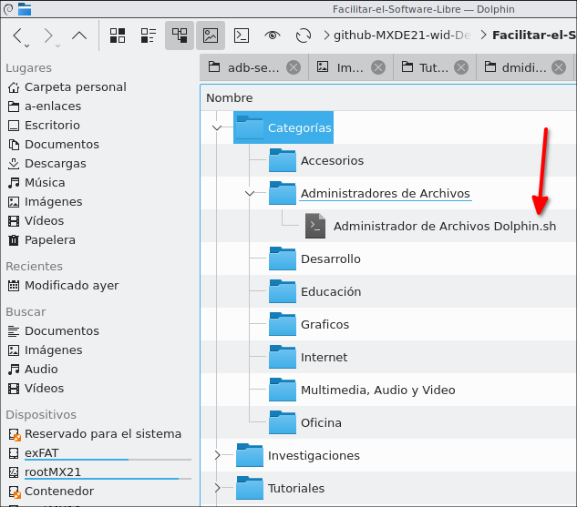

# Facilitar-el-Software-Libre
Tutoriales sobre Software Libre en Markdown para ver Off-line

# Dependencia Dolphin
Necesita tener instalado el Administrador de Archivos Dolphin; si usted usa algún Sistema Operativo Linux como Kubuntu, KDE Neon u otro basado en KDE ya vendrá instalado, pero si usa un Linux no basado en KDE necesitará instalarlo bien siguiendo el siguiente tutorial:

[https://facilitarelsoftwarelibre.blogspot.com/2019/11/instalar-correctamente-dolphin-en-entornos-no-kde.html](https://facilitarelsoftwarelibre.blogspot.com/2019/11/instalar-correctamente-dolphin-en-entornos-no-kde.html)


# Navegando entre las carpetas Categoría
A sugerencia de [Alejando Días Infante](https://u-gob.com/author/aldzinft/) de [Escuelas Linux](https://escuelaslinux.sourceforge.io/) he creado este método de que un script con un nombre en una categoría redirija a Dolphin a otra carpeta:



Las instrucciones de los scritps es como la siguiente:

```
#! /bin/bash

cd ..
cd ..
dolphin Tutoriales

```

es algo sencillo, redirije a Dolphin a abrir algún directorio que yo quiera

Dios les bendiga


