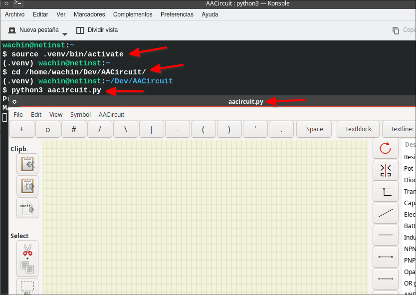

### Uso de AACircuit en Debian 12 para Crear Diagramas de Circuitos ASCII

**AACircuit** es una herramienta para diseñar circuitos electrónicos en formato ASCII, ideal para documentos de texto plano o para quienes prefieren una visualización en terminal. 
### Paso 1: Instalación de Dependencias en Debian 12

Clona el repositorio (debes tener instalado git):

```
git clone https://github.com/Blokkendoos/AACircuit
```

Para que AACircuit funcione correctamente, es necesario instalar algunas dependencias:

1. Abre una terminal y ejecuta los siguientes comandos para instalar las bibliotecas necesarias:

   ```
   sudo apt install -y python3-pip libgirepository1.0-dev libcairo2-dev gir1.2-gtk-3.0
   ```

2. Luego, instala `pycairo` y `PyGObject` en tu entorno de Python usando `pip`. Si usas MX Linux 21 o 23 no tendrás problemas con pip::

   ```
   pip install xerox pypubsub bresenham pycairo PyGObject
   ```
   
pero si usas Debian te recomiendo el siguiente manual para crear un entorno virtual:

**pip no me deja instalar paquetes de python en Debian 12**
[https://facilitarelsoftwarelibre.blogspot.com/2024/08/pip-no-me-deja-instalar-paquetes-de-python-en-debian-12.html](https://facilitarelsoftwarelibre.blogspot.com/2024/08/pip-no-me-deja-instalar-paquetes-de-python-en-debian-12.html)

3. Una vez instaladas las dependencias, ejecuta el archivo `aacircuit.py`. 

   ```
   python3 aacircuit.py
   ```

Esto abrirá la interfaz de AACircuit, lista para que puedas crear tus diseños.

### Lanzando el programa en Debian 12
En Debian 12 para poderlo usar debo crear un entorno virtual con venv siguiendo el tutorial anteriormente mencionado, en mi caso he clonado el repositorio en HOME en la carpeta Dev y debo poner los comandos que se muestran en la siguiente imagen (no pongo los comandos porque en cada caso sería diferente donde hayan clonado el repositorio):



y el siguiente es un circuito que estaba yo representando:


### Paso 2: Uso de la Interfaz de AACircuit

AACircuit ofrece una interfaz gráfica basada en GTK, en la cual verás:
- **Panel de Componentes**: Contiene los símbolos y elementos electrónicos disponibles, como resistencias, capacitores y fuentes de voltaje.
- **Área de Dibujo**: La "pizarra" donde puedes construir tu circuito colocando y conectando componentes.
- **Configuración de Preferencias**: Aquí puedes ajustar el tamaño de la cuadrícula y personalizar los caracteres ASCII que representan cada componente.

### Paso 3: Crear un Circuito Básico

1. **Selecciona un Componente**: Elige un componente desde el panel, como una resistencia.
2. **Coloca el Componente**: Haz clic en el área de dibujo para ubicar la resistencia donde desees.
3. **Conecta los Componentes**: Usa líneas horizontales y verticales (`-` y `|`) para crear conexiones entre los componentes. AACircuit permite añadir líneas automáticamente entre ellos.
4. **Ajusta la Cuadrícula**: En las preferencias, puedes modificar la cantidad de filas y columnas para adaptar el diseño.

### Paso 4: Personalización y Exportación del Diseño

- **Modificar Caracteres ASCII**: Personaliza los caracteres que representan los componentes. Por ejemplo, puedes usar `R` para una resistencia o `C` para un capacitor.
- **Guardar y Exportar**:
  - **Guardar como ASCII**: Exporta el diseño como un archivo de texto ASCII que se puede copiar y pegar en otros documentos.
  - **Exportar como PDF**: Si necesitas un formato más visual, puedes exportarlo como un archivo PDF.

### Ejemplo de Circuito Básico en ASCII

Para ayudarte a comenzar, aquí tienes un ejemplo sencillo de un circuito con una resistencia y una fuente de voltaje:

```
+----R----+
|         |
V         |
|         |
+---------+
```

- `R` representa una resistencia.
- `V` indica una fuente de voltaje.
- Los caracteres `-` y `|` forman las conexiones.

### Consejos Prácticos

- **Usa Atajos**: Familiarízate con los atajos de teclado para duplicar y rotar componentes.
- **Guarda Frecuentemente**: Debido a que AACircuit no tiene deshacer avanzado, es útil guardar copias del diseño en progreso.


# Referencias

1. **Página oficial de GTK y PyGObject**:
   - GTK es el kit de herramientas utilizado para la interfaz gráfica de AACircuit, mientras que **PyGObject** es la biblioteca que permite a Python interactuar con GTK. Aquí encontrarás documentación oficial y ejemplos de uso de GTK en Python.
   - [GTK Documentation](https://docs.gtk.org/)
   - [PyGObject Documentation](https://pygobject.readthedocs.io/en/latest/)

2. **ASCII Art para Diagramas Técnicos**:
   - La creación de diagramas ASCII tiene una larga tradición en la informática y puede ser muy útil en contextos donde el texto plano es preferible. Esta guía ofrece principios generales para crear diagramas en ASCII:
   - [A Guide to ASCII Diagrams](https://asciiflow.com/)

3. **Uso de Cairo para Dibujos en Python**:
   - **Cairo** es la biblioteca subyacente que AACircuit utiliza para gráficos en 2D. La documentación de Cairo proporciona información sobre cómo crear gráficos y exportarlos en diferentes formatos, como PDF, lo cual es útil si quieres aprender más sobre cómo AACircuit maneja la generación de sus gráficos.
   - [PyCairo Documentation](https://pycairo.readthedocs.io/en/latest/)

4. **Programación con PubSub en Python**:
   - AACircuit utiliza un sistema de mensajería llamado **pubsub** para comunicar eventos entre partes del programa. Este enfoque es común en aplicaciones gráficas, y esta guía te ayudará a entender cómo implementar el patrón publicador-suscriptor en Python.
   - [Python PubSub Documentation](https://pypubsub.readthedocs.io/en/latest/)

5. **Introducción a las Interfaces Gráficas en Python**:
   - Si quieres explorar más sobre cómo funcionan las interfaces gráficas en Python y cómo GTK se compara con otras opciones, esta guía de Python GUI puede darte una buena base.
   - [Python GUI Programming - A Beginner’s Guide](https://realpython.com/start-here/) 

Estas referencias deberían ayudarte a profundizar en el uso de AACircuit y las tecnologías que lo soportan.