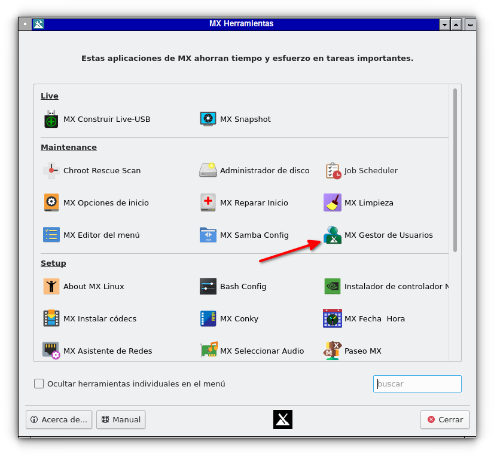
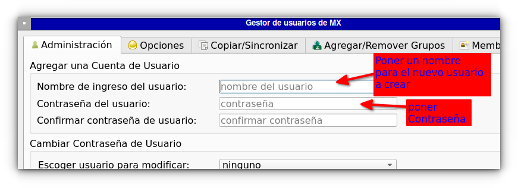
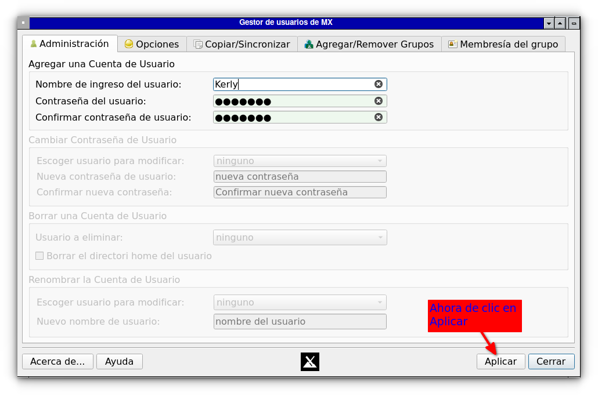

Busque entre las aplicaciones a:

MX Herramientas

luego de clic en:

MX Gestor de usuarios

Ahora añada su nuevo usuario:

 

El nombre no debe tener espacios o caracteres especiales, ejemplo está bien: Kerly, y clic en aplicar:

ahora salga de la sesión y vuelva a entrar con el nuevo usuario