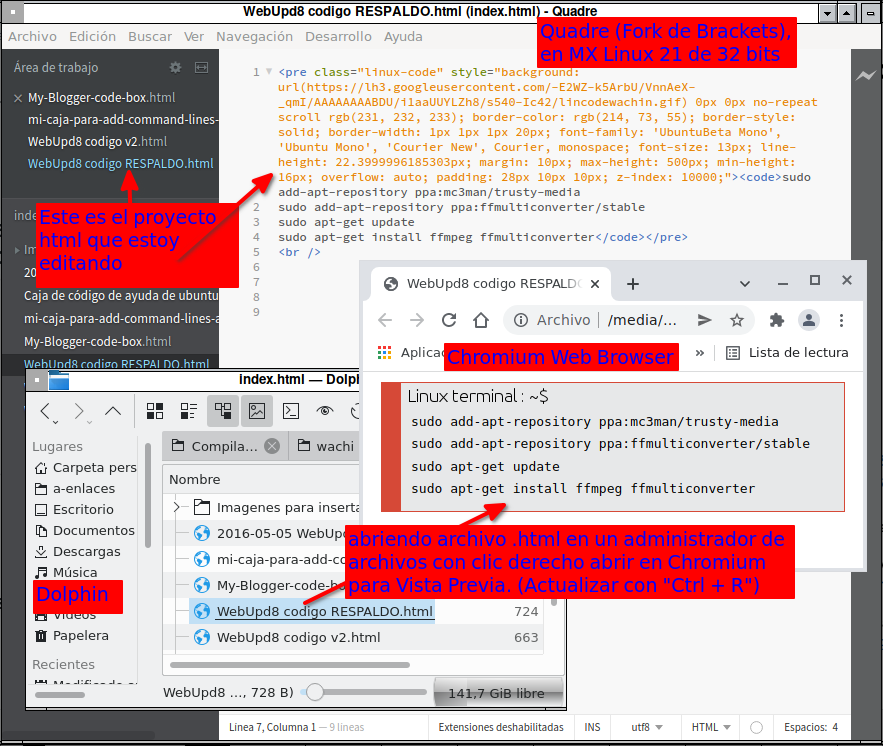

# Compilar Brackets (Fork Quadre) en MX Linux 21 de 32 bits
Han hecho un Fork de Brackets para seguirle dando mantenimiento y que se pueda usar en Linux. Yo lo he compilado en MX Linux 21 de 32 bits y funciona, y he creado un Fork y allí lo he subido para que lo puedan usar en Linux 32 bits

## DEPENDENCIAS
Brackets necesita node.js 16 para poder ser compilado

## Compilar node.js 16.15.0 para 32 bits
Encontré el codigo fuente en:

[https://nodejs.org/dist/v16.15.0/](https://nodejs.org/dist/v16.15.0/)

descargar:

[https://nodejs.org/dist/v16.15.0/node-v16.15.0.tar.xz](https://nodejs.org/dist/v16.15.0/node-v16.15.0.tar.xz)

extraer:

node-v16.15.0.tar.xz

según las instrucciones de compilación en el archivo:

/nodejs/node-v16.15.0/BUILDING.md

hay que instalar algunos paquetes:

    sudo apt-get install python3 gcc g++ make python3-pip


## Compilando Node.js

**Nota:** Si la ruta donde está el código fuente contenga algún espacio la compilación fallará, por eso asegurese que no haya espacios en los nombres de las carpetas

Para compilar build Node.js:

```
./configure
make -j4
sudo make install
```

Para ver la versión instalada:

    node -v


# Compilando Quadre:  
Con las siguientes instrucciones se compila y generan los ejecutables:

```
git clone https://github.com/quadre-code/quadre
cd quadre
git submodule update --init
npm install
npm run dist
```

luego de un tiempo de compilación, en la carpeta:

/dist-build

se encuentran los instaladores


# Usar el instalador deb, o AppImage, o portable
En esa carpeta **dist-build** estarán los siguietes:

**quadre--ia32-linux-unpacked**  
que es el portable, para asegúrese que el archivo:

quadre

esté como ejecutable, para ver eso en algún administrador de archivos de clic derecho y en la pestaña "Permisos" verifique que esté marcado como ejecutable y para lanzarlo dele doble clic

**Quadre-2.0.0-alpha.6-i386.AppImage**  
Es el App image, asegúrese que esté como ejecutable, para ver eso en algún administrador de archivos de clic derecho y en la pestaña "Permisos" verifique que esté marcado como ejecutable y para lanzarlo dele doble clic

**quadre_2.0.0-alpha.6_i386.deb**  
Es el instalador, instalelo con gdebi

# Cómo poner en español
De clic en:

**Debug**

allí clic en:
k
**Switch Language**

y elija el idioma español y de clic en:

**reload quadre**


# Vista previa no funciona, solución usar un Navegador Web extra
La vista previa no funciona en:

**Archivo / Vista previa dinámica**

pero usted puede usar otro navegador web, ejemplo si usted usa Firefox instale Chromium:

    sudo apt install chromium chromium-l10n

para ver la vista previa, haga clic derecho en su archivo de proyecto .html y ábralo con chromium, y cuando haga algún cambio vuelva a cargar el navegador web con "Ctrl + R"


 
 

### Consultas

html - Brackets - Live Preview not working - Stack Overflow  
https://stackoverflow.com/questions/25108420/brackets-live-preview-not-working  
https://stackoverflow.com/a/50334602/10648253  
I had this problem as well. What I did was simply goto File->Open Folder... it all worked after all the necessary files were loaded into Brackets. 

Enhacement: Chromium-based forks for live preview · Issue 13010 · adobe/brackets  
https://github.com/adobe/brackets/issues/13010  

Live preview doesn't work on archlinux Issue 9562 · adobe/brackets  
https://github.com/adobe/brackets/issues/9562  


