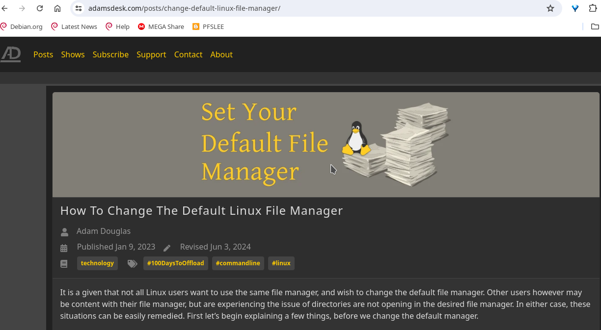
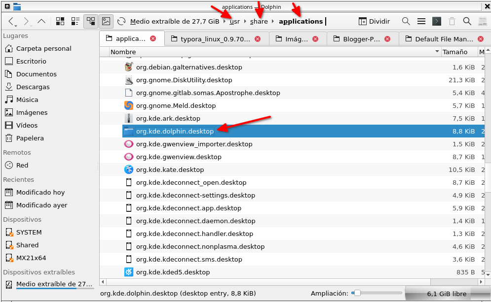

# Cómo cambiar el Administrador de Archivos Predeterminado de Linux desde la terminal


La siguiente entrada es una traducción y aumentado de:

[https://www.adamsdesk.com/posts/change-default-linux-file-manager/](https://draft.blogger.com/blog/post/edit/8761056917308551623/8816026536907223517#)



Cambiar el administrador de archivos predeterminado en Linux depende del entorno de escritorio que estés usando.. Es un hecho que no todos los usuarios de Linux quieren usar el mismo administrador de archivos y desean cambiar el administrador de archivos predeterminado. Sin embargo, otros usuarios pueden estar contentos con su administrador de archivos, pero experimentan el problema de que los directorios no se abren en el administrador de archivos deseado. En cualquier caso, estas situaciones pueden remediarse fácilmente. Primero comencemos explicando algunas cosas, antes de cambiar el administrador predeterminado.

## Asociación De Archivos

Una aplicación se asocia a archivos o contenido mediante lo que se llama tipo MIME o también conocido como tipo de medio. Cuando se instala una aplicación, los tipos MIME se configuran automáticamente y se actualizan cuando se aplica una actualización de software. Piense en ello como un mapa que le da al sistema instrucciones sobre qué programa abre un archivo en particular. En el caso del administrador de archivos, el tipo MIME se llama “inodo/directorio”. Cualquier aplicación configurada como predeterminada que esté asociada a este tipo MIME y se abrirá como administrador de archivos incluso si la aplicación en sí no es realmente un administrador de archivos. Las aplicaciones que se sabe que están configuradas como administrador de archivos pueden ser [Audacious](https://translate.google.com/website?sl=es&tl=en&hl=es&client=webapp&u=https://audacious-media-player.org/) , [VSCodium](https://translate.google.com/website?sl=es&tl=en&hl=es&client=webapp&u=https://github.com/VSCodium/vscodium) , [Kitty](https://translate.google.com/website?sl=es&tl=en&hl=es&client=webapp&u=https://sw.kovidgoyal.net/kitty/) , etc.

## ¿Qué Es Un Archivo De Entrada De Escritorio?

Una forma de integrar una aplicación en los menús de un entorno de escritorio Linux que sigue la especificación estándar del menú de escritorio XDG. Piense en estos archivos como un acceso directo que proporciona toda la información necesaria para funcionar sin problemas.

## Encuentre el Administrador de Archivos predeterminado

Para determinar el administrador de archivos predeterminado, ejecute el siguiente comando.

```
$ xdg-mime query default inode/directory
codium.desktop
```

## Cambiar El Administrador De Archivos Predeterminado

Para cambiar el administrador predeterminado, debe saber cómo se llama el nombre del archivo de entrada del escritorio. Los archivos de entrada de escritorio generalmente se almacenan en un par de ubicaciones en un sistema Linux, “~/.local/share/applications/” para aplicaciones específicas del usuario y “/usr/share/applications/” o “/usr/local/share /aplicaciones/” para aplicaciones instaladas en todo el sistema. Intente localizar el nombre de la aplicación explorando cada uno de los directorios enumerados o buscando usando el `find`comando.

A continuación se muestra un ejemplo de una búsqueda de archivos GNOME (nautilus) dentro del directorio “/usr/share/applications/”.

```
$ find /usr/share/applications/ -iname "*nautilus*"
/usr/share/applications/nautilus-autorun-software.desktop
/usr/share/applications/org.gnome.Nautilus.desktop
```

El siguiente ejemplo de comando establecerá Archivos GNOME (nautilus) como el administrador de archivos predeterminado:

```
$ xdg-mime default org.gnome.Nautilus.desktop inode/directory
```

Para verificar si el cambio funcionó, puede ejecutar el siguiente comando:

```
$ xdg-mime query default inode/directory
org.gnome.Nautilus.desktop
```

Esta busqueda también se puede hacer manualmente, entrando desde un administrador de archivos en la ruta:

/usr/share/applications/ 



encontré el archivo desktop buscando la palabra: dolphin


## Comandos para cambiar a los siguientes administradores de archivos

A continuación se muestran los comandos de los administradores de archivos más conocidos y cómo cambiarlos para que sean los predeterminados:

─ **Nautilus**

```
xdg-mime default org.gnome.Nautilus.desktop inode/directory
```

─ **Dolphin**

```
$ xdg-mime default org.kde.dolphin.desktop inode/directory
```

─ **Doble Commander**

```
$ xdg-mime default doublecmd.desktop inode/directory
```

─ **Gnome Comander**

```
$ xdg-mime default org.gnome.gnome-commander.desktop inode/directory
```

─ **Krusader**

```
$ xdg-mime default org.kde.krusader.desktop inode/directory
```

─ **Thunar**

```
$ xdg-mime default thunar.desktop inode/directory
```

─ **Caja**

```bash
$ xdg-mime default org.mate.caja.desktop inode/directory
```

─ **Nemo**

```bash
$ xdg-mime default nemo.desktop inode/directory
```

─ **PCManFM**

```bash
$ xdg-mime default pcmanfm.desktop inode/directory
```

─ **Thunar**

```bash
$ xdg-mime default thunar.desktop inode/directory
```

─ **Midnight Commander**

Para Midnight Commander, que es un administrador de archivos de línea de comandos, no es común establecerlo como el administrador de archivos predeterminado para manejar carpetas gráficamente. Sin embargo, si deseas establecerlo, primero asegúrate de que tienes un archivo `.desktop` adecuado para Midnight Commander. Si no lo tienes, puedes crear uno como sigue:

1.) Crea un archivo llamado `mc.desktop` en `~/.local/share/applications/` (o `/usr/share/applications/` para todos los usuarios):

```ini
[Desktop Entry]
Name=Midnight Commander
Comment=File Manager
Exec=mc
Icon=utilities-terminal
Terminal=true
Type=Application
Categories=System;FileTools;FileManager;
```

2.) Luego, usa el siguiente comando:

```bash
$ xdg-mime default mc.desktop inode/directory
```

─ **nnn**
Semejante hacer para nnn

```
$ xdg-mime default nnn.desktop inode/directory
```


Con estos comandos puedes configurar el administrador de archivos que prefieras como predeterminado en tu sistema Linux.

