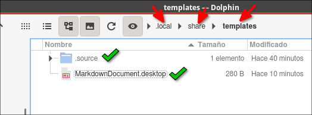
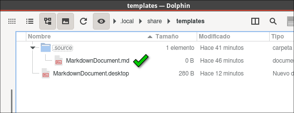
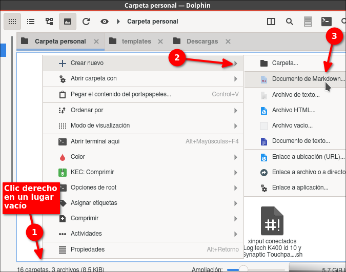

 

# Cómo se crea un Documento nuevo (Plantilla) con clic derecho en Dolphin ejemplo de Markdown .md

Estoy tratando de encontrar en Internet la solución para poder crear un nuevo archivo en Dolphin administrador de archivos y al fin encontré una entrada que me explica cómo hacerlo. En contraste en Ubuntu el administrador de archivos Nautilus tiene fácilmente como añadir con click derecho "Crear nuevos" tipos de archivos porque en el Home hay una carpeta que se llama Plantillas y allí uno puede poner cualquier archivo con la extensión del archivo que uno quiere que aparezca un nuevo archivo en el administrador de archivos Nautilus al darle clic derecho y luego en "Crear nuevo", pero en Dolphin no aparece esa característica, pero sí se puede hacer aunque es más difícil, más complicado pero estas son las instrucciones para hacerlo

## Verificando la estructura KDE para los archivos de "Crear nuevo"
En dolphin habilita el poder ver los archivos ocultos con "Ctrl + H" y si no estas usando un Sistema Operativo Linux basado en KDE, Neon (como yo) no estarán presentes algunas carpetas. Navega hasta:

$HOME/.local/share/

o lo que es lo mismo:

.local/share/

allí crea (si no la hay) la carpeta:

templates

y allí dentro crea la carpeta:

.sources


## Crear las carpetas templates/.source y el archivo.desktop para ejemplo Markdown .md
Los archivos que describen los elementos en tu menú “Crear nuevo” se deben encontrar en:

$HOME/.local/share/templates
$HOME/.local/share/templates/.sources

Para mi necesidad con editor de texto como ejemplo Kate debo crear un nuevo archivo de texto llamado:

MarkdownDocument.desktop

en el directorio $HOME/.local/share/templates y añadir el siguiente contenido:
```desktop
[Desktop Entry]
Name=Markdown Document...
Name[en_GB]=Markdown Document...
Name[es]=Documento de Markdown...
Comment=New Markdown document:
Comment[en_GB]=New Markdown document:
Comment[es]=Nuevo documento de Markdown:
Type=Link
URL=.source/MarkdownDocument.md
Icon=text-markdown
```
y guardar y cerrar




**Cómo encontré el nombre del icono para el archivo .desktop?**
El nombre del icono lo encontré buscando la palabra Markdown en: /usr/share/icons/ y allí aparecieron varios nombres ejemplos: 

/usr/share/icons/Papirus/22x22/mimetypes/text-markdown.svg

/usr/share/icons/Papirus/48x48/mimetypes/text-x-markdown.svg

entonces en base a ese elegí uno y me gustó: text-markdown.svg y como no es necesario usar la extensión del archivo pues el Sistema lo reconoce por eso nomás puse: text-markdown,


Además con un editor de texto o un editor de Markdown cree un archivo vacío en el directorio $HOME/.local/share/templates/.source y nómbrelo:

MarkdownDocument.md



Eso es todo, y ya podrá ver al dar clic derecho con Dolphin en un lugar vació el menú:

+ Crear nuevo > Documento de Markdown...




## Plantillas de Documentos de LibreOffice

Para la suite LibreOffice. Aquí tienes los archivos .desktop correspondientes:

1. LibreOffice Calc (Hoja de cálculo):
```desktop
[Desktop Entry]
Name=Hoja de cálculo...
Name[en_GB]=Spreadsheet...
Name[es]=Hoja de cálculo...
Comment=Nueva hoja de cálculo de LibreOffice
Comment[en_GB]=New LibreOffice spreadsheet
Comment[es]=Nueva hoja de cálculo de LibreOffice
Type=Link
URL=.source/Hoja_de_calculo.ods
Icon=libreoffice-calc
```

2. LibreOffice Impress (Presentación):
```desktop
[Desktop Entry]
Name=Presentación...
Name[en_GB]=Presentation...
Name[es]=Presentación...
Comment=Nueva presentación de LibreOffice
Comment[en_GB]=New LibreOffice presentation
Comment[es]=Nueva presentación de LibreOffice
Type=Link
URL=.source/Presentacion.odp
Icon=libreoffice-impress
```

3. LibreOffice Draw (Dibujo):
```desktop
[Desktop Entry]
Name=Dibujo...
Name[en_GB]=Drawing...
Name[es]=Dibujo...
Comment=Nuevo dibujo de LibreOffice
Comment[en_GB]=New LibreOffice drawing
Comment[es]=Nuevo dibujo de LibreOffice
Type=Link
URL=.source/Dibujo.odg
Icon=libreoffice-draw
```

4. LibreOffice Base (Base de datos):
```desktop
[Desktop Entry]
Name=Base de datos...
Name[en_GB]=Database...
Name[es]=Base de datos...
Comment=Nueva base de datos de LibreOffice
Comment[en_GB]=New LibreOffice database
Comment[es]=Nueva base de datos de LibreOffice
Type=Link
URL=.source/Base_de_datos.odb
Icon=libreoffice-base
```

**Notas importantes:**
1. Deberás crear los archivos vacíos correspondientes en la carpeta `.sources/` con las extensiones:
   - `.ods` para Calc
   - `.odp` para Impress
   - `.odg` para Draw
   - `.odb` para Base

2. Los nombres de los iconos (`libreoffice-calc`, `libreoffice-impress`, etc.) son los estándar en la mayoría de las distribuciones Linux, pero puedes verificarlos en tu sistema en:
   - `/usr/share/icons/`
   - `/usr/share/icons/hicolor/`

3. Para crear los archivos plantilla vacíos, la manera más sencilla es:
   1. Abrir la aplicación correspondiente de LibreOffice
   2. Crear un documento nuevo y vacío
   3. Guardarlo en la carpeta `.sources/` con el nombre correspondiente
   4. No es necesario añadir contenido, pero podrías incluir configuraciones básicas como:
      - Márgenes predeterminados
      - Tamaño de página
      - Estilos básicos
      - Configuración regional

4. Para Base (.odb), ten en cuenta que necesitarás decidir si quieres incluir:
   - Base de datos incorporada HSQLDB (la opción más común)
   - Conexión a una base de datos externa
   - Base de datos incorporada Firebird

## Qué otras plantillas podría necesitar?
Las siguientes plantillas útiles que podrías añadir:

1. Documento HTML básico:
```desktop
[Desktop Entry]
Name=Documento HTML...
Name[en_GB]=HTML Document...
Name[es]=Documento HTML...
Comment=Nuevo documento HTML
Comment[en_GB]=New HTML document
Comment[es]=Nuevo documento HTML
Type=Link
URL=.source/PaginaWeb.html
Icon=text-html
```

2. Script de Python:
```desktop
[Desktop Entry]
Name=Script Python...
Name[en_GB]=Python Script...
Name[es]=Script Python...
Comment=Nuevo script Python
Comment[en_GB]=New Python script
Comment[es]=Nuevo script Python
Type=Link
URL=.source/Script.py
Icon=text-x-python
```

3. Hoja de cálculo CSV:
```desktop
[Desktop Entry]
Name=Hoja CSV...
Name[en_GB]=CSV Sheet...
Name[es]=Hoja CSV...
Comment=Nueva hoja de cálculo CSV
Comment[en_GB]=New CSV spreadsheet
Comment[es]=Nueva hoja de cálculo CSV
Type=Link
URL=.source/Datos.csv
Icon=text-csv
```

4. Script de Bash:
```desktop
[Desktop Entry]
Name=Script Bash...
Name[en_GB]=Bash Script...
Name[es]=Script Bash...
Comment=Nuevo script de Bash
Comment[en_GB]=New Bash script
Comment[es]=Nuevo script Bash
Type=Link
URL=.source/Script.sh
Icon=text-x-script
```

Recuerda que para cada uno de estos archivos .desktop necesitarás crear su correspondiente archivo plantilla vacío (o con contenido básico) en la carpeta `.sources/`. Por ejemplo, para el HTML podrías incluir la estructura básica:

```html
<!DOCTYPE html>
<html lang="es">
<head>
    <meta charset="UTF-8">
    <meta name="viewport" content="width=device-width, initial-scale=1.0">
    <title>Nuevo Documento</title>
</head>
<body>
    
</body>
</html>
```

Para el script Python podrías incluir el shebang y encoding:

```python
#!/usr/bin/env python3
# -*- coding: utf-8 -*-
```

Y para el script Bash:

```bash
#!/bin/bash
```
Dios les bendiga

# CONSULTAS

**Add your own “Create New” options in KDE Dolphin**
Johan Zietsman 2019-10-31
[https://ex-mente.com/em_blog_posts/add-your-own-create-new-options-in-kde-dolphin/](https://ex-mente.com/em_blog_posts/add-your-own-create-new-options-in-kde-dolphin/)

**Y en el Sistema Operativo Linux Debian 12** 
Que parece que esto lo instaló LibreOffice) encontré los siguientes archivos:

/usr/share/templates/TextDocument.desktop

file:///usr/share/templates/.source/TextDocument.odt