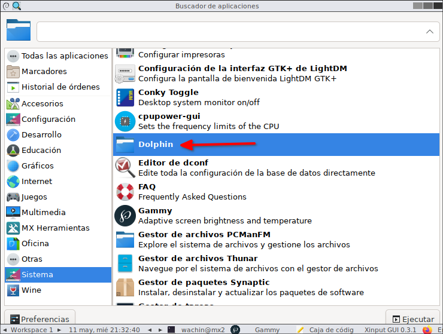
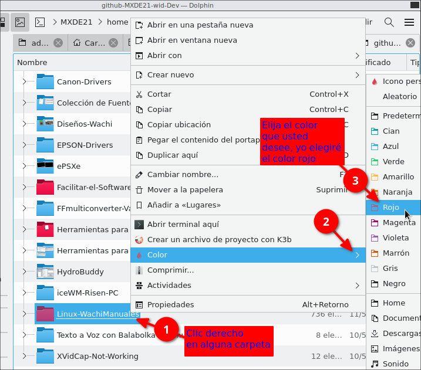

# Dolphin Color Folder, Debian 11, Ubuntu 22.04
Este tutorial es sólo para Sistemas Operativos Linux basados en Debian 11, además basados en Ubuntu 22.04 y pueden probarlo en basados en Ubuntu 20.04 y me avisan si funciona

# Tutorial pensado para Linux no KDE
Está pensado en Distribuciones Linux que NO son basadas en KDE (como Kubuntu, KDE Neon, etc) ya que allí vienen instaladas todas las dependencias para que funcione bien Dolphin. Este tutorial es para que puedan usar Dolphin Color Folder en otras Distribuciones Linux en las que no les funcione

# Instalación de Dolphin
Para que pueda funcionar correctamente Dolphin en Sistemas Operativos Linux no KDE ponga estos comandos en la terminal:

```
sudo apt install dolphin kde-baseapps konsole kde-cli-tools \
     kio-extras kdegraphics-thumbnailers ffmpegthumbs engrampa \
     kde-style-oxygen-qt5 kde-style-qtcurve-qt5 breeze
```

Si tiene curiosidad puede ver la siguiente entrada con explicaciones del porqué de instalar esos paquetes:
 
**Instalar correctamente Dolphin (Administrador de archivos) en MX Linux, antiX basados en Debian en entornos no KDE (tal vez basados en Ubuntu también)**
https://facilitarelsoftwarelibre.blogspot.com/2019/11/instalar-correctamente-dolphin-en-entornos-no-kde.html

Una vez instalado, estará entre todas sus aplicaciones, ejemplo:



pero sino puede lanzarlo desde la terminal así:

```
dolphin
```


# Instalación de Dolphin Folder Color
Copie todo el siguiente código (seleccionelo todo de una sola vez) y peguelo en una terminal:

```
mkdir -p ~/.local/share/kservices5/ServiceMenus
cd /tmp
git clone https://github.com/wachin/dolphin-folder-color
cd dolphin-folder-color
cp *.desktop ~/.local/share/kservices5/ServiceMenus
sudo ./install.sh
echo "Dios les bendiga" 
```

y es posible le aparezca una ventandole pidiendo que confirme la instalación y luego aparecerá la siguiente ventana:
 
 

allí como se ve hay que dar clic en Aceptar y cierre Dolphin y vuelvalo a abrir (para que lo reinicie)

y al dar clic derecho en alguna carpeta le aparecerán las opciones para escoger los colores de carpetas que usted desee:



# Temas de iconos compatibles con Dolphin Folder color
No todos los temas de iconos son compatibles, los que conozco que son compatibles son:

**Breeze Icon Theme.-** Que ya lo instalamos cuando instalamos el paquete Breeze

**Oxygen Icon Theme.-** Este tema de iconos hasta donde se viene por defecto instalado en Sistemas Operativos Linux KDE pero se lo puede instalar así:

```
sudo apt install oxygen-icon-theme
```

**Nuvola Orange Icon Theme.-** El cual es un Fork que yo hice del tema Nuvola, las instrucciones de instalación están en:

https://facilitarelsoftwarelibre.blogspot.com/2020/06/tema-de-iconos-nuvola-color-naranja.html

solo que mi tema no está del todo completo, yo le puse los colores faltantes de algunas carpetas para poder usarlo con Dolphin Folder Color, si desean lo pueden probar

**vimix-icon-theme.-** Puede que también funcione:

https://github.com/vinceliuice/vimix-icon-theme

pero no lo he testeado.

**KDE Store Full Icon Themes**.- Hay muchos temas de iconos KDE en:

https://store.kde.org/browse?cat=132&order=latest


algunos de ellos podrian ser compatibles y tener las carpetas de colores necesarias, pero es necesario probar, me avisan si encuentran algunas
