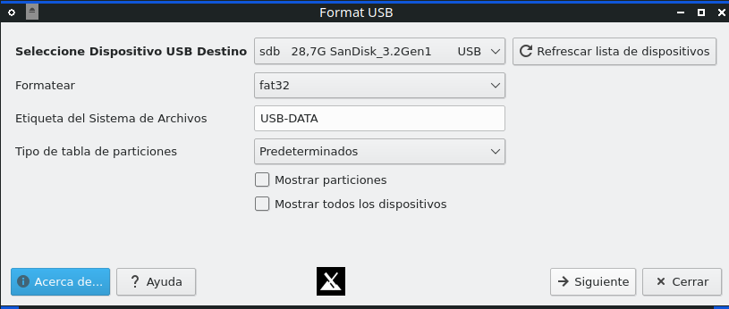
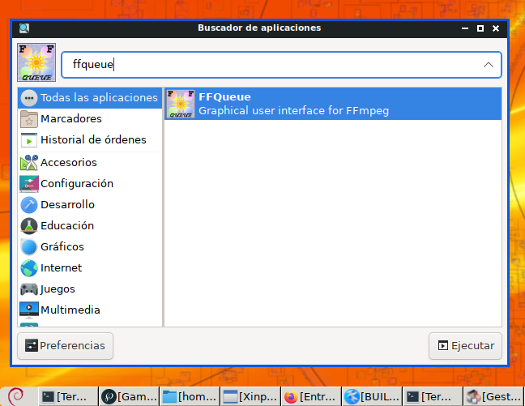

# Instalar FFQueue desde código fuente

Instalando FFQueue en MX Linux 21 de 32 bits

La siguientes es una traducción usando Google Translator de la información del programa en la página:

http://ffqueue.bruchhaus.dk/

**Traducción:**  

FFQueue es (otra) interfaz gráfica de usuario para FFMpeg con soporte integral tanto para las funciones básicas como para las funciones más avanzadas como los gráficos de filtro. FFQueue facilita la creación de varios trabajos y su procesamiento como una sola cola.
FFQueue puede ordenar la salida más significativa de FFMpeg y mostrarla en la consola gráfica y guardarla en un archivo de registro basado en HTML (codificado por colores) para una fácil revisión cuando se haya procesado la cola.

FFQueue está disponible en 32 bits y algunas de sus características principales son:

* Procesar múltiples trabajos de codificación
*     Indicación de progreso con tiempo restante
*     Cree ajustes preestablecidos reutilizables (o temporales) para facilitar la creación de trabajos
*     Creación de lotes para múltiples trabajos (soporte de arrastrar y soltar)
*     Detección automática de subtítulos o audio de archivos externos
*     Codificación de dos pasos con manejo de archivos temporales
*     Cree miniaturas y / o mosaicos a través de ajustes preestablecidos o la herramienta de creación de pulgares
*     Especifique una línea de comando personalizada (con o sin preajuste) para cubrir toda la funcionalidad de FFMpeg
*     Mostrar información de transmisión avanzada para archivos multimedia
*     Grabación fácil de subtítulos (se admiten subtítulos basados ​​en texto y mapas de bits)
*     Hacer video a partir de imágenes (crear presentación de diapositivas) con pista de audio opcional
*     Concatenar múltiples archivos multimedia (audio/video) en un solo archivo
*     Estabilización de video de dos pasos (usando filtros vidstab*)
*     Soporte sólido para gráficos de filtro FFMpeg (ver más abajo)
*     Compatibilidad con FFMpeg de 32 bits y 64 bits

FFQueue tiene soporte incorporado para los siguientes gráficos de filtro:

* Caja de desenfoque
*     Equilibrio de color (ajustar sombra, medio tono y realce)
*     Superposición de color (coloque un cuadro de color en cualquier lugar)
*     Ajuste de curva (color)
*     Matriz de color
*     Cosecha
*     desentrelazado
*     Dejuder
*     deshacer
*     Eliminar fotogramas duplicados
*     Voltear y espejo
*     Escalonamiento del marco
*     Tono/Saturación/Brillo
*     HQ Eliminación de ruido 3D
*     Entrelazar
*     Colores invertidos
*     Corrección de lentes
*     Ruido
*     Almohadilla a medida
*     Perspectiva
*     posterizar
*     Quitar logotipo
*     Girar
*     Escalar (redimensionar)
*     Afilar (o suavizar)
*     Cambiar avión U & V
*     Transponer
*     Viñeta
*     Marca de agua (imagen superpuesta)
*     paso de banda
*     Rechazar banda
*     Cambiar tempo
*     Reasignación de canales
*     Canales de retardo
*     Eco
*     Ecualizador (10 bandas)
*     Flanger
*     encabezar
*     paso alto
*     Paso bajo
*     Normalización
*     fáser
*     volver a muestrear
*     Volumen y tono (ganancia, graves y agudos)
*     Filtro personalizado (audio y video)

Muchos de los filtros se pueden limitar en el tiempo desde y hacia un índice de tiempo específico. procesada.

# Instalación

Ahora si vamos con la instalación. Los siguientes pasos están basado en la guía de compilación de FFQueue:

https://github.com/bswebdk/FFQueue/blob/master/BUILD-GUIDE.TXT

Instalar dependencias

    sudo apt install libwxgtk3.0-gtk3-dev make autoconf automake

**Nota:** En mi ordenador tengo instaladas otras herramientas de compilación

Ahora poner en una terminal una por una:

    git clone https://github.com/bswebdk/FFQueue
    cd FFQueue
    autoreconf --install
    mkdir build
    cd build
    ../configure
    make
    sudo make install

**Nota:** Si al momento de dar make a usted le aparece algún mensaje de error ha de ser porque falta alguna herramienta de compilación, usted puede buscar en Google el mensaje de error o enviarme a mi una captura de pantalla a mi correo wachin.id@gmail.com para añadir aquí la dependencia faltante del paquete de compilación.

# Para lanzar
Puede buscar entre todas las aplicaciones

o también puede lanzarlo desde la terminal:

    ffqueue

# Tutorial de uso
Ver en:

http://ffqueue.bruchhaus.dk/Documentation.aspx

# Desinstalar

Para desinstalarlo debe estar en la carpeta:

build

allí deberá poner:

    sudo make uninstall

Dios les bendiga

