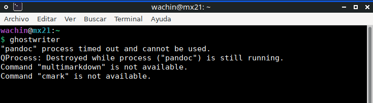
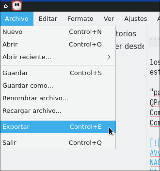
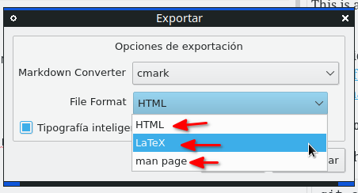
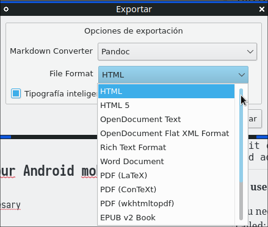
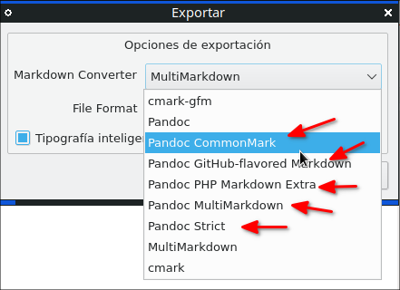
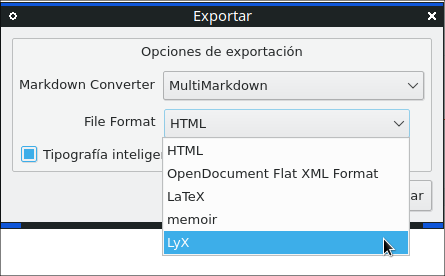
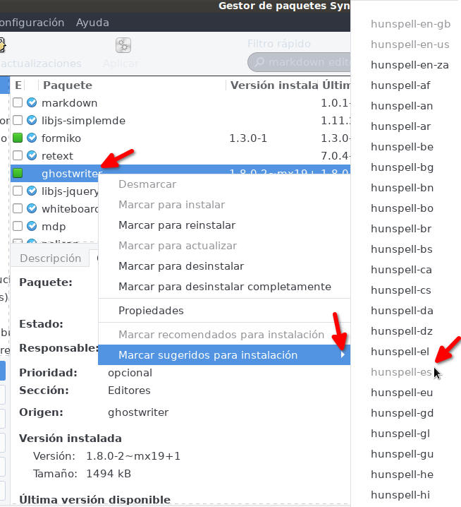
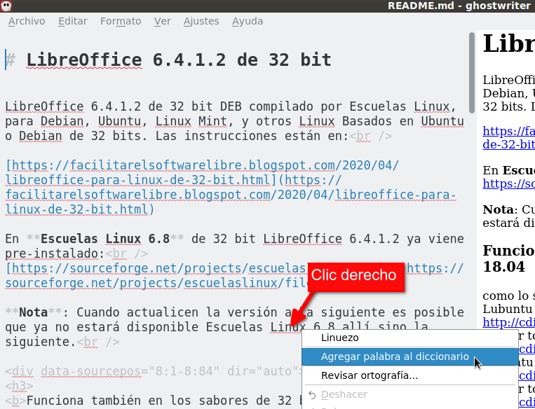

Este programa se puede instalar desde los repositorios de MX Linux al
igual que muchos Linux

[]{#anchor}Actualizar los repositorios
--------------------------------------

sudo apt update

[]{#anchor}\*\*Instalar Ghostwriter desde la terminal + diccionario
-------------------------------------------------------------------

\*\*

Para instalar desde la terminal:

sudo apt install ghostwriter cmark pandoc libtext-multimarkdown-perl
hunspell-es

los paquetes al lado de ghostwriter son para que no aparezca este
mensaje:

"pandoc" process timed out and cannot be used.\
QProcess: Destroyed while process ("pandoc") is still running.\
Command "multimarkdown" is not available.\
Command "cmark" is not available

{width="25.894cm"
height="7.161cm"}

al instalarlos se puede exportar a varios archivos

Archivo --\> Exportar

{width="11.642cm"
height="12.453cm"}

**cmark** formatos disponibles:

{width="15.946cm"
height="8.608cm"}

HTML\
Latex\
man page

**pandoc** formatos disponibles

{width="15.487cm"
height="13.123cm"}

HTML\
HTML5\
Open Document Text\
Open Document Text Flat XML Format\
Rich Text Format\
Word Document\
PDF (LaText)\
PDF (ConText)\
PDF (wkhtmltopdf)\
EPUB v2 Book\
EPUB v3 Book\
Fiction2Book e-Book\
LaText\
groff man page

además de otros

pandoc menu principal otros sub formatos

{width="15.558cm"
height="11.289cm"}

**MultiMarkdown** formatos disponibles:

{width="15.699cm"
height="9.737cm"}

HTML\
OpenDocument Flat XML Format\
LaText\
memoir\
LyX

**Instalar Ghostwriter desde synaptic + diccionarios**

Búsquelo en synaptic, si no lo tenía instalado instálelo así:

sudo apt install synaptic

y búsque el paquete:

ghostwriter

dele clic derecho e instale

hunspell-es

pero además usted puede ver que hay otros diccionarios de otros idiomas
y los puede instalar si los necesitaría, pues allí están todos los
disponibles de hunspell

{width="23.072cm"
height="25.329cm"}

En la siguiente imagen les muestro cómo aparece listo para corregir o
añadir al diccionario palabras marcadas en rojo:

{width="26.917cm"
height="20.602cm"}

[]{#anchor-1}Instale Fuentes bonitas Monoespaciadas
---------------------------------------------------

Le aconsejo que por ejemplo instale:

iosevka\
[*https://github.com/be5invis/Iosevka*](https://github.com/be5invis/Iosevka)

También vea si les guíe una de las sig entradas en:

[*https://facilitarelsoftwarelibre.blogspot.com/search?q=fuentes*](https://facilitarelsoftwarelibre.blogspot.com/search?q=fuentes)

Dios les bendiga
