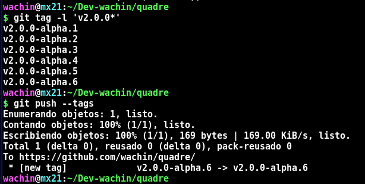

I want to use Brackets in MX Linux 21 x386 and found a Fork that are given support in: https://github.com/quadre-code/quadre and I compile it and working, but the only way to use Live Preview is with this instructions.

v2.0.0-alpha.6

git tag -a v2.0.0-alpha.6 -m 'quare 20220516 v2.0.0-alpha.6'

git show v2.0.0-alpha.6

