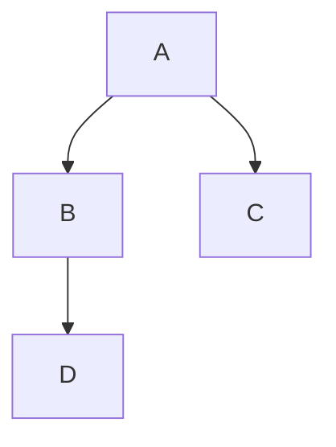

Esta guía asume que estás usando **Debian 12** (o una distribución de Linux similar como **Ubuntu 24.04**, pero podría servir en otro Linux) 

## Paso 1: Instalar Hugo versión extendida a través del archivo `.deb` (64 bit)
No uses la versión de los repositorios pues se necesita la versión extendida

1. **Descargar el archivo `.deb` más reciente de Hugo:**
   - Visita la [página de lanzamientos de Hugo en GitHub](https://github.com/gohugoio/hugo/releases).
   - Encuentra la última versión para Linux (por ejemplo, `hugo_extended_withdeploy_*.*.*_Linux-64bit.deb`).
   - Descárgalo, por ejemplo, usando `wget`:

    ```bash
    wget https://github.com/gohugoio/hugo/releases/download/v0.141.0/hugo_extended_withdeploy_0.141.0_linux-amd64.deb
    ```

2. **Instalar el archivo `.deb`:**
    ```bash
    sudo dpkg -i hugo_*.*.*_linux-amd64.deb
    ```

3. **Verificar la instalación:**
```bash
hugo version
```
Deberías ver la versión de Hugo instalada.

---

## Paso 2: Configurar un sitio de GitHub Pages

### 1. Crear un repositorio en GitHub:
   - Ve a [GitHub](https://github.com) y crea un nuevo repositorio llamado `username.github.io`, donde `username` es tu nombre de usuario en GitHub (por ejemplo, `wachin.github.io`).

### 2. Clonar el repositorio a tu máquina local:
```bash
git clone https://github.com/username/username.github.io
cd username.github.io
```

### 3. Crear un archivo `index.html` simple para probar GitHub Pages:
```bash
echo "Hi World" > index.html
```

### 4. Realizar commit y hacer push de los cambios:
```bash
git add .
git commit -m "Commit inicial"
git push origin main
```

### 5. Configura tu repositorio en GitHub, por ejemplo:

```plaintext
https://github.com/username/username.github.io/settings
```
donde `username` es tu nombre de usuario en GitHub y el nombre de tu página de GitHub. Luego, haz clic en **Pages** en la parte inferior izquierda o ve a:
```plaintext
https://github.com/username/username.github.io/settings/pages
```

donde `username` es tu nombre de usuario en GitHub y el nombre de tu página de GitHub, y asegúrate de que el nombre de tu página aparezca allí y que la rama configurada esté en "main".

### 6. Verificar tu sitio en GitHub Pages:
   - Visita `https://username.github.io` en tu navegador.
   - Deberías ver "Hi World" mostrado.

---

## Paso 3: Inicializar un sitio Hugo

1. **Navega al directorio de tu repositorio:**
```bash
cd username.github.io
```

2. **Inicializa un nuevo sitio Hugo:**
```bash
hugo new site . --force
```
   La bandera `--force` se usa porque el directorio no está vacío (contiene `index.html`).

3. **Eliminar el archivo `index.html`:**
```bash
rm index.html
```

---

## Paso 4: Instalar el tema Arberia
Estas son las instrucciones de instalación del tema Arberia personalizadas para mi

### 1. No inicializar el repositorio
En las instrucciones de instalación del tema en el sitio web indican inicializar el repositorio:

```bash
git init
```
pero ya lo hemos inicializado, por lo que no será necesario hacerlo.
   
### 2. Haz un Fork del repositorio del tema Arberia:

Yo voy a configurar Google Analytics y además hacer otros arreglos y para que estos sean aplicables debo hacer un fork del repositorio. Entro en:

[https://github.com/antedoro/arberia](https://github.com/antedoro/arberia)

y clic en el botón "Fork"

[https://github.com/wachin/arberia](https://github.com/wachin/arberia)

### 3. Agregar el tema Arberia como submódulo:
Para cambiar el submódulo a tu fork, debes actualizar su configuración. Aquí están los pasos:

---

#### 1. Eliminar la configuración del submódulo existente
Primero, elimina el submódulo existente del índice de Git sin borrar los archivos:

```bash
git submodule deinit -f themes/arberia
git rm -f themes/arberia
rm -rf .git/modules/themes/arberia
```

Esto elimina la referencia del submódulo original del repositorio y la configuración de Git.

---

#### 2. Agregar tu fork como submódulo
Ahora puedes añadir tu fork como submódulo correctamente, el siguiente es el mío, usted debe cambiar "wachin" por su nombre de usuario:

```bash
git submodule add https://github.com/wachin/arberia.git themes/arberia
```

---

#### 3. Verifica y actualiza `.gitmodules`
Abre el archivo `.gitmodules` y verifica que la URL sea correcta, usted debe ver en "wachin" el nombre de su usuario:

```plaintext
[submodule "themes/arberia"]
	path = themes/arberia
	url = https://github.com/wachin/arberia.git
```

Si necesitas corregir algo, edita el archivo y guarda los cambios.

---

#### 4. Inicializa y actualiza el submódulo
Asegúrate de inicializar y actualizar el submódulo con los nuevos cambios:

```bash
git submodule update --init --recursive
```

---

#### 5. Confirma los cambios
Finalmente, añade y confirma los cambios en tu repositorio:

```bash
git add .
git commit -m "Cambio el tema Arberia por mi fork"
git push
```

El submódulo ahora apunta a al fork, en este caso al mío (`wachin/arberia`). Si necesitas realizar personalizaciones, puedes hacerlo directamente en tu fork. 😊


### 4. Actualizar el archivo `config.toml` para usar el tema Arberia:
En el sitio del tema [https://themes.gohugo.io/themes/arberia/](https://themes.gohugo.io/themes/arberia/) dice que hay que abrir el archivo `config.toml` y agregar la siguiente línea:
```toml
theme = "arberia"
```
esta configuración ya está añadida en el siguiente ejemplo, junto con otras importantes:

---

## Paso 5: Configurar con ejemplo config.toml

### 1. Crear un archivo básico `config.toml`:
   Abre el archivo `config.toml` y agrega la siguiente configuración, porque con esto funcionará:

```toml
title = 'Respuestas AI'
baseURL = "https://wachin.github.io/"
relativeURLs = "True"
languageCode = 'en-us'
defaultContentLanguage = 'en'
theme = "arberia"

# Format date. See https://gohugo.io/functions/format/
dateformat = "Monday, January 2, 2006"
#lastmod = "2025-01-21"  # Replace with the current date or the last modified date of your site
  
# To list the most relevant pages on the front page or similar, 
# you should use the site.Params.mainSections list instead of comparing 
# section names to hard-coded values like "posts" or "post".
[params]
  mainSections = ['posts']
  dateFormat = "January 2, 2006"  # Date format for posts
  footerMenu = false              # Set to true if you want a footer menu
  socialIcons = false             # Set to true if you want social icons
  showReadingTime = true          # Show estimated reading time for posts
  showWordCount = true            # Show word count for posts
  showAuthor = true               # Show author name in posts
  showDate = true                 # Show date in posts
  googleAnalytics = "G-R0L8R30ZCR"  # Leave this empty to disable Google Analytics
  
[taxonomies]
  tag = "tags"
  category = "categories"

[outputs]
  home = ["HTML", "JSON", "RSS", "AMP"]
  page = ["HTML"]
  section = ["HTML", "RSS"]
  taxonomy = ["HTML", "RSS"]

[markup]
  [markup.tableOfContents]
    startLevel = 2
    endLevel = 5
    ordered = false
    tocMinWordCount = 100 # Minimum word count to display the Table of Contents

  [markup.goldmark]
    [markup.goldmark.renderer]
      unsafe = true

  [markup.highlight]
    codeFences = true

[permalinks]
  posts = "/:title/"

[minify]
  minifyOutput = true

enableRobotsTXT = true

############################# Plugins ##############################
# CSS Plugins
# [[params.plugins.css]]
# link = "css/Custom.css"
# [[params.plugins.css]]
# link = "https://pro.fontawesome.com/releases/v5.10.0/css/all.css"

# JS Plugins
# [[params.plugins.js]]
# link = "js/customJS.js"

# Generate favicon with https://realfavicongenerator.net/
# and copy favicon folder (name it favicon) to static/ folder
[assets]
  favicon = "favicon/favicon.ico"
  favicon16x16 = "favicon/favicon-16x16.png"
  favicon32x32 = "favicon/favicon-32x32.png"
  apple_touch_icon = "favicon/apple-touch-icon.png"
  safari_pinned_tab = "favicon/safari-pinned-tab.svg"
  # safari_color = "18354c"
  # theme_color = "#18354c"
  # msapplication_TileColor = "#ffc40d"

######################################
[menu]
  [[menu.main]]
    identifier = "home"
    pre = ""
    post = ""
    name = "Home"
    url = "/"
    title = ""
    weight = 1

  [[menu.main]]
    identifier = "start_here"
    pre = "fa fa-drafting-compass"
    post = ""
    name = "Start Here"
    url = "/start-here"
    title = ""
    weight = 2

  [[menu.main]]
    identifier = "view"
    pre = "fa fa-th-large"
    post = ""
    name = "View"
    url = ""
    title = ""
    weight = 3

  [[menu.main]]
    identifier = "list_view"
    pre = "fa fa-list"
    post = "Post list view of all posts"
    name = "List View →"
    url = "/posts/"
    title = ""
    weight = 4
    parent = "view"
    [menu.main.params]
      color = "#ff7e73"

  [[menu.main]]
    identifier = "grid_view"
    pre = "fa fa-th"
    post = "Post grid view of all posts"
    name = "Grid View →"
    url = "/portfolio/"
    title = ""
    weight = 5
    parent = "view"
    [menu.main.params]
      color = "#abe5b1"

  [[menu.main]]
    identifier = "post_view_sidebar"
    pre = "fa fa-file-text-o"
    post = "Single post view with sidebar"
    name = "Single Post View With Sidebar"
    url = "/post-with-sidebar/"
    title = ""
    weight = 6
    parent = "view"
    [menu.main.params]
      color = "#ffc873"

  [[menu.main]]
    identifier = "post_view_no_sidebar"
    pre = "fa fa-file-text-o"
    post = "Single post view without sidebar"
    name = "Single Post View Without Sidebar"
    url = "/post-without-sidebar/"
    title = ""
    weight = 7
    parent = "view"
    [menu.main.params]
      color = "#ffc873"

  [[menu.main]]
    identifier = "post_view_cover"
    pre = "fa fa-picture-o"
    post = "Single post view with cover image"
    name = "Single Post View with Cover"
    url = "/post-with-cover-image/"
    title = ""
    weight = 8
    parent = "view"
    [menu.main.params]
      color = "#abe0e5"

  [[menu.main]]
    identifier = "video_post"
    pre = "fa fa-film"
    post = "Single post view of video post"
    name = "Video Post"
    url = "/video-post-view/"
    title = ""
    weight = 9
    parent = "view"
    [menu.main.params]
      color = "#abe0e5"

  [[menu.main]]
    identifier = "landinpage"
    pre = "fa fa-star text-warning"
    post = "Insert html on index.md file"
    name = "Landing Page"
    url = "/landingpage/"
    title = ""
    weight = 10
    parent = "view"
    [menu.main.params]
      color = ""
      bordertop = true

  [[menu.main]]
    identifier = "contact"
    pre = ""
    post = ""
    name = "Contact"
    url = "/contact/"
    title = ""
    weight = 12

  [[menu.main]]
    identifier = "about"
    pre = ""
    post = ""
    name = "About"
    url = "/about/"
    title = ""
    weight = 13

# Footer config
[footer]
  [[menu.footer]]
    name = "Privacy Policy"
    url = "/policy-privacy"
    weight = 1

  [[menu.footer]]
    name = "Contact"
    url = "/contact"
    weight = 2

############################# social site ########################
[[params.social]]
  title = "medium"
  icon = "fab fa-medium-m" # fontawesome icon : https://fontawesome.com/
  link = "https://medium.com/@antedoro"

[[params.social]]
  title = "facebook"
  icon = "fab fa-facebook-f" # fontawesome icon : https://fontawesome.com/
  link = "https://www.facebook.com/antedoroguitars"

[[params.social]]
  title = "twitter"
  icon = "fab fa-twitter" # fontawesome icon : https://fontawesome.com/
  link = "https://twitter.com/AntedoroGuitars"

[[params.social]]
  title = "instagram"
  icon = "fab fa-instagram" # fontawesome icon : https://fontawesome.com/
  link = "https://www.instagram.com/antedoroguitars/"

[[params.social]]
  title = "pinterest"
  icon = "fab fa-pinterest-p" # fontawesome icon : https://fontawesome.com/
  link = "https://www.pinterest.it/antedoroguitars"

[[params.social]]
  title = "telegram"
  icon = "fab fa-telegram-plane" # fontawesome icon : https://fontawesome.com/
  link = "https://telegram.me/antedoroguitars"
```
 
### 3. Crear cuenta en Google Analytics**

[https://analytics.google.com/](https://analytics.google.com/)

crea la cuenta y añade tu sitio ejemplo:

tusitio.github.io

y en resumen te darán un código como este:

```html
<!-- Google tag (gtag.js) -->
<script async src="https://www.googletagmanager.com/gtag/js?id=G-R8H5K6J6KU"></script>
<script>
  window.dataLayer = window.dataLayer || [];
  function gtag(){dataLayer.push(arguments);}
  gtag('js', new Date());

  gtag('config', 'G-R8H5K6J6KU');
</script>
```

ese número:

G-R8H5K6J6KU

es necesario.

### 4. Poner el ID G. Analytics en config.toml
Para usar Google Analytics, asegúrate de configurar el ID en config.toml ejemplo:

googleAnalytics = "G-R8H5K6J6KU"

Reemplaza G-R8H5K6J6KU con tu ID de Google Analytics.
 
### 5. Configurar el archivo `/themes/arberia/layouts/partials/head.html para Google Analytics`
Yo deseo usar Google Alalytics así que en el archivo:

```plaintext
/home/wachin/Dev/wachin.github.io/themes/arberia/layouts/partials/head.html
```
en su caso en:

```plaintext
/home/suusuario/Dev/suusuario.github.io/themes/arberia/layouts/partials/head.html
```

en la parte de abajo a la línea:

```html
{{ "<!-- OpenGraph + Twitter + Analytics + Disqus -->" | safeHTML }}
# Resto del código
```

junto con el resto de su contenido de su contenido lo reemplazo por:

```html
	{{ "<!-- OpenGraph + Twitter + Analytics + Disqus -->" | safeHTML }}
	{{- if hugo.IsProduction | or (eq .Site.Params.env "production") }}
	{{ with .Params.Image }}
	<meta property="og:image" content="{{ . | absURL }}" />
	{{ end }}
	{{ template "_internal/opengraph.html" . }}
	{{ template "_internal/twitter_cards.html" . }}
	{{ template "_internal/schema.html" . }}
	{{/* {{ template "_internal/google_news.html" . }} */}}
	{{ if .Site.Params.googleAnalytics }}
	<!-- Google tag (gtag.js) -->
	<script async src="https://www.googletagmanager.com/gtag/js?id=G-R8H5K6J6KU"></script>
	<script>
		window.dataLayer = window.dataLayer || [];
		function gtag(){dataLayer.push(arguments);}
		gtag('js', new Date());
		gtag('config', 'G-R8H5K6J6KU');
	</script>
	{{ end }} <!-- Cierra el if para .Site.Params.googleAnalytics -->
	{{ template "_internal/disqus.html" . }}
	{{- end -}}
</head>
```

donde en el número G-R8H5K6J6KU debe reemplazarlo por el suyo, esto debe hacerlo en las líneas:

```html
	# Resto del código
	<script async src="https://www.googletagmanager.com/gtag/js?id=G-R8H5K6J6KU"></script>
	# Resto del código
		gtag('config', 'G-R8H5K6J6KU');
	# Resto del código
```

Además, observe como está la identación, debe quedar igual.

y también debe añadirlo al archivo `config.toml` en la sección "googleAnalytics", bueno debe poner el suyo en vez del que está allí: 

```toml
[params]
  mainSections = ['posts']
  dateFormat = "January 2, 2006"  # Date format for posts
  footerMenu = false              # Set to true if you want a footer menu
  socialIcons = false             # Set to true if you want social icons
  showReadingTime = true          # Show estimated reading time for posts
  showWordCount = true            # Show word count for posts
  showAuthor = true               # Show author name in posts
  showDate = true                 # Show date in posts
  googleAnalytics = "G-R0L8R30ZCR"  # Leave this empty to disable Google Analytics
```

### 2. Crea tu primera entrada:
```bash
hugo new posts/my-first-post.md
```
   Edita el archivo markdown generado `content/posts/` para añadir a tu contenido.

   Luego abre el archivo:
   
   my-first-post.md
   
   y donde dice: 
   
   draft: true
   
   cambialo por:
   
   draft: false
   
   para que no sea un borrador y se pueda publicar en [https://wachin.github.io/](https://wachin.github.io/) exactamente en: [https://wachin.github.io/posts/](https://wachin.github.io/posts/)
   
Además si va a usar Mermaid debe añadir:

mermaid: true

Ejemplo:

```plaintext
---
title: "Ejemplo De Archivo Markdown Complejo"
date: 2025-01-22T13:34:57-05:00
draft: false
mermaid: true
---
```

---

## Paso 6: Prueba tu sitio localmente

### 1. Inicia el servidor de Hugo:
```bash
hugo server -D
```

### 2. Previsualiza tu sitio:
   - Abre tu navegador y ve a `http://localhost:1313`.
   - Deberías ver tu sitio Hugo con el tema Arberia aplicado.

---

## Paso 7: Desplegar a GitHub Pages

Hugo es un **generador de sitios estáticos**. Esto significa que toma tu contenido (como archivos Markdown) y lo convierte en un conjunto de **archivos estáticos** (HTML, CSS, JavaScript, etc.). Desplegar un sitio significa hacerlo disponible en internet para que cualquier persona pueda visitarlo utilizando un navegador web (como Chrome, Firefox o Safari). Cuando despliegas un sitio, básicamente estás tomando los archivos que has creado (como HTML, CSS e imágenes) y los pones en un servidor conectado a internet. Este servidor "alberga" tu sitio, lo que significa que almacena los archivos y los entrega a los visitantes cuando escriben la dirección de tu sitio web. En este caso, GitHub Pages es el servidor.

### 1. Construye tu sitio:
```bash
hugo
```
   Esto genera archivos estáticos en el directorio `public/`.

### 2. Copia el contenido del directorio `public/` a la raíz de tu repositorio:
```bash
cp -r public/* .
```
**¿Por qué usamos la carpeta `public/`?**

La carpeta `public/` es donde Hugo almacena la versión final de tu sitio después de haber sido construido. Contiene:
- **Archivos HTML**: Estos definen la estructura de tus páginas web.
- **Archivos CSS**: Estos controlan el estilo (colores, fuentes, diseño, etc.).
- **Archivos JavaScript**: Estos añaden interactividad (como botones o animaciones).
- **Imágenes y otros recursos**: Estos son los elementos visuales de tu sitio.

Cuando despliegas tu sitio, básicamente estás subiendo el contenido de esta carpeta `public/` a un servidor.

### 3. Realiza commit y haz push de los cambios:

```bash
git add .
git commit -m "Desplegar sitio Hugo con el tema Arberia"
git push origin main
```

### 4. Verifica tu sitio en GitHub Pages:
   - Visita `https://username.github.io` en tu navegador.
   - Deberías ver tu sitio Hugo en vivo.---

## Step 8: Limpiar el cache
Es necesario absolutamente limmpiar el cache pues de lo contrario al subir los cambios con git add git commit git push los cambios no se aplicarán:

**Clear Hugo cache:**
```bash
hugo --gc
```
una vez limpiado el cache ya se pueden subir los cambios.

## Paso 9: Edición de archivos

### 1. Al editar algún archivo hay que limpiar el cache
Ejemplo al editar los archivos:

```plaintext
/home/wachin/Dev/wachin.github.io/config.toml

/home/wachin/Dev/wachin.github.io/content/
/home/wachin/Dev/wachin.github.io/content/posts/
```

después de editados hay que limpiar el cache con:

```bash
hugo --gc
```

y luego construir el sitio

```bash
hugo
```
   
Esto genera archivos estáticos en el directorio `public/`.

### 2. Copie el contenido del directorio `public/` a la raíz de su repositorio:

```bash
cp -r public/* .
```
### 3. Suba los cambios

```bash
git add .
git commit -m "update the site"
git push
```

### 4. Resumen comandos subida
Si deseas resumir todo puedes poner:

```bash
hugo --gc
hugo
cp -r public/* .
git add .
git commit -m "update the site"
git push
```


## Paso 10. Cómo realizar cambios al Fork del Tema Arberia

Aquí están los pasos para actualizar tu fork de Arberia si sólo si haz hecho algún cambio en algún archivo en:

themes/arberia

### 1. Moverse al directorio del submódulo
Cambia al directorio del submódulo para gestionar sus cambios directamente:

```bash
cd themes/arberia
```

### 2. Revisar y confirmar los cambios
Revisa los cambios realizados en el submódulo:

```bash
git status
```

Si estás satisfecho con los cambios, añádelos y confirma:

```bash
git add .
git commit -m "Personalizaciones en el tema Arberia"
```

### 3. Subir los cambios a tu fork
Sube los cambios al repositorio del submódulo (tu fork en GitHub):

```bash
git push
```


### 4. Volver al repositorio principal
Regresa al directorio principal de tu sitio:

```bash
cd ../../
```

### 5. Resumen comandos actualizar Fork Arberia
Los siguientes comandos se puedes poner si no hay ningun conflicto en el repositorio, y se puedes copiar todos y ponerlos todos de una sola vez, pero cambia el commit por lo que hayas hecho:

```bash
cd themes/arberia
git add .
git commit -m "Personalizaciones en el tema Arberia"
git push
cd ../../
```

### 6. Actualizar el submódulo en el repositorio principal

Ahora, registra la nueva referencia del submódulo en el repositorio principal:

Para hacer esto repite el **"Paso 10"** en: **"4. Resumen comandos de subida"**

---

## Añado soporte para Mermaid

1. Actualizar `config.toml`:
```toml
[markup]
  # Resto del código
  [markup.highlight]
        codeFences = true
```

2. Crear archivo de gancho de renderizado `/layouts/_default/_markup/render-codeblock-mermaid.html`:
```html
<div class="mermaid">
  {{- .Inner | safeHTML }}
</div>
```

3. Añadir Mermaid script a `/themes/arberia/layouts/partials/head.html`:
```html
    <script src="https://cdn.jsdelivr.net/npm/mermaid/dist/mermaid.min.js"></script>
    <script>
    mermaid.initialize({ startOnLoad: true });
    </script>
```

4. Mantenga un archivo de código corto mínimo `/layouts/shortcodes/mermaid.html`:
```html
{{ .Inner }}
```

Ahora puedes usar diagramas de sirena directamente en Markdown:
````markdown

````

y se verá así:


## Añado soporte para Mathjax

1. En `config.toml`, asegúrese de que el renderizador Goldmark esté configurado como inseguro:
```toml
[markup]
  # Resto del código
  [markup.goldmark]
    [markup.goldmark.renderer]
      unsafe = true
```

2. Añadir script MathJax a: `/themes/arberia/layouts/partials/head.html`:
```html
    <!-- Mathjax Support -->
    <script>
        window.MathJax = {
            tex: {
                inlineMath: [['$', '$'], ['\\(', '\\)']],
                displayMath: [['$$', '$$'], ['\\[', '\\]']]
            }
        };
    </script>
    <script src="https://cdn.jsdelivr.net/npm/mathjax@3/es5/tex-mml-chtml.js"></script>
```

3. Ejemplos de uso de MathJax en Markdown:
- Fórmula matemáticas en línea: `$E = mc^2$`
- Fórmula matemáticas en bloque: 

`$$
\int_{-\infty}^{\infty} e^{-x^2} dx = \sqrt{\pi}
$$`

esto se verá así:
- Fórmula matemáticas en línea: $E = mc^2$

- Fórmula matemáticas en bloque: 

$$
\int_{-\infty}^{\infty} e^{-x^2} dx = \sqrt{\pi}
$$


## Paso 6. Actualizar Fork del Tema Arberia desde otro ordenador
En un caso remoto de que el repositorio de tu fork, ejemplo el mío [https://github.com/wachin/arberia](https://github.com/wachin/arberia) lo desees clonar y editar en otro ordenador, para actualizar los cambios en el ordenador donde primero lo estabas editando, debes poner:

```bash
git submodule update --remote --merge
```
Esto actualizará el submódulo del tema a su última versión si fue editado en otro ordenador.

<<<<<<< HEAD
# Consultas

**https://github.com/antedoro/arberia**
[https://github.com/antedoro/arberia](https://github.com/antedoro/arberia)

=======

# Descargar en otro ordenador el repositorio username.github.io
Si deseas descargar en otro ordenador el respositorio para usarlo allí debes hacer lo siguiente:
```bash
git clone https://github.com/username/username.github.io
cd username.github.io
git submodule update --init --recursive
```

remplaza con tus datos. Al hacer esto se descargará además en username.github.io/themes/arberia/ todo el repositorio del tema arberia.


en mi caso es así:
```bash
git clone https://github.com/wachin/wachin.github.io
cd wachin.github.io/
git submodule update --init --recursive
```

# Revisar el tutorial de Hugo
También es importante revisar en la siguiente dirección pues está cómo crear un sitio y todo lo necesario con Hugo:

[https://gohugo.io/getting-started/quick-start/](https://gohugo.io/getting-started/quick-start/)
>>>>>>> refs/remotes/origin/main
