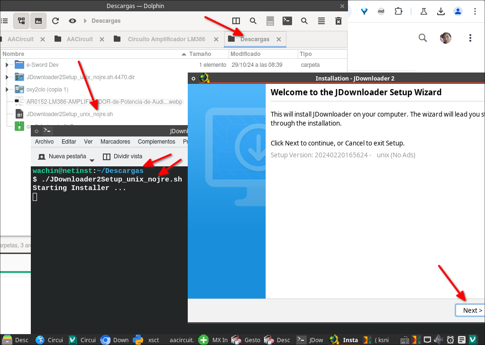
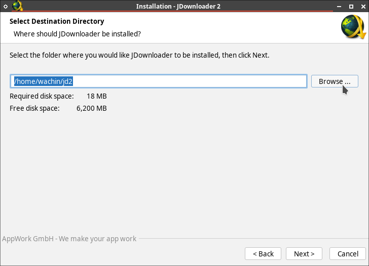
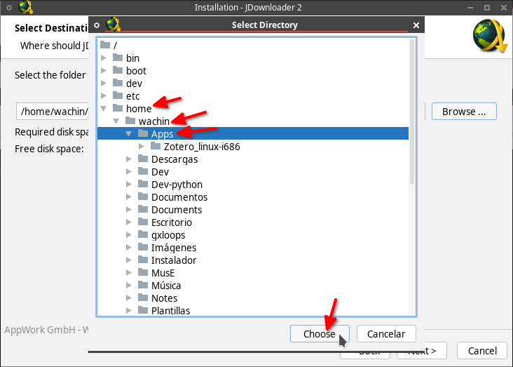
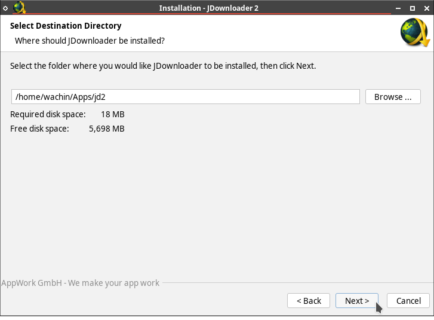

# Tutorial: Instalación de JDownloader en Linux

## Requisitos Previos
- Una distribución Linux (Ubuntu, Debian, Fedora, etc.)
- Java Runtime Environment (JRE) instalado
- Acceso a internet

## Método 1: Instalación usando Java Web Start (Recomendado)

1. Primero, asegúrate de tener Java instalado:
```
java -version
```

2. Si Java no está instalado, instálalo:
   - Para Ubuntu/Debian:
   ```
   sudo apt update
   sudo apt install default-jre
   ```
   - Para Fedora:
   ```
   sudo dnf install java-latest-openjdk
   ```

3. Descarga JDownloader:
   - Visita la página oficial: [http://jdownloader.org/download/index](http://jdownloader.org/download/index)
   - Descarga el archivo terminado en .sh

4. Dale permisos de ejecución al archivo:
```
chmod +x ~/Downloads/JDownloader2Setup_unix_nojre.sh
```

También es posible que el nombre varíe en algún momento, y también se puede darle permisos de ejecución con clic derecho en el administrador de archivos y en la pestaña Permisos marcarlo como ejecutable

5. Ejecuta el instalador

Abre una terminal donde está el archivo .sh y ejemplo con el siguiente nombre ejecutalo así:

```
./JDownloader2Setup_unix_nojre.sh
```
**Nota:** El nombre del archivo .sh puede variar, debe escribirlo correctamente de acuerdo a como lo descargó

al ejecutarlo se abrirá la ventana del instalador

6. Sigue el asistente de instalación gráfico



siguiente . . pero cuando te pida seleccionar la carpeta donde tu quiera que Jdownloader sea instalado seleccionala en "Browser":



y allí selecciona una, ejemplo yo tengo una carpeta con el nombre Apps y allí tengo aplicaciones de Linux:



y allí si Next:



## Configuración Post-Instalación

Configura la carpeta de descargas predeterminada:
   - Ve a Ajustes > Opciones
   - Busca "Carpeta de Descargas"
   - Selecciona tu carpeta preferida

## Solución de Problemas Comunes

Si las descargas son lentas:
   - Configura el número máximo de conexiones simultáneas
   - Verifica tu conexión a internet
   - Comprueba si tu ISP está limitando las descargas

## Notas Adicionales

- Puedes acceder a JDownloader remotamente usando [MyJDownloader](https://my.jdownloader.org/)
- Se recomienda mantener JDownloader actualizado para mejor rendimiento y seguridad

Dios les bendiga