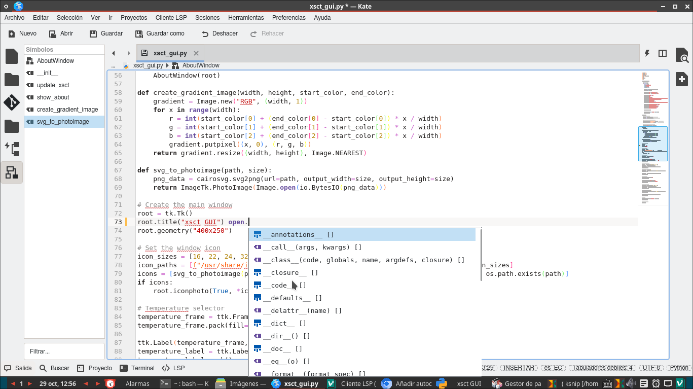
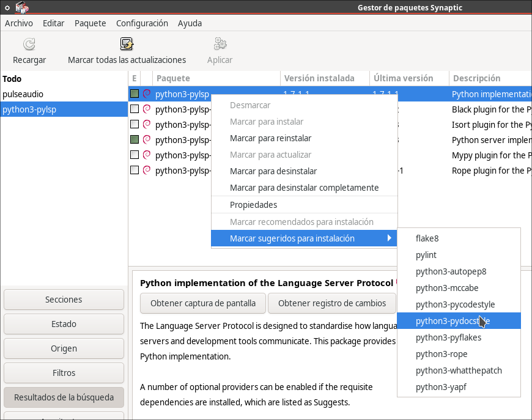
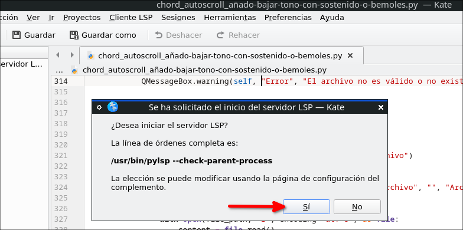
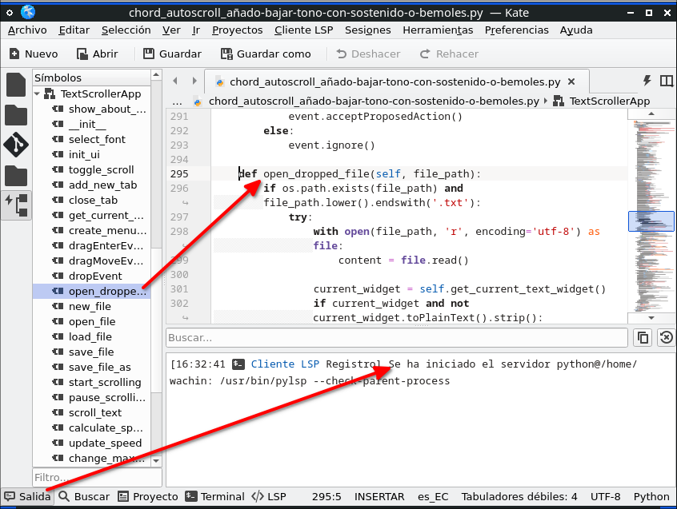
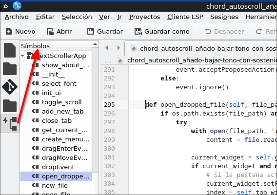

# Habilitar formato automático o autocompletado con Cliente LSP (python3-pylsp) en Kate ("Esquema de Símbolos" python y otros lenguajes)

En el editor de texto Kate es posible habilitar funciones como el formato automático o el autocompletado de código al momento de escribir, así como ejemplo en VS Code

La siguiente imagen es del Editor de Texto Kate con el autocompletado habilitado para el lenguaje de porgramación python:

 


## Dependencias
Necesitamos instalar el paquete:

```
python3-pylsp
```

sugiero instalarlo desde Synaptic

Este paquete instala automáticamente: python3-docstring-to-markdown y ese paquete en synaptic tiene el enlace: https://github.com/python-lsp/docstring-to-markdown con las instrucciones de instalación, pero sólo es para 64 bit

Además este paquete sugiere otros paquetes:





La descripción de esos paquetes es la siguiente los cuales si usted desea lo spuede instalar allí con clic derecho:


**flake8**

Comprobador de código que utiliza pycodestyle y pyflakes

Flake8 es un contenedor de PyFlakes, pycodestyle y el script Ned's McCabe.
Flake8 ejecuta todas las herramientas iniciando el script único 'flake8', pero ignora
las opciones extendidas de pycodestyle y PyFlakes y solo utiliza valores predeterminados. Muestra
las advertencias en una salida fusionada por archivo.

**pylint**

Comprobador estático de código Python 3 y generador de diagramas UML

Pylint es un analizador de código fuente Python que busca errores de programación, ayuda a aplicar un estándar de codificación y detecta olores de código (tal como se define en el libro Refactoring de Martin Fowler).

Pylint puede considerarse otro PyChecker, ya que casi todas las pruebas que puede hacer con PyChecker también se pueden hacer con Pylint. Sin embargo, Pylint
ofrece algunas funciones más, como comprobar la longitud de las líneas de código, comprobar si los nombres de las variables están bien formados de acuerdo con su estándar de codificación o comprobar si las interfaces declaradas están realmente implementadas,
y mucho más.

Además, es posible escribir complementos para agregar sus propias comprobaciones.

El paquete también incluye los siguientes comandos adicionales:

* pyreverse: un generador de diagramas UML
* symilar: un verificador de similitudes independiente
* epylint: Pylint compatible con Emacs y Flymake


**python3-autopep8**

Herramienta que formatea automáticamente el código Python para que cumpla con PEP 8

autopep8 formatea automáticamente el código Python para que cumpla con la guía de estilo
de PEP 8. Utiliza la utilidad pep8 para determinar qué partes del código deben formatearse. autopep8 es capaz de solucionar la mayoría de los problemas de formato que
pueden ser reportados por pep8. Este paquete es para Python3.

**python3-mccabe**

Comprobador de complejidad de código Python (Python 3)

Este módulo proporciona un complemento para el comprobador de código Python de flake8 para ejecutar el script de complejidad de código de McCabe en código Python 3.

Este paquete proporciona únicamente enlaces de módulos de Python 3.

**python3-pycodestyle**

Comprobador de guía de estilo de Python (antes llamado pep8) - Python 3.x

Cuenta con una arquitectura de complementos que permite agregar nuevas comprobaciones fácilmente.
Salida analizable que enumera los números de línea de la ubicación del error. Consta de
solo un archivo Python y solo requiere stdlib.

Este paquete contiene el módulo Python 3.x.

**python3-pydocstyle**

Comprobador de estilo de cadenas de documentación de Python (biblioteca de Python 3)

PEP-257 proporciona convenciones para cadenas de documentación de Python (literales de cadena que
aparecen como primera declaración en una definición de módulo, función, clase o método
con fines de documentación). Esta herramienta comprueba el código Python para ver si se han cumplido estas convenciones y si faltan cadenas de documentación.

Este paquete instala la biblioteca para Python 3.

**python3-pyflakes**

Comprobador pasivo de programas Python 3 - Módulos Python

Pyflakes es un programa para analizar programas Python y detectar varios
errores. Funciona analizando el archivo fuente, no importándolo, por lo que
es seguro usarlo en módulos con efectos secundarios. También es mucho más rápido.

A diferencia de PyLint, Pyflakes solo verifica errores lógicos en los programas;
no realiza ninguna verificación de estilo.

Esta es la versión de la biblioteca Python 3.

**python3-rope**

Biblioteca de refactorización de Python 3

Rope es una biblioteca de refactorización de Python que se puede utilizar con varios editores
e IDE. Proporciona muchas operaciones de refactorización, así como formas de asistencia de código, como autocompletado y acceso a la documentación. Para utilizar la
refactorización en los repositorios Mercurial, Git y Svn, se deben instalar los paquetes recomendados. Para obtener una lista completa de las características, consulte la página de inicio del proyecto.

Esto proporciona la versión Python3 de la biblioteca.

**python3-whatthepatch**

Biblioteca para analizar archivos de parches (Python 3)

What The Patch!? es una biblioteca para analizar archivos de parches. Su único propósito
es leer un archivo de parches y convertirlo en un formato que otros
programas puedan usar.

Este paquete instala la biblioteca para Python 3.

**python3-yapf**

Módulos públicos para yapf (Python 3)

Yapf es una herramienta que reformatea el código para que tenga el mejor formato posible, de acuerdo con la
guía de estilo. No solo se ocupa de los errores de pelusa, sino también de la
apariencia estilística del código Python. La idea también es similar a la herramienta 'gofmt'
para el lenguaje de programación Go. Este paquete instala la herramienta para Python 2.

Este paquete proporciona los módulos para Python 3.


## Activar el Cliente LSP en Kate
después de instalar el paquete indicado cierre Kate si lo tenía abierto y vuelvalo a abrir y debería aparecer este mensaje en una ventana:



pongale que si y aparecerá así:




pero si no aparece lo puede instalar así, en Kate ir y marcar en:

**Preferencias > Configurar Kate >  Complementos > (*) Cliente LSP**

Al hacer esto en el panel izquierdo aparecerá un icono que al pasar encima el cursor dice:

Esquema de Simbolos



## Añadir el código lspclient manualmente para que funcione en no KDE Linux
Si usas un Sistema Operativo ejemplo Debian que no es KDE, puede ser que no funcione, si fuera así verifíquelo al poner en la terminal:

```
kate ~/.config/kate/lspclient/settings.json
```

dejo abierto ese archivo y de la siguiente dirección copiar todo el contenido (Ctrl + A):

[https://github.com/KDE/kate/blob/master/addons/lspclient/settings.json
](https://github.com/KDE/kate/blob/master/addons/lspclient/settings.json)

**Nota:** Ese archivo contiene las url de las paginas web con las instrucciones para instalar esos lenguajes de programación arriba mencionados.

una vez que he copiado el contenido debe pegar el contenido en el archivo que dejamos abierto y guardar y cerrar esa pestaña en Kate

Cuando usted cierre Kate y lo abra otra vez a Kate y abra un script en python se verá el esquema del script en la izquierda de Kate, solo que se demora un poco en activarse, pero solo es de esperar. Además si abra ejemplo un archivo .m markdown se verá a la izquierda abajo un botón en Kate llamado "Salida" que al darle clic está la url donde debemos ir para instalar el lenguaje de programación pues allí estarán las instrucciones.


## Marksman (64 bit)

Al copiar el enlace que me da al abrir un archivo markdown (a la izquierda abajo en el botón en Kate llamado "Salida"):

[https://github.com/artempyanykh/marksman/blob/main/docs/install.md](https://github.com/artempyanykh/marksman/blob/main/docs/install.md)

y entrar en un navegador web, veo las instrucciones, pero allí falta para Debian 12 de 32 bit así que no lo instalo.


  
**CONSULTAS**

**How to enable Kate's LSP Client for HTML and PHP?**
[https://www.reddit.com/r/kde/comments/y34v70/how_to_enable_kates_lsp_client_for_html_and_php/](https://www.reddit.com/r/kde/comments/y34v70/how_to_enable_kates_lsp_client_for_html_and_php/)

**Kate - LSP Client Status**
[https://kate-editor.org/post/2020/2020-01-01-kate-lsp-client-status/ ](https://kate-editor.org/post/2020/2020-01-01-kate-lsp-client-status/%20)