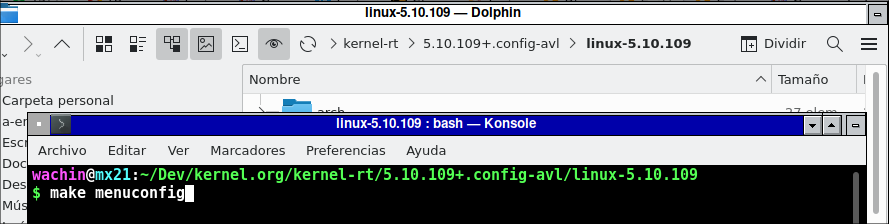
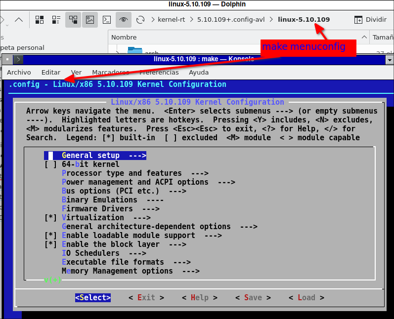
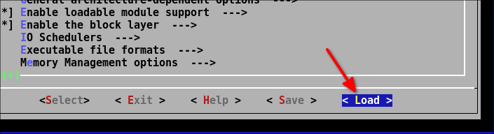
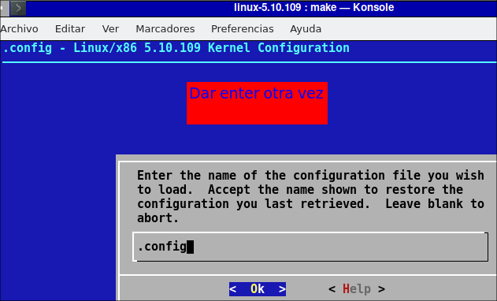
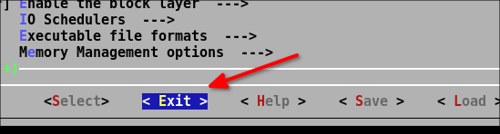
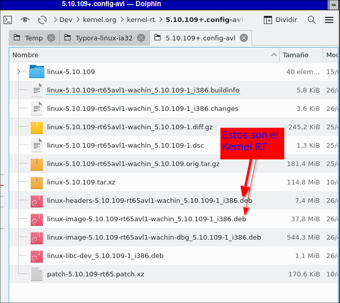

# Creando Kernel de Tiempo Real (Real Time) para MX Linux 21
En los repositorios de Sistemas Operativos Linux basados en Debian como ejemplo MX Linux y otros está disponible para instalar un Kernel Real Time (RT). Primero es necesario recargar los repositorios:
 
    sudo apt-get update
 
luego instalar las actualizaciones si es que las hayan enviado:
 
    sudo apt-get upgrade

Los siguientes dos paquetes que tienen dentro del nombre: image y headers son paquetes de configuración que instalan automáticamente el último Kernel RT que esté disponible

**Instalar Kernel Realtime para 32 bits desde Debian repo**
Si su ordenador usa 32 bits, poner en la terminal:

    sudo apt-get install dkms linux-image-rt-686-pae linux-headers-rt-686-pae


**Instalar Kernel Realtime para 64 bits desde Debian repo**
Si su ordenador usa 64 bits, poner en la terminal:

    sudo apt-get install dkms linux-image-rt-amd64 linux-headers-rt-amd64
    
## Kernel Instalado
Pero a la fecha 16 de marzo del 2024 en MX Linux 21 de 32 bit el Kernel RT que se instala es la versión 5.10.0-28 y a veces cuando enciendo un ordenador que armé con la tarjeta madre que me regaló mi primo Paco, información de la misma la cual se puede conocer poniendo en una terminal:

    sudo dmidecode -t 2

con lo cual sé que es un:

ASUSTek Computer INC. LEONITE Version: 5.00 Serial Number: MS1C6CS29109829

les cuento que a veces al encender el ordenador y en el grub al elegir ese Kernel 5.10.0-28 a veces se cuelga y no se puede poner la contraseña para iniciar sesión. Pero otro Kernel 5.6 de [AV Linux el que yo compilé](https://facilitarelsoftwarelibre.blogspot.com/2022/04/compilando-kernel-de-av-linux-en-mx.html) siempre va bien, nunca se cuelga esa PC, será porque es muy muy vieja y es más compatible el Kernel 5.6 con el hardware antiguo. Esta es la razón por la cual compilar un Kernel Real Time desde kernel.org porque allí uno puede elegir versiones antiguas que no están en Synaptic

## Añadir el nombre del Mantenedor o Responsable a su Sistema para que se compile con ese nombre (Opcional)
Esto es totalmente opcional, no es necesario para compilar el Kernel, pero si lo hace una vez instalado el  Kernel al revisarlo en Synaptic se verá allí su nombre y su correo

Para hacer esto ponga en una terminal lo siguiente (teniendo instalado Gedit):

```
gedit ~/.bashrc 
```

allí debe llegar hasta abajo y con enter hacerse un espacio::


[](https://draft.blogger.com/#)

 y allí debe de poner lo siguiente:

DEBEMAIL="your.email.address@example.org"
DEBFULLNAME="Firstname Lastname"
export DEBEMAIL DEBFULLNAME

y cambiar con sus datos, a mi me queda así: 

[](https://draft.blogger.com/#)

ahora  cierro Gedit y reinicio el ordenador. 

# ¿Qué versión de Kernel está instalado en mi Sistema Operativo?

Primero debe saber qué kernel trae su distrubución, pongo en la terminal:

`uname -r` 

y me da:

5.10.0-13-686-pae

entonces se que si instalo una versión como esa debería de funcionar, o sea esto es para tener una idea

# Instalar dependencias

Debemos instalar las siguientes dependencias para poder compilarlo:

```sudo apt-get install libncurses5-dev fakeroot wget xz-utils flex bison libssl-dev```

# Elegir la versión del código fuente del Kernel a Compilar

Ahora es necesario ver cual Kernel se podría instalar, y es necesario saber que en la siguiente página ellos tienen los Kernel con Soporte de Largo Plazo (LTS) y nos conviene usarlos pues los mantienen actualizados en cuantos a seguridad. Diríjase a:

**Longterm release kernels**
[https://www.kernel.org/category/releases.html](https://www.kernel.org/category/releases.html)

**Nota**: Si sepan Inglés les aconsejo que lean, esa entrada, o que la traduzcan en [Google Traductor](https://translate.google.com/)

Allí encuentro y copio la siguiente información en esta fecha 2022-06-15:

```
Version Maintainer 	                        Released 	Projected EOL
5.15 	Greg Kroah-Hartman & Sasha Levin 	2021-10-31 	Oct, 2023
5.10 	Greg Kroah-Hartman & Sasha Levin 	2020-12-13 	Dec, 2026
5.4 	Greg Kroah-Hartman & Sasha Levin 	2019-11-24 	Dec, 2025
4.19 	Greg Kroah-Hartman & Sasha Levin 	2018-10-22 	Dec, 2024
4.14 	Greg Kroah-Hartman & Sasha Levin 	2017-11-12 	Jan, 2024
4.9 	Greg Kroah-Hartman & Sasha Levin 	2016-12-11 	Jan, 2023
```

entonces lo más seguro es que funcione una versión:

5.10
5.15

# Versión de Kernel elegida para buscar el Parche Real Time correcto

Voy a usar una versión del Kernel:

5.10

entonces con esto en mente debo buscar un parche Real Time para esta versión, para esto me dirijo a:

**Proyectos Real Time**  
[https://mirrors.edge.kernel.org/pub/linux/kernel/projects/rt](https://mirrors.edge.kernel.org/pub/linux/kernel/projects/rt)

allí entre toda la lista busco el número 

5.10

y allí dentro busco un patch para la versión 5.10 y a esta fecha que hago este tutorial encuentro el más actual que es:

patch-5.10.109-rt65.patch.xz                       07-Apr-2022 03:09    171K

y me descargo ese. Aquí pongo el enlace completo:

[https://mirrors.edge.kernel.org/pub/linux/kernel/projects/rt/5.10/patch-5.10.109-rt65.patch.xz](https://mirrors.edge.kernel.org/pub/linux/kernel/projects/rt/5.10/patch-5.10.109-rt65.patch.xz)

pero les explico que luego es muy posible que este enlace ya no esté disponible porque ellos generalmente andan haciendo actualizaciones (en los Kernel que están en continuo mantenimiento LTS)

# Buscar el código fuente correcto para el mismo parque RT

Me dirijo a:

**Linux Kernel**  
[https://mirrors.edge.kernel.org/pub/linux/kernel/](https://mirrors.edge.kernel.org/pub/linux/kernel/)

allí dentro busco:

v5.x

y allí encuentro:

[https://mirrors.edge.kernel.org/pub/linux/kernel/v5.x/](https://mirrors.edge.kernel.org/pub/linux/kernel/v5.x/)


y allí dentro encuentro el código fuente que encaja con el parque:

linux-5.10.109.tar.xz                              28-Mar-2022 08:03    115M

[https://mirrors.edge.kernel.org/pub/linux/kernel/v5.x/linux-5.10.109.tar.xz](https://mirrors.edge.kernel.org/pub/linux/kernel/v5.x/linux-5.10.109.tar.xz)

**Nota:** Con el paso del tiempo este archivo ya no estará disponible porque lo actualizan en los Kernel LTS (cuando encuentran una vulnerabilidad la corrigen)

# Resumen de Descarga

Haré un resumen de los enlaces para poner en la terminal y descargar. Le aconsejo que esto lo haga dentro de alguna carpeta:

**Parche RT**

    wget -c https://mirrors.edge.kernel.org/pub/linux/kernel/projects/rt/5.10/patch-5.10.109-rt65.patch.xz

**Kernel**

    wget -c https://mirrors.edge.kernel.org/pub/linux/kernel/v5.x/linux-5.10.109.tar.xz

# Aplicación del Parche RT

Ubíquese en una terminal en el lugar donde está el parche y el código fuente:

patch-5.10.109-rt65.patch.xz
linux-5.10.109.tar.xz

y ponga:

```tar xJvf linux-5.10.109.tar.xz
tar xJvf linux-5.10.109.tar.xz
cd linux-5.10.109
xzcat ../patch-5.10.109-rt65.patch.xz | patch -p1
```

# Usando el archivo de configuración de AV Linux
Allí mismo ponga en la terminal:
```
wget https://github.com/wachin/AV-Linux-archivos-importantes/raw/master/AVL-MXE-2021.05.22-xfce4-openbox-i386.iso/usr/src/linux-headers-5.9.1-rt19avl1/.config
```
con esto colocamos allí el archivo oculto (para verlo aplaste Ctrl + H):

.config

que como hemos parchado el Kernel a RT habilita las siguientes configuraciones para convertirlo en un Kernel Real Time:

```
# Enabled CCONFIG_NO_HZ_IDLE
 -> General setup
  -> Timers subsystem
   -> Timer tick handling (Full dynticks system (tickless))
    (X) Idle dynticks system (tickless idle)

# Enabled CONFIG_HIGH_RES_TIMERS
 -> General setup
  -> Timers subsystem
   [*] High Resolution Timer Support

# Enabled CONFIG_PREEMPT_RT
 -> Processor type and features
  -> Preemption Model (Fully Preemptible Kernel (Real-Time))
   (X) Fully Preemptible Kernel (Real-Time)

# Enabled CONFIG_HZ_1000 
 -> Processor type and features
  -> Timer frequency (1000 HZ)
   (X) 1000 HZ

# Enabled CPU_FREQ_DEFAULT_GOV_PERFORMANCE
 ->  Power management and ACPI options
  -> CPU Frequency scaling
    -> Default CPUFreq governor
     (X) performance
```

Sobre estas configuraciones información:

| Configuración en .config                                     | Descripción                                                  |
| ------------------------------------------------------------ | ------------------------------------------------------------ |
| [CONFIG_NO_HZ_IDLE](https://cateee.net/lkddb/web-lkddb/NO_HZ_IDLE.html) | Esta opción habilita un sistema inactivo sin señales: las interrupciones del temporizador solo se activarán según sea necesario cuando el sistema esté inactivo. Esto suele ser interesante para el ahorro de energía. |
| [CONFIG_HIGH_RES_TIMERS](https://cateee.net/lkddb/web-lkddb/HIGH_RES_TIMERS.html) | Esta opción habilita la compatibilidad con el temporizador de alta resolución. Si su hardware no es compatible, esta opción solo aumenta el tamaño de la imagen del kernel. |
| [CONFIG_PREEMPT_RT](https://rt.wiki.kernel.org/index.php/CONFIG_PREEMPT_RT_Patch) | El conjunto de parches [CONFIG_PREEMPT_RT](http://www.kernel.org/pub/linux/kernel/projects/rt/) lo mantiene un pequeño grupo de desarrolladores principales encabezado por Ingo Molnar. Este parche permite adelantarse a casi todo el kernel, con la excepción de unas pocas regiones de código muy pequeñas ("regiones críticas raw_spinlock"). Esto se hace reemplazando la mayoría de los spinlocks del kernel con mutexes que admiten la [herencia de prioridad](https://rt.wiki.kernel.org/index.php/Priority_inheritance), así como también moviendo todas las interrupciones y las interrupciones de software a los subprocesos del kernel.<br/><br/>Puede encontrar un [RT_PREEMPT_HOWTO](https://rt.wiki.kernel.org/index.php/RT_PREEMPT_HOWTO) detallado en esta página.<br/><br/>Paul McKenney ha escrito una buena [descripción general de CONFIG_PREEMPT_RT](http://lwn.net/Articles/146861/) que es una buena introducción a los cambios introducidos en el kernel por el parche CONFIG_PREEMPT_RT.<br/><br/>[Aquí](http://osadl.org/RT) se encuentra disponible una descripción general de los diversos componentes del parche CONFIG_PREEMPT_RT y su estado de fusión en el núcleo de la línea principal. |
| [CONFIG_HZ_1000](https://cateee.net/lkddb/web-lkddb/HZ_1000.html) | 1000 Hz es la opción preferida para sistemas de escritorio y otros sistemas que requieren respuestas interactivas rápidas a eventos. |
| [CPU_FREQ_DEFAULT_GOV_PERFORMANCE](https://www.linuxtopia.org/online_books/linux_kernel/kernel_configuration/re168.html) | Esto establece la frecuencia de forma estática a la frecuencia más alta admitida por la CPU |

Ese archivo .config el cual tiene las configuraciones del Kernel de AV Linux del 2021 lo extraje de la ISO del mismo y lo subí a GitHub:

[https://github.com/wachin/AV-Linux-archivos-importantes/tree/master/AVL-MXE-2021.05.22-xfce4-openbox-i386.iso/usr/src/linux-headers-5.9.1-rt19avl1](https://github.com/wachin/AV-Linux-archivos-importantes/tree/master/AVL-MXE-2021.05.22-xfce4-openbox-i386.iso/usr/src/linux-headers-5.9.1-rt19avl1)

Ahora poner allí mismo en la terminal:

`make menuconfig`



y al ejecutar:



## VERIFICANDO SOPORTE EXFAT (OPCIONAL)

Yo utilizo particiones exFAT y si este Kernel no tiene soporte no me sirve, para verificar si tiene entro en:

File Systems ---> DOS/FAT/exFAT 

y este Kernel si tiene


## No hacer ningún cambio en la configuración del Kernel 

No es necesario hacer ningún cambio pues ese archivo .config ya tiene las configuraciones para el Kernel RT de [AV Linux](http://www.bandshed.net/) 2021

Presionaremos la tecla Tab o con la  flecha derecha para ubicarnos en el menú:

Load



y dar Enter, y cuando dice Ok dar Enter otra vez



Ahora con Tab o flecha derecha llegar hasta Exit y dar Enter:



y enter en la nueva configuración:


## ELEGIR LA VELOCIDAD DE COMPILACIÓN

Este paso es opcional, podemos exportar el nivel de concurrencia para la compilación *(Concurrencia es la acción de concurrir distintos  sucesos o cosas en un mismo lugar o tiempo)*, para esto existen las siguientes opciones dependiendo de la cantidad de procesadores que usted tenga, para esto hay una regla la de agregar el número uno al número de núcleos que tenga su procesador, ejemplo:

 

Si usted tenga 2 núcleos debe poner
export CONCURRENCY_LEVEL=3

Si usted tenga 4 núcleos debe poner
export CONCURRENCY_LEVEL=5

 

Así, mi laptop es una Dell Inspiron 1750 y tiene dos núcleos así que yo debo de poner así:

```
export CONCURRENCY_LEVEL=3
```

esto es para que la compilación no se demore mucho

 

### Compinado el Kernel etiquetandolo  

Es  posible Compilar el Kernel y ponerle una etiqueta como descripción, en el siguiente ejemplo en LOCALVERSION= está la etiqueta  wachin:

```
make deb-pkg LOCALVERSION=-wachin KDEB_PKGVERSION=$(make kernelversion)-1
```

si se pone eso en la terminal con esa etiqueta será compilado el Kernel y eso aparecerá al final del nombre del deb

ahora pongo una imagen de lo que sale al poner el comando:

[](https://draft.blogger.com/#)

hay que esperar un buen rato hasta que termine la compilación, pueden ser horas

 . . . . . 

Bueno, ya se compiló, quizá se demoró unas 5 horas en compilar (depende del ordenador), ahora pongo una imágen de cómo me quedó



los dos deb:

linux-headers-5.10.109-rt65avl1-wachin_5.10.109-1_i386.deb
linux-image-5.10.109-rt65avl1-wachin_5.10.109-1_i386.deb

# Instalar el Kernel RT

Esos dos archivos deb son el Kernel, póngalos en una carpeta aparte e instalelos, abra una terminal allí y ponga:

`sudo dpkg -i *.deb`

y si desea los puede compartir en la Web

Si desea puede abrir Synaptic y buscar las palabras:

kernel image

o:

kernel header

y verá su nombre, su correo, y la etiqueta:


make deb-pkg LOCALVERSION=-wachin KDEB_PKGVERSION=$(make kernelversion)-1


salir


**BASADO EN:**

**Building realtime Linux for ROS 2 [community-contributed] — ROS 2 Documentation: Foxy documentation**
[https://docs.ros.org/en/foxy/Tutorials/Building-Realtime-rt_preempt-kernel-for-ROS-2.html](https://docs.ros.org/en/foxy/Tutorials/Building-Realtime-rt_preempt-kernel-for-ROS-2.html)

**System configuration [Linux-Sound]**
[https://wiki.linuxaudio.org/wiki/system_configuration#do_i_really_need_a_real-time_kernel](https://wiki.linuxaudio.org/wiki/system_configuration#do_i_really_need_a_real-time_kernel)

**Real-Time Linux | Toradex Developer Center**
[https://developer.toradex.com/linux-bsp/real-time/real-time-linux/#preempt-rt-patch-set](https://developer.toradex.com/linux-bsp/real-time/real-time-linux/#preempt-rt-patch-set)

**Guide for Debian Maintainers**
[https://www.debian.org/doc/manuals/debmake-doc/index.en.html](https://draft.blogger.com/#)
**Chapter 3. Tool Setups**
[https://www.debian.org/doc/manuals/debmake-doc/ch03.en.html#email-setup](https://draft.blogger.com/#)


