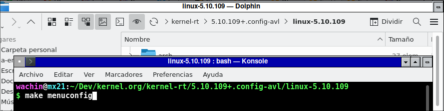
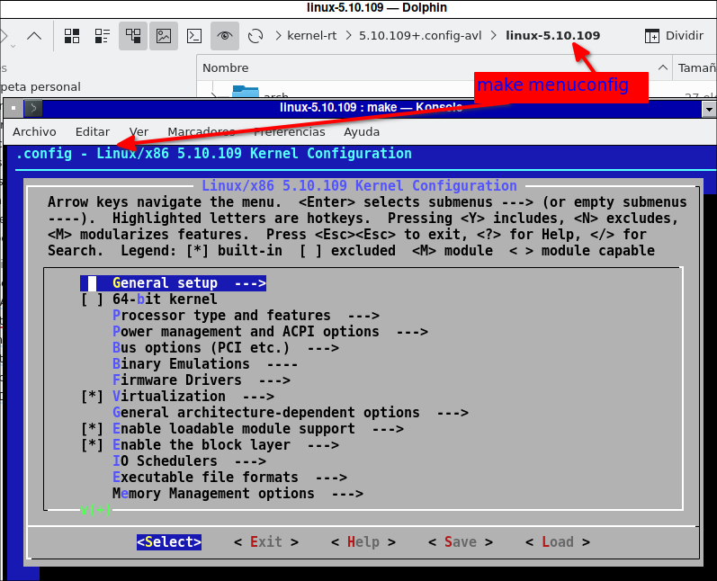
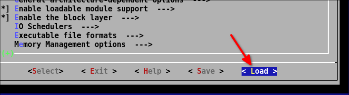
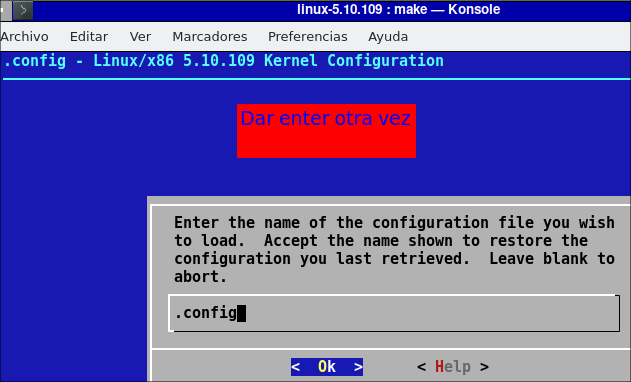
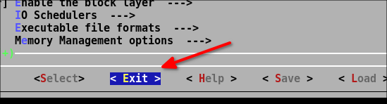
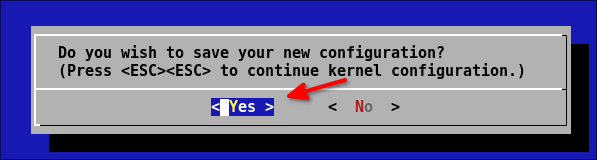
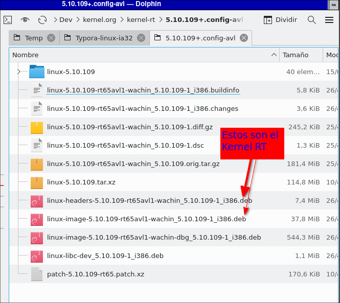

# Creando Kernel de Tiempo Real (Real Time) para MX Linux 21

### Añadir el nombre del Mantenedor o Responsable a su Sistema para que se compile con ese nombre (Opcional)

Esto es totalmente opcional, no es necesario para compilar el Kernel, pero si lo hace una vez instalado el  Kernel al revisarlo en Synaptic se verá allí su nombre y su correo

Para hacer esto ponga en una terminal lo siguiente (teniendo instalado Gedit):

```
gedit ~/.bashrc 
```

allí debe llegar hasta abajo y con enter hacerse un espacio::


[](https://draft.blogger.com/#)

 y allí debe de poner lo siguiente:

DEBEMAIL="your.email.address@example.org"
DEBFULLNAME="Firstname Lastname"
export DEBEMAIL DEBFULLNAME

y cambiar con sus datos, a mi me queda así: 

[](https://draft.blogger.com/#)

ahora  cierro Gedit y reinicio el ordenador. 

# ¿Qué versión de Kernel está instalado en mi Sistema Operativo?

Primero debe saber qué kernel trae su distrubución, pongo en la terminal:

`uname -r` 

y me da:

5.10.0-13-686-pae

entonces se que si instalo una versión como esa debería de funcionar.

# Instalar dependencias

Debemos instalar las siguientes dependencias para poder compilarlo:

```sudo apt-get install libncurses5-dev fakeroot wget xz-utils flex bison libssl-dev```

# Elegir la versión del código fuente del Kernel a Compilar

Ahora es necesario ver cual Kernel se podría instalar, y es necesario saber que en la siguiente página ellos tienen los Kernel con Soporte de Largo Plazo (LTS) y nos conviene usarlos pues los mantienen actualizados en cuantos a seguridad. Diríjase a:

**Longterm release kernels**
[https://www.kernel.org/category/releases.html](https://www.kernel.org/category/releases.html)

**Nota**: Si sepan Inglés les aconsejo que lean, esa entrada, o que la traduzcan en [Google Traductor](https://translate.google.com/)

Allí encuentro y copio la siguiente información en esta fecha 2022-06-15:

```
Version Maintainer 	                        Released 	Projected EOL
5.15 	Greg Kroah-Hartman & Sasha Levin 	2021-10-31 	Oct, 2023
5.10 	Greg Kroah-Hartman & Sasha Levin 	2020-12-13 	Dec, 2026
5.4 	Greg Kroah-Hartman & Sasha Levin 	2019-11-24 	Dec, 2025
4.19 	Greg Kroah-Hartman & Sasha Levin 	2018-10-22 	Dec, 2024
4.14 	Greg Kroah-Hartman & Sasha Levin 	2017-11-12 	Jan, 2024
4.9 	Greg Kroah-Hartman & Sasha Levin 	2016-12-11 	Jan, 2023
```

entonces lo más seguro es que funcione una versión:

5.10
5.15

# Versión de Kernel elegida para buscar el Parche Real Time correcto

Voy a usar una versión del Kernel:

5.10

entonces con esto en mente debo buscar un parque R eal Time para esta versión, para esto me dirijo a:

**Proyectos Real Time**

[https://mirrors.edge.kernel.org/pub/linux/kernel/projects/rt](https://mirrors.edge.kernel.org/pub/linux/kernel/projects/rt)

allí entre toda la lista busco el número 

5.10

y allí dentro busco un patch para la versión 5.10 y a esta fecha que hago este tutorial encuentro el más actual que es:

patch-5.10.109-rt65.patch.xz                       07-Apr-2022 03:09    171K

y me descargo ese. Aquí pongo el enlace completo:

[https://mirrors.edge.kernel.org/pub/linux/kernel/projects/rt/5.10/patch-5.10.109-rt65.patch.xz](https://mirrors.edge.kernel.org/pub/linux/kernel/projects/rt/5.10/patch-5.10.109-rt65.patch.xz)

pero les explico que luego es muy posible que este enlace ya no esté disponible porque ellos generalmente andan haciendo actualizaciones (en los Kernel que están en continuo mantenimiento LTS)

# Buscar el código fuente correcto para el mismo parque RT

Me dirijo a:

[https://mirrors.edge.kernel.org/pub/linux/kernel/](https://mirrors.edge.kernel.org/pub/linux/kernel/)

allí dentro busco:

v5.x

y allí encuentro:

[https://mirrors.edge.kernel.org/pub/linux/kernel/v5.x/](https://mirrors.edge.kernel.org/pub/linux/kernel/v5.x/)


y allí dentro encuentro el código fuente que encaja con el parque:

linux-5.10.109.tar.xz                              28-Mar-2022 08:03    115M

[https://mirrors.edge.kernel.org/pub/linux/kernel/v5.x/linux-5.10.109.tar.xz](https://mirrors.edge.kernel.org/pub/linux/kernel/v5.x/linux-5.10.109.tar.xz)

**Nota:** Con el paso del tiempo este archivo ya no estará disponible porque lo actualizan en los Kernel LTS (cuando encuentran una vulnerabilidad la corrigen)

# Resumen de Descarga

Haré un resumen de los enlaces para poner en la terminal y descargar. Le aconsejo que esto lo haga dentro de alguna carpeta:

**Parche RT**

    wget -c https://mirrors.edge.kernel.org/pub/linux/kernel/projects/rt/5.10/patch-5.10.109-rt65.patch.xz

**Kernel**

    wget -c https://mirrors.edge.kernel.org/pub/linux/kernel/v5.x/linux-5.10.109.tar.xz

# Aplicación del Parche RT

Ubíquese en una terminal en el lugar donde está el parche y el código fuente:

patch-5.10.109-rt65.patch.xz

linux-5.10.109.tar.xz

y ponga:

```tar xJvf linux-5.10.109.tar.xz
tar xJvf linux-5.10.109.tar.xz
cd linux-5.10.109
xzcat ../patch-5.10.109-rt65.patch.xz | patch -p1
```

# Usando el archivo de configuración de AV Linux
Allí mismo ponga en la terminal:
```
wget https://github.com/wachin/AV-Linux-archivos-importantes/raw/master/AVL-MXE-2021.05.22-xfce4-openbox-i386.iso/usr/src/linux-headers-5.9.1-rt19avl1/.config
```
con esto colocamos allí el archivo oculto (para verlo aplaste Ctrl + H):

.config

que contiene las siguientes configuraciones para convertirlo en un Kernel Real Time:

```
# Enable CONFIG_PREEMPT_RT
 -> General Setup
  -> Preemption Model (Fully Preemptible Kernel (Real-Time))
   (X) Fully Preemptible Kernel (Real-Time)

# Enable CONFIG_HIGH_RES_TIMERS
 -> General setup
  -> Timers subsystem
   [*] High Resolution Timer Support

# Enable CONFIG_NO_HZ_FULL
 -> General setup
  -> Timers subsystem
   -> Timer tick handling (Full dynticks system (tickless))
    (X) Full dynticks system (tickless)

# Set CONFIG_HZ_1000 (note: this is no longer in the General Setup menu, go back twice)
 -> Processor type and features
  -> Timer frequency (1000 HZ)
   (X) 1000 HZ

# Set CPU_FREQ_DEFAULT_GOV_PERFORMANCE [=y]
 ->  Power management and ACPI options
  -> CPU Frequency scaling
   -> CPU Frequency scaling (CPU_FREQ [=y])
    -> Default CPUFreq governor (<choice> [=y])
     (X) performance
```


Ese archivo .config el cual tiene las configuraciones del Kernel de AV Linux del 2021 lo extraje y lo subí a GitHub:

[https://github.com/wachin/AV-Linux-archivos-importantes/tree/master/AVL-MXE-2021.05.22-xfce4-openbox-i386.iso/usr/src/linux-headers-5.9.1-rt19avl1](https://github.com/wachin/AV-Linux-archivos-importantes/tree/master/AVL-MXE-2021.05.22-xfce4-openbox-i386.iso/usr/src/linux-headers-5.9.1-rt19avl1)

Ahora poner allí mismo en la terminal:

make menuconfig



y al ejecutar:



## No hacer ningún cambio en la configuración del Kernel 

No  es necesario hacer ningún cambio pues ese archivo .config ya tiene las  configuraciones para el Kernel RT de [AV Linux](http://www.bandshed.net/) (que yo le [extraje](https://github.com/wachin/AV-Linux-archivos-importantes/tree/master/AVL-MXE-2021.05.22-xfce4-openbox-i386.iso/usr/src/linux-headers-5.9.1-rt19avl1) a la iso de la versión 2021). 

Presionaremos la tecla Tab o con la  flecha derecha para ubicarnos en el menú:

Load



y dar Enter cuando dice Ok



Ahora con Tab o flecha derecha llegar hasta Exit y dar Enter:



y enter en la nueva configuración:




## ELEGIR LA VELOCIDAD DE COMPILACIÓN

Antes de empezar la compilación del Kernel necesitamos exportar el nivel de concurrencia (Concurrencia es la acción de concurrir distintos  sucesos o cosas en un mismo lugar o tiempo),  para esto existen las siguientes opciones dependiendo de la cantidad de procesadores que usted tenga, para esto hay una regla la de agregar el número uno al número de núcleos que tenga su procesador, ejemplo:

 

Si usted tenga 2 debe poner
export CONCURRENCY_LEVEL=3

Si usted tenga 4 debe poner
export CONCURRENCY_LEVEL=5

 

Así, mi laptop es una Dell Inspiron 1750 y tiene dos núcleos así que yo debo de poner así:

```
export CONCURRENCY_LEVEL=3
```

esto es para que la compilación no se demore mucho

 

#### Compinado el Kernel etiquetandolo  

Es  posible Compilar el Kernel y ponerle una etiqueta como descripción, en el siguiente ejemplo en LOCALVERSION= está la etiqueta  wachin:

```
make deb-pkg LOCALVERSION=-wachin KDEB_PKGVERSION=$(make kernelversion)-1
```

si se pone eso en la terminal con esa etiqueta será compilado el Kernel y eso aparecerá al final del nombre del deb

ahora pongo una imagen de lo que sale al poner el comando:

[](https://draft.blogger.com/#)

hay que esperar un buen rato hasta que termine la compilación, pueden ser horas

 . . . . . 

Bueno, ya se compiló, quizá se demoró unas 5 horas en compilar (depende del ordenador), ahora pongo una imágen de cómo me quedó



los dos deb:

linux-headers-5.10.109-rt65avl1-wachin_5.10.109-1_i386.deb
linux-image-5.10.109-rt65avl1-wachin_5.10.109-1_i386.deb

son el Kernel, póngalos en una carpeta aparte, y si desea los puede compartir en la Web


CONFIGURAR EL TIEMPO REAL


Fully Preemptible Kernel (Real Time)

Seleccionar en: 

General setup ---> Preemption Model (xxxx)--->

elegir:

- Fully Preemptible Kernel (Real Time)


exFAT

Este Kernel si tiene soporte:

File Systems ---> DOS/FAT/exFAT 


Timer Frecuency 1000 Hz
En:

Processor type and features ---> Timer Frecuency (xxx) ---

entrar y chequear la frecuencia a 1000 Hz


Default CPUFreq governor (schedutil)

 en:

Power management and ACPI options --- 

CPU Frequency scaling ---

Default CPUFreq governor (schedutil)

voy a ver si al usar otro .config cambia a performance


make deb-pkg LOCALVERSION=-wachin KDEB_PKGVERSION=$(make kernelversion)-1


salir


**BASADO EN:**

**Building realtime Linux for ROS 2 [community-contributed] — ROS 2 Documentation: Foxy documentation**
[https://docs.ros.org/en/foxy/Tutorials/Building-Realtime-rt_preempt-kernel-for-ROS-2.html](https://docs.ros.org/en/foxy/Tutorials/Building-Realtime-rt_preempt-kernel-for-ROS-2.html)

**System configuration [Linux-Sound]**
[https://wiki.linuxaudio.org/wiki/system_configuration#do_i_really_need_a_real-time_kernel](https://wiki.linuxaudio.org/wiki/system_configuration#do_i_really_need_a_real-time_kernel)

**Real-Time Linux | Toradex Developer Center**
[https://developer.toradex.com/linux-bsp/real-time/real-time-linux/#preempt-rt-patch-set](https://developer.toradex.com/linux-bsp/real-time/real-time-linux/#preempt-rt-patch-set)

**Guide for Debian Maintainers**
[https://www.debian.org/doc/manuals/debmake-doc/index.en.html](https://draft.blogger.com/#)
**Chapter 3. Tool Setups**
[https://www.debian.org/doc/manuals/debmake-doc/ch03.en.html#email-setup](https://draft.blogger.com/#)


