# Compilando un Kernel y personalizarlo en Linux

### Porqué compilar un Kernel para personalizarlo?

Deseo compilar un Kernel y personalizarlo porque tengo un ordenador de pocos recursos y voy a compilar el Kernel desabilitando la Virtualización y otros para alijerar el Kernel

Este tutorial lo estoy haciendo en MX Linux 21, pero lo puede usar en cualquier Linux basado en Debian, y podría adaptarlo para Ubuntu u otro Linux.

## Requisitos

- 40 GB de espacio de Disco
- 4 GB de memoria RAM como mínimo sería lo ideal, pero si tiene 3 GB lo puede compilar pero debe dejar cerradas las demás aplicaciones para evitar que le aparezca algún error desconocido.
- Debe hacer las cosas con cuidado cuando quiera configurar el Kernel, anote todo lo que hace, si aplasta flecha arriba, abajo, barra espaciadora, etc, vea bien todo lo que aplasta, anote lo que hace.

### Añadir el nombre del Mantenedor o Responsable a su Sistema para que se compile con ese nombre (Opcional)

Esta parte es totalmente opcional, no es necesario para compilar el Kernel, pero si lo hace una vez instalado el Kernel al revisarlo en Synaptic se verá allí su nombre y su correo, para hacerlo lo más fácil es hacer visibles a los archivos ocultos con Ctrl + H y darle clic derecho y abrir con algún editor de texto al archivo oculto:

.bashrc

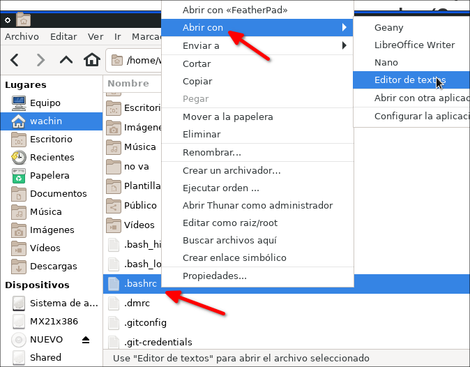

en la siguiente imagen está abierto con Gedit:

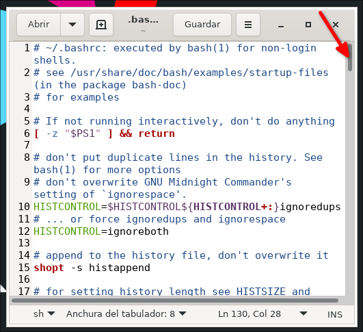

 y allí debe de poner lo siguiente:

DEBEMAIL="your.email.address@example.org"  
DEBFULLNAME="Firstname Lastname"  
export DEBEMAIL DEBFULLNAME  

y cambiar con sus datos.  

A mi me queda así: 

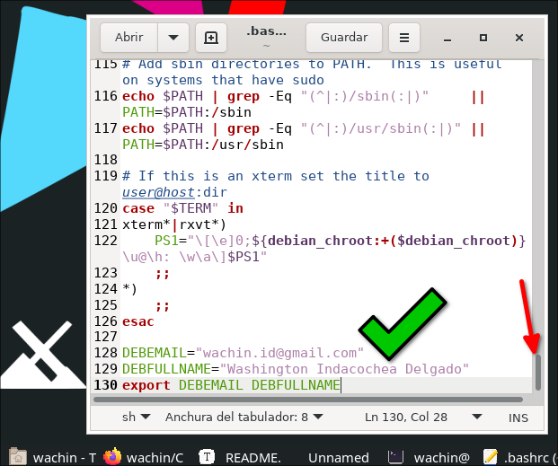

ahora guardo y cierro el editor de texto y cierro sesión y vuelo a entrar en el ordenador. 

# ¿Qué versión de Kernel está instalado en mi Sistema Operativo?

Primero debe saber qué kernel trae su distrubución para tener una idea de qué Kernel debe compilar, pongo en la terminal:

`uname -r` 

y me da:

5.10.0-20-amd64

entonces sé que si instalo una versión como esa debería de funcionar, o sea esto es para tener una idea

# Instalar dependencias

Debemos instalar las siguientes dependencias para poder compilarlo:

```
sudo apt-get install gcc build-essential libncurses5-dev fakeroot wget xz-utils flex bison libssl-dev autoconf automake cmake dwarves openssl libelf-dev libudev-dev libpci-dev libiberty-dev bc python3-sphinx lzop lzma lzma-dev libmpc-dev u-boot-tools gettext
```

**Nota:** Es posible que con el paso del tiempo se necesite alguna otra dependencia lo cual deberán de consultando con la información de error que les dé mientras lo compilan.

# Elegir la versión del código fuente del Kernel a Compilar

Ahora es necesario ver cual Kernel se podría instalar, y es necesario saber que en la siguiente página ellos tienen los Kernel con Soporte de Largo Plazo (LTS) y nos conviene usarlos pues los mantienen actualizados en cuantos a seguridad. Diríjase a:

**Longterm release kernels**
[https://www.kernel.org/category/releases.html](https://www.kernel.org/category/releases.html)

La siguiente captura de pantalla la hago con la fecha Enero 2024

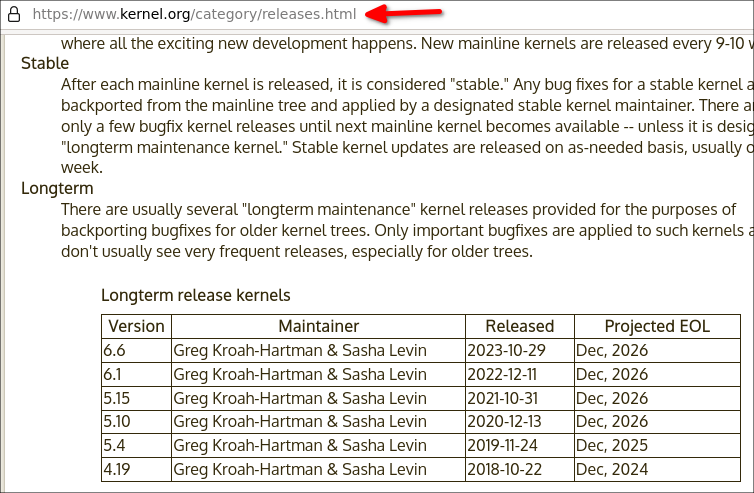

**Nota**: Si no sepan Inglés les aconsejo que la traduzcan en [Google Traductor](https://translate.google.com/)

Allí encuentro y copio la siguiente información:

```
Version 	Maintainer 	Released 	Projected EOL
6.6 	Greg Kroah-Hartman & Sasha Levin 	2023-10-29 	Dec, 2026
6.1 	Greg Kroah-Hartman & Sasha Levin 	2022-12-11 	Dec, 2026
5.15 	Greg Kroah-Hartman & Sasha Levin 	2021-10-31 	Dec, 2026
5.10 	Greg Kroah-Hartman & Sasha Levin 	2020-12-13 	Dec, 2026
5.4 	Greg Kroah-Hartman & Sasha Levin 	2019-11-24 	Dec, 2025
4.19 	Greg Kroah-Hartman & Sasha Levin 	2018-10-22 	Dec, 2024
```

entonces lo más seguro es que funcione una versión:

5.10
en adelante, porque esa está con la feha 2020.

# Buscar el código fuente correcto

La preguna importante es con qué criterio debo buscar el código fuente del Kernel? Debemos tener muy en cuenta la fecha en que compramos nuestro ordenador y de acuerdo a eso buscar el codigo fuente del Kernel

En mi caso el ordenador es del 2009 y debo usar la versión mas antigua del Kernel pero que se pueda instalar en el Linux que estoy usando y que esté actualizado

Me dirijo a:

**Linux Kernel**  
[https://mirrors.edge.kernel.org/pub/linux/kernel/](https://mirrors.edge.kernel.org/pub/linux/kernel/)

allí dentro busco el:

v5.x

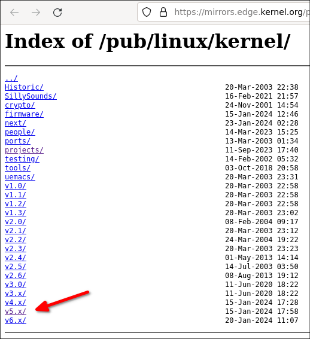

**Nota:** También luego intentaré con el v4.x porque tal vez pueda funcionar.

y allí encuentro:

[https://mirrors.edge.kernel.org/pub/linux/kernel/v5.x/](https://mirrors.edge.kernel.org/pub/linux/kernel/v5.x/)

y allí dentro busco un código fuente con el nombre:

Linux 5.10. . 

y elijo el siguiente:

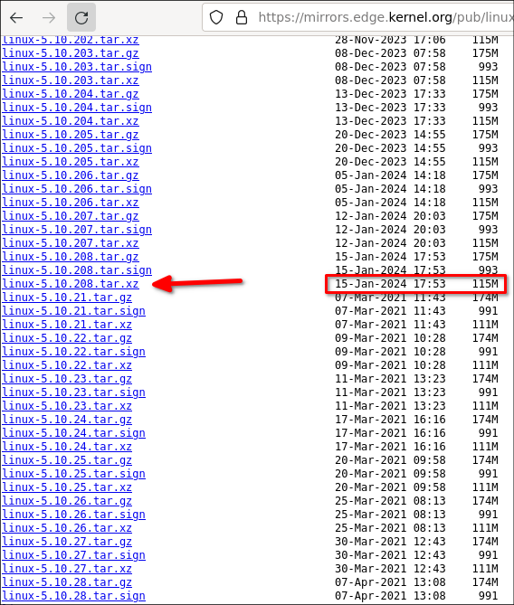

con la fecha actual que en este caso es 2024 y .tar.xz porque ocupa menos espacio:

linux-5.10.208.tar.xz                              15-Jan-2024 17:53    115M

y el siguiente es el enlace que lo copio de allí:

https://mirrors.edge.kernel.org/pub/linux/kernel/v5.x/linux-5.10.208.tar.xz

**Nota:** Con el paso del tiempo es posible que este archivo ya no esté disponible porque lo actualizán en los Kernel LTS (cuando encuentran una vulnerabilidad la corrigen)

# Descargandolo con wget

Primero les aconsejo que hagan la descarga en alguna carpeta para este proposito en algún lugar y allí abran una terminal y pongan ejemplo par mi caso es:

**Kernel**

    wget -c https://mirrors.edge.kernel.org/pub/linux/kernel/v5.x/linux-5.10.208.tar.xz

y extraer el contendio del Kernel

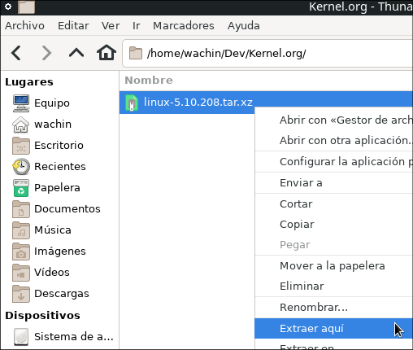

# Configurando el Kernel
Entrar en la carpeta del Kernel y abrir una terminal allí:

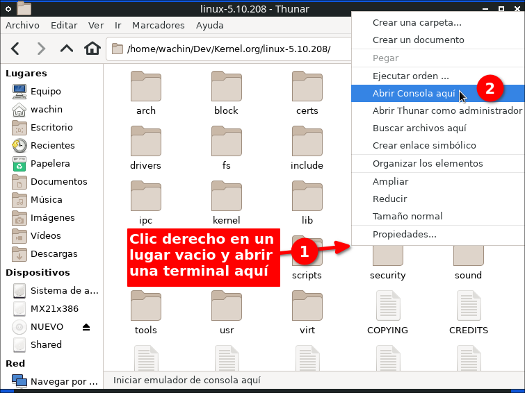

y poner allí en la terminal:

```
make menuconfig
```

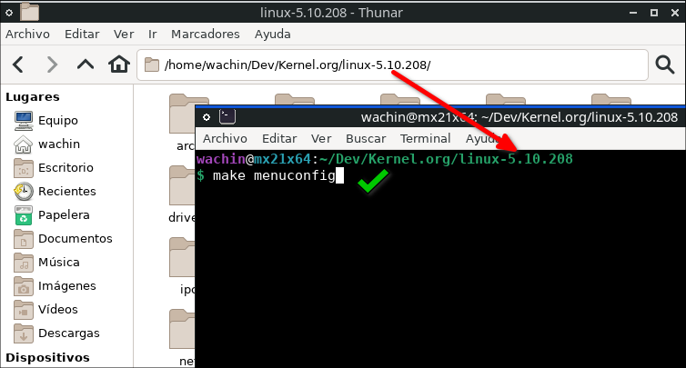

y al dar ENTER aparecerá la configuración del Kernel:

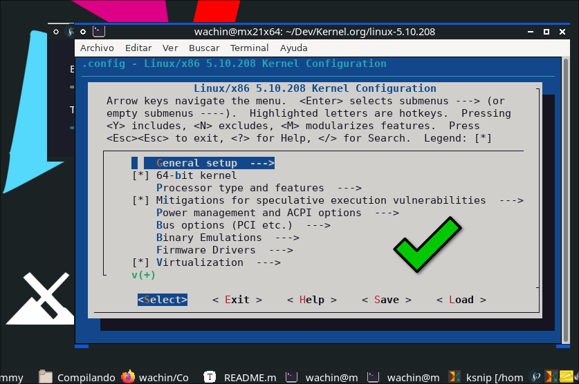

### Las opciones de ayuda

Allí dice:

Arrow keys navigate the menu.  <Enter> selects submenus ---> (or empty │  
  │  submenus ----).  Highlighted letters are hotkeys.  Pressing <Y>        │  
  │  includes, <N> excludes, <M> modularizes features.  Press <Esc><Esc> to exit│  
  │  <?> for Help, </> for Search.  Legend: [*] built-in  [ ] 

que traducido es:

Las teclas de flecha navegan por el menú. <Entrar> selecciona submenús ---> (o vacío │
   │ submenús ----). Las letras resaltadas son teclas de acceso rápido. Presionando <Y> │
   │ incluye, <N> excluye, <M> modulariza funciones. Presione <Esc><Esc> para salir│
   │ <?> para Ayuda, </> para Buscar. Leyenda: [*] incorporado [ ]

Es decir ejemplo que si presiono:

/

aparecerá un menú para buscar, y con doble Esc regreso atrás

## VERIFICANDO SOPORTE EXFAT (OPCIONAL)

Yo utilizo una particion exFAT para allí poner archivos que puedo consultar desde Linux y Windows pues tengo Dual Bool y si este Kernel no tiene soporte tendría que instalarselo, para verificar si tiene entro en la carpeta:

fs

la cual es la abreviación de File System

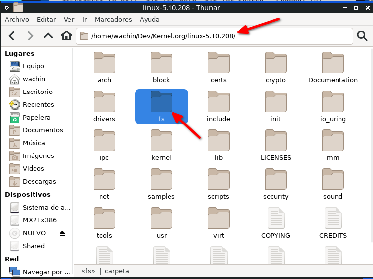

allí dentro en este kernel está la carpeta:

exfat

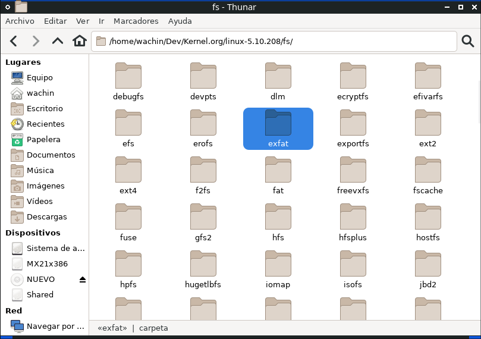

también en el menú de las configuraciones del Kernel se puede revisar en:

**File Systems ---> DOS/FAT/exFAT** 

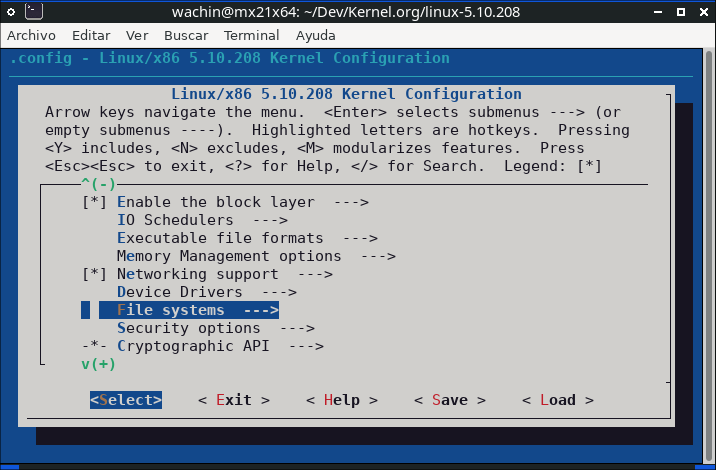 

y doy ENTER y con la flecha hacia abajo busco:

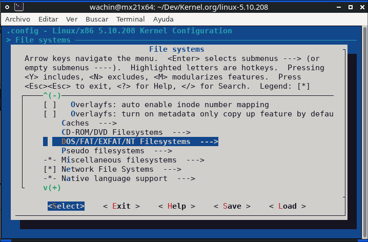

y este Kernel si tiene:

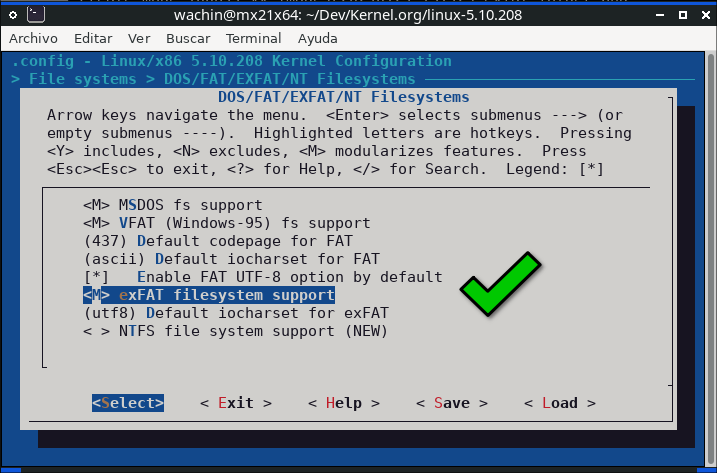

ahora retrocedo con Esc dos veces hasta llegar al inicio.

## Qué puedo desabilitar en el Kernel?

Según el siguiente tutorial:

https://berkinakkaya.medium.com/compiling-installing-a-custom-linux-kernel-195770f657be

tomaré cosas que pienso que podré desabilitar:

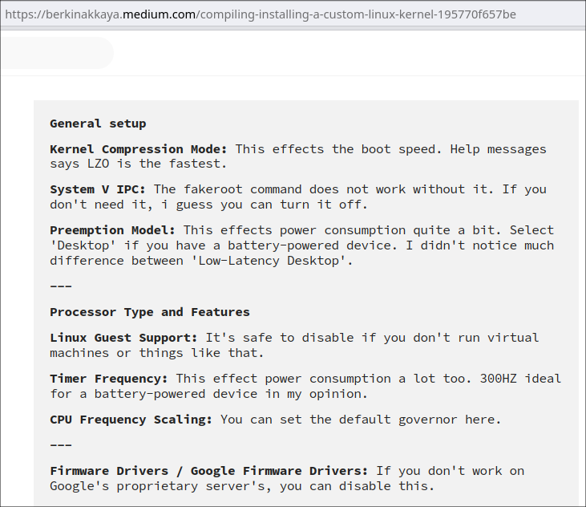

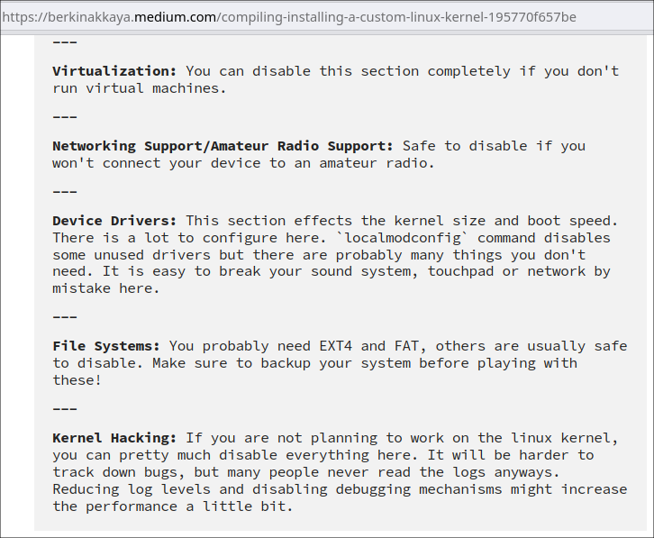

La compresión del Kernel

Según:

**Kernel configuration**

https://wiki.postmarketos.org/wiki/Kernel_configuration

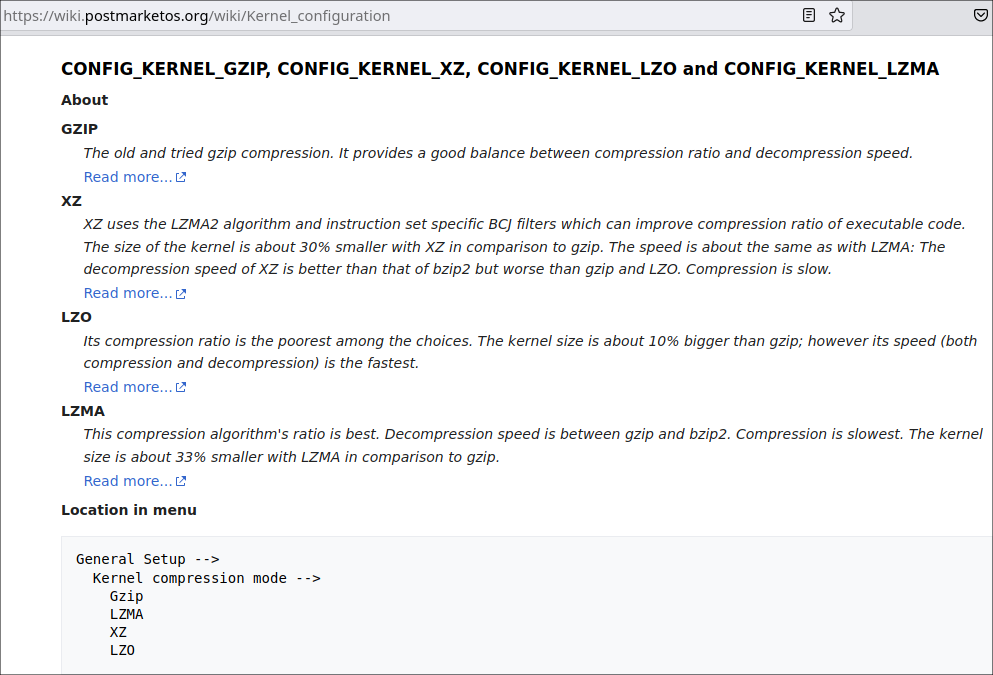

donde la traducción sería:

**GZIP**
     La vieja y probada compresión gzip. Proporciona un buen equilibrio entre la relación de compresión y la velocidad de descompresión.

**XZ**
     XZ utiliza el algoritmo LZMA2 y filtros BCJ específicos del conjunto de instrucciones que pueden mejorar la relación de compresión del código ejecutable. El tamaño del kernel es aproximadamente un 30% más pequeño con XZ en comparación con gzip. La velocidad es aproximadamente la misma que con LZMA: la velocidad de descompresión de XZ es mejor que la de bzip2 pero peor que la de gzip y LZO. La compresión es lenta.

**LZO**
     Su relación de compresión es la más pobre entre las opciones. El tamaño del kernel es aproximadamente un 10% mayor que el de gzip; sin embargo su velocidad (tanto de compresión como descompresión) es la más rápida.

**LZMA**
     La relación de este algoritmo de compresión es la mejor. La velocidad de descompresión está entre gzip y bzip2. La compresión es más lenta. El tamaño del kernel es aproximadamente un 33% más pequeño con LZMA en comparación con gzip.

Para llegar allí:

**General setup --->**

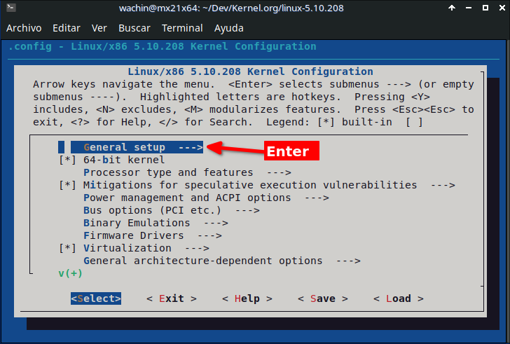

luego:

**Kernel compression mode (XZ)  --->**

--->.png)

y se ve por defecto:

XZ

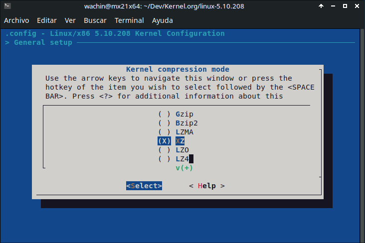

elijo:

**LZO**

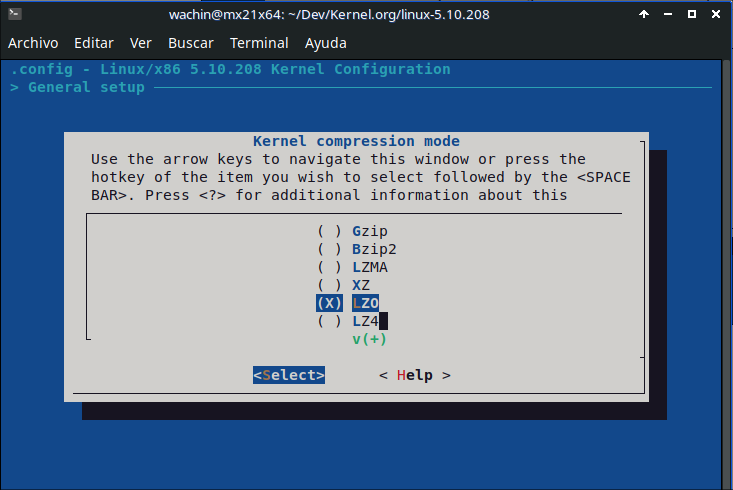

y lo veo ya activado:

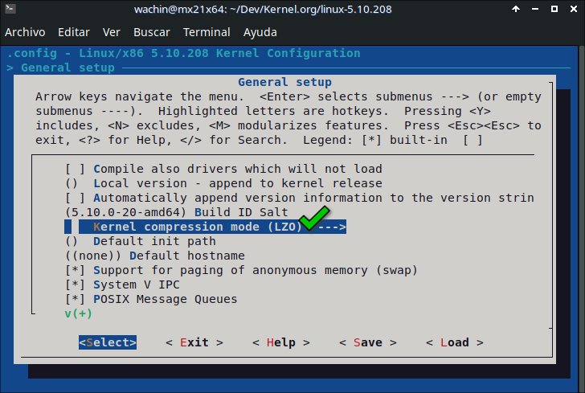

doy Esc dos veces más para llegar el inicio

### Desabilitando el Soporte para invitados de Linux

Yo no voy a usar este Sistema Operativo dentro de una máquina virtual así que lo voy a desabilitar:


entro allí:

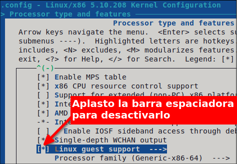

listo:

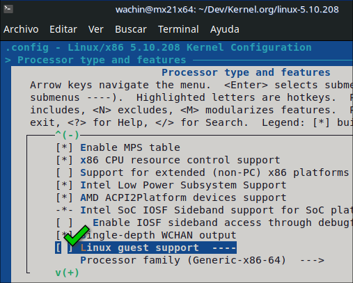

Doy Esc dos veces para ir al menú anterior.

### Desabilito Google Firmware Drivers

Como yo no uso eso lo voy a desabilitar:


pero ya está desabilitado:

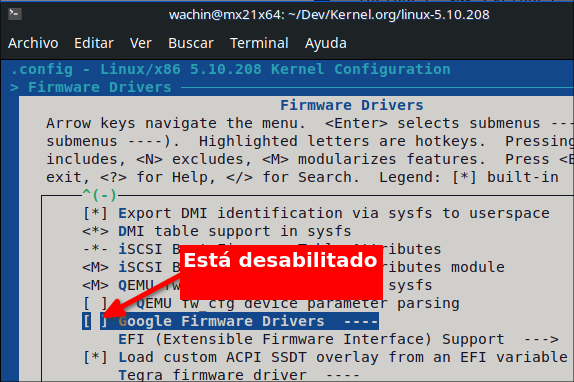

### Desactivando la virtualización 

Me pongo encima de:

**Virtualization**

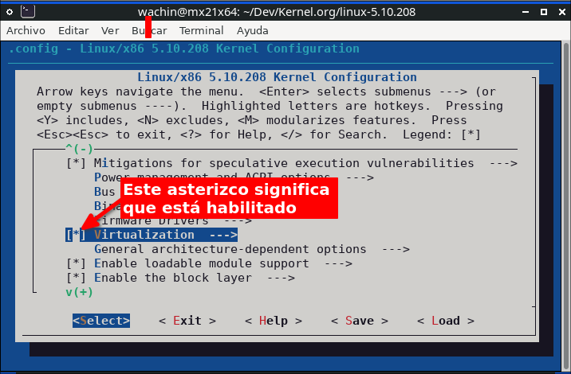

y aplasto la barra espaiadora para desactibarlo:

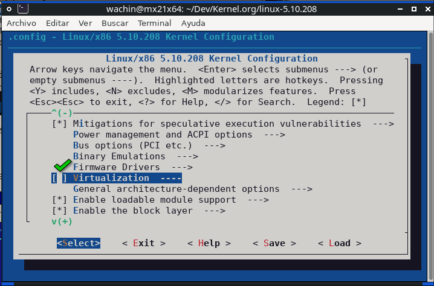

Bien, también desabilito:

```
---Networking Support / Amateur Radio Support
```

### Desabilitar todo en Kernel hacking

como allí dice que es seguro desactivar todo lo que hay allí, pues a todo lo que tiene asterisco lo desactivo con la barra espaciadora:

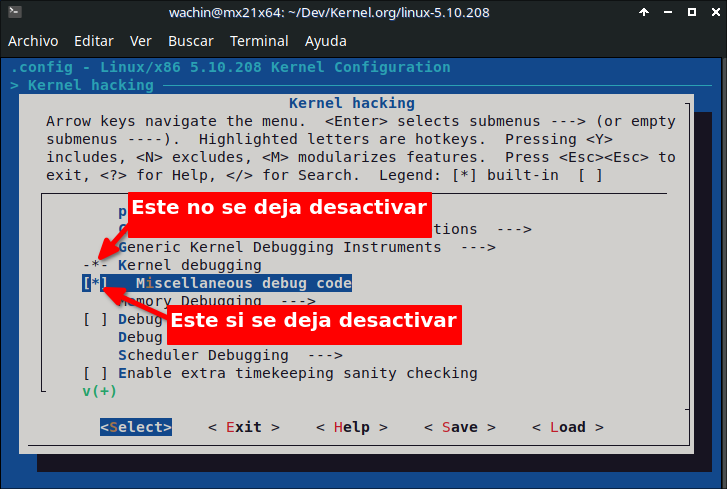

entré en todos los sub menú y desabilité todo lo que pude.

### Guardando (Save)

Con la flecha derecha de su teclado llegue hasta Save:

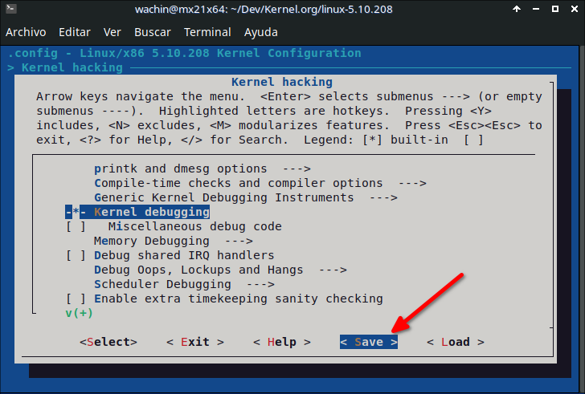

y de Enter:

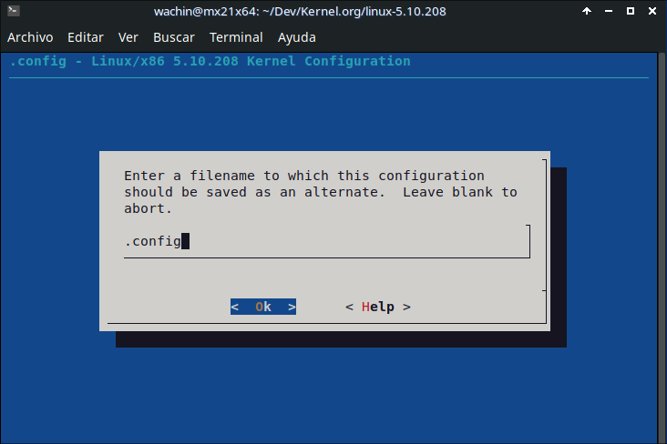

allí dice que la configuración ha sido guardada a .config:

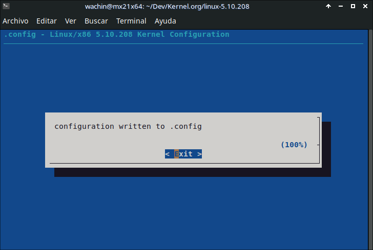

### Evitando posible error de compilación que no se encuentra "debian/certs/debian-uefi-certs.pem"

Para evitar este posible error, ahora que tenemos el archivo .config debemos abrirlo, para ello aplastamos Ctrl + H para ver los archivos ocultos y lo abrirmos con algún editor de texto:

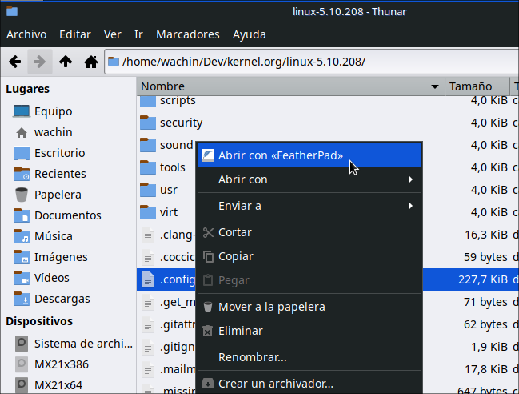

allí debemos buscar:

CONFIG_SYSTEM_TRUSTED_KEYS

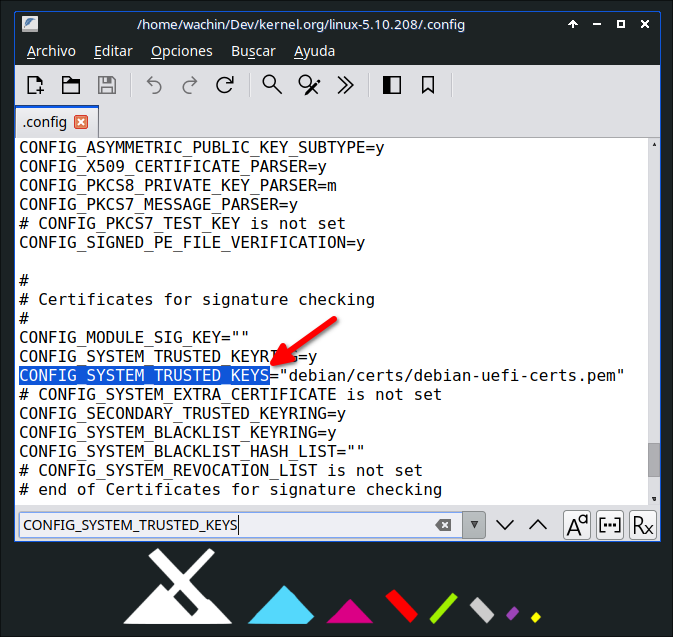

y borrar todo lo que está entre parentesis, es decir cambiar, de:

CONFIG_SYSTEM_TRUSTED_KEYS="debian/certs/debian-uefi-certs.pem"

a:

CONFIG_SYSTEM_TRUSTED_KEYS=""

Guardar y cerrar

En la siguiente imagen es como me queda:

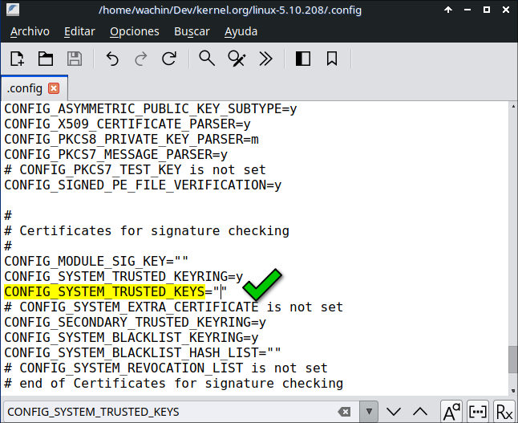

Con esto evitamos que en un momento de la compilación nos salga como en la siguiente pantalla:

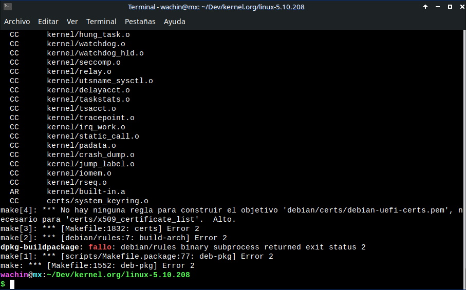


### El archivo **.config** como respaldo de nuestra configuración para usarlo en otra compilación

Si todos los cambios que usted haya hecho en el Kernel fueran demasiados, en el archivo .config se pueden guardar y cargarlos en otro Kernel que usted vaya a compilar. Eso se hace en la opción Load.

de Enter otra vez

Y de Esc varias veces hasta que salga y quede en la terminal negra:

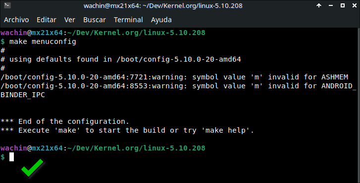

### Elegir la velocidad de compilación (opcional)

Este paso es opcional, podemos exportar el nivel de concurrencia para la compilación *(Concurrencia es la acción de concurrir distintos  sucesos o cosas en un mismo lugar o tiempo)*, para esto existen las siguientes opciones dependiendo de la cantidad de procesadores que usted tenga, para esto hay una regla la de agregar el número uno al número de núcleos que tenga su procesador

Para saber cuántos procesadores tiene ponga en una terminal:

```
nproc --all
```

 y ejemplo:


Si usted tenga 2 núcleos debe poner
export CONCURRENCY_LEVEL=3

Si usted tenga 4 núcleos debe poner
export CONCURRENCY_LEVEL=5


Así, mi laptop es una Dell Inspiron 1750 y tiene dos núcleos así que yo debo de poner así:

```
export CONCURRENCY_LEVEL=3
```

esto es para que la compilación no se demore mucho

 

#### Compinado el Kernel etiquetandolo con mi Nick Name

Es  posible Compilar el Kernel y ponerle una etiqueta como descripción, en el siguiente ejemplo en LOCALVERSION= está la etiqueta  **wachin**:

```
make deb-pkg LOCALVERSION=-wachin KDEB_PKGVERSION=$(make kernelversion)-1
```

así como en la siguiente imagen:

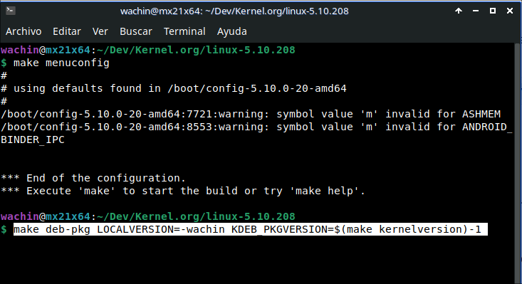

y dar Enter

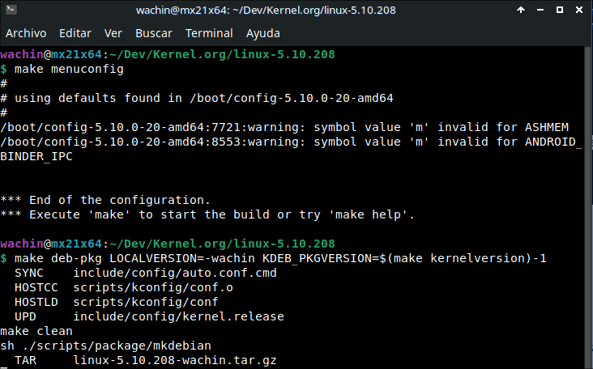

así, será compilado el Kernel y la etiqueta que ustedes hayan puesto aparecerá al final del nombre del deb


hay que esperar un buen rato hasta que termine la compilación, pueden ser horas

 . . . . . 

Bueno, ya se compiló, quizá se demoró unas 5 horas en compilar (depende del ordenador), ahora pongo una imágen de cómo me quedó


los dos deb:

linux-headers-5.10.109-rt65avl1-wachin_5.10.109-1_i386.deb
linux-image-5.10.109-rt65avl1-wachin_5.10.109-1_i386.deb

# Instalar el Kernel RT

Esos dos archivos deb son el Kernel, póngalos en una carpeta aparte e instalelos, abra una terminal allí y ponga:

`sudo dpkg -i *.deb`

y si desea los puede compartir en la Web

Si desea puede abrir Synaptic y buscar las palabras:

kernel image

o:

kernel header

y verá su nombre, su correo, y la etiqueta:


make deb-pkg LOCALVERSION=-wachin KDEB_PKGVERSION=$(make kernelversion)-1


salir


**BASADO EN:**  

**Building realtime Linux for ROS 2 [community-contributed] — ROS 2 Documentation: Foxy documentation**  
[https://docs.ros.org/en/foxy/Tutorials/Building-Realtime-rt_preempt-kernel-for-ROS-2.html ](https://docs.ros.org/en/foxy/Tutorials/Building-Realtime-rt_preempt-kernel-for-ROS-2.html) 

**System configuration [Linux-Sound] ** 
[https://wiki.linuxaudio.org/wiki/system_configuration#do_i_really_need_a_real-time_kernel](https://wiki.linuxaudio.org/wiki/system_configuration#do_i_really_need_a_real-time_kernel)  

**Real-Time Linux | Toradex Developer Center ** 
[https://developer.toradex.com/linux-bsp/real-time/real-time-linux/#preempt-rt-patch-set](https://developer.toradex.com/linux-bsp/real-time/real-time-linux/#preempt-rt-patch-set)  

**Guide for Debian Maintainers**  
[https://www.debian.org/doc/manuals/debmake-doc/index.en.html ](https://draft.blogger.com/#) 
**Chapter 3. Tool Setups**  
[https://www.debian.org/doc/manuals/debmake-doc/ch03.en.html#email-setup  ](https://draft.blogger.com/#)

**The Linux Kernel: The Source Code**  
https://www.linux.org/threads/the-linux-kernel-the-source-code.8679/  

**Compiling the kernel 5.11.11**  
https://askubuntu.com/questions/1329538/compiling-the-kernel-5-11-11  
https://askubuntu.com/a/1329625  

**BTF: .tmp_vmlinux.btf: pahole (pahole) is not available Failed to generate BTF for vmlinux**  
https://stackoverflow.com/questions/61657707/btf-tmp-vmlinux-btf-pahole-pahole-is-not-available  
https://stackoverflow.com/a/61758176  

-is-not-available-Failed-to-generate-BTF-for-vmlinux.png)

para evitar ese error instalar dwarves:

```sh
sudo apt install dwarves
```

**Building and compiling Linux Kernel**  
https://dev.to/rahulku48837211/building-and-compiling-linux-kernel-2elc  

**Error while building CM - lzop: not found - SOLVED + how to fix**  
https://xdaforums.com/t/error-while-building-cm-lzop-not-found-solved-how-to-fix.2465760/  

**EBC Exercise 08 Installing Development Tools 4.4**  
https://elinux.org/EBC_Exercise_08_Installing_Development_Tools_4.4  

**Minimal requirements to compile the Kernel**  
https://www.kernel.org/doc/html/next/process/changes.html

**How to Compile a Linux Kernel**  
https://www.linux.com/topic/desktop/how-compile-linux-kernel-0/  

Configuring the kernel

Before we actually compile the kernel, we must first configure which modules to include. There is actually a really easy way to do this. With a single command, you can copy the current kernel’s config file and then use the tried and true menuconfig command to make any necessary changes. To do this, issue the command:

cp /boot/config-$(uname -r) .config

Now that you have a configuration file, issue the command make menuconfig. This command will open up a configuration tool (Figure 1) that allows you to go through every module available and enable or disable what you need or don’t need.


