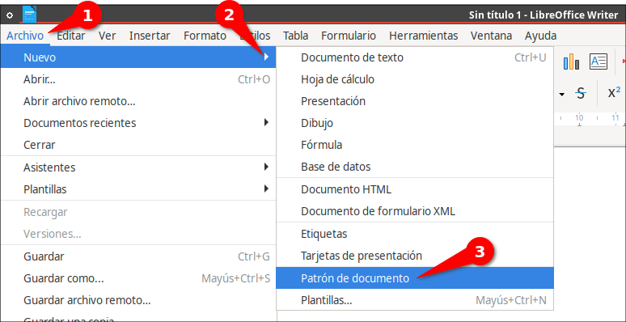

# Cómo insertar varios archivos .odt .docx .doc de documentos en LibreOffice en un sólo archivo

## Insertar varios archivos de documentos en uno de LibreOffice

La siguiente es una forma de unir varios archivos `.odt` o `.docx` o `.doc` en uno solo usando LibreOffice. Para hacerlo, primero hay que tener listos varios archivos  `.odt` o `.docx` o `.doc` y luego en LibreOffice Writer hay que dar clic en:

**1.)** Clic en: **Archivo > Nuevo > Patrón de documento**. 

Allí aparece una ventana llamada **Navegador** y por defecto  **Texto** y a éste seleccionarlo con clic izquierdo y luego darle clic derecho y seleccionar **Insertar > Archivo** y navegar hasta el lugar donde están los documentos y elegir todos los que quiera añadir puede ser con "Ctlr + A" para seleccionar todos o "Ctrl + clic encima de los que desea añadir". Luego, dar clic en **Insertar** y se añadirán al **Patrón de documento**.

**2.)** A continuación, cerrar la ventana **Navegador** y clic en el menú **Editar > Enlaces externos**.., y por defecto estará selecciono uno de los archivos, y dar "Ctrl + A" para seleccionar todos los documentos de la lista y dar clic en el botón **Desenlazar**, y parece una confirmación que dice: "¿Confirma que quiere eliminar el enlace seleccionado?" y dar que sí y clic en "**Cerrar**"

## Romper los enlaces de las secciones y eliminar los marcadores de sección.

Cuando insertas varios archivos `.odt` o `.docx` o `.doc` en un patrón de documento de LibreOffice, cada archivo insertado se convierte en una sección separada del documento. Estas secciones están delimitadas por unos "cuadros" , que en realidad son marcadores de sección.

Esto no es conveniente si uno quisiera ejemplo ponerle a todo el documento dos columnas (aunque si se puede si primero al patrón de documento se lo configura con dos columnas "Formato > Columnas..." antes de insertar los archivos); no se podrá hacer eso pues sólo se aplicarán dos columnas en la sección del documento en el lugar que esté el cursor (selección actual) no a todo el documento. Para resolver esto y poder aplicar el formato de dos columnas (o cualquier otro formato) a todo el documento, necesitas romper los enlaces de las secciones y eliminar los marcadores de sección. Aquí están los pasos para hacerlo:

**1.)** En el menú de LibreOffice ve a **Formato > Secciones**

**2.)** En el diálogo que aparece, por defecto estará seleccionado uno de los archivos insertados, dale clic encima de ese archivo y da "Ctrl + A" o "Ctrl + clic encima de los archivos"

**3.)** (Desmarca las casillas "**Enlace**" y "**Proteger**" si están marcadas).

**4.)** Haz clic en el botón "**Quitar**" y "**Aceptar**"

Lo que hemos hecho es eliminar completamente las secciones y los marcadores de sección mantenieno el contenido.

Después de hacer esto, tu documento debería comportarse como un documento normal sin secciones. Ahora podrás aplicar el formato de dos columnas (o cualquier otro formato) a todo el documento a la vez.

Recuerda que al hacer esto, estarás convirtiendo el patrón de documento en un documento normal, perdiendo la capacidad de actualizar los subdocumentos individuales. 

### Exportar a `.odt` 

Ahora sólo hay que exportar el documento. Clic en:

**Archivo > Exportar**

por defecto está seleccionado "**Documento de texto ODF (odt)**" como formato de salida y dar clic en "**Exportar**" (también está disponible PDF y HTML)

**Nota:** Si desea tener el archivo en .docx o .doc después debe abrir el documento y se abrirá como archivo normal de LibreOffice (ya no como patrón de documento) y allí lo podrá guardar con otro formato

Dios les bendiga

