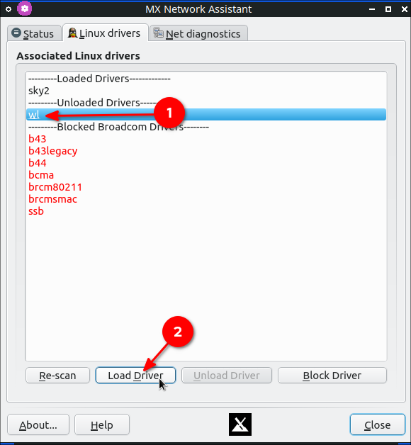
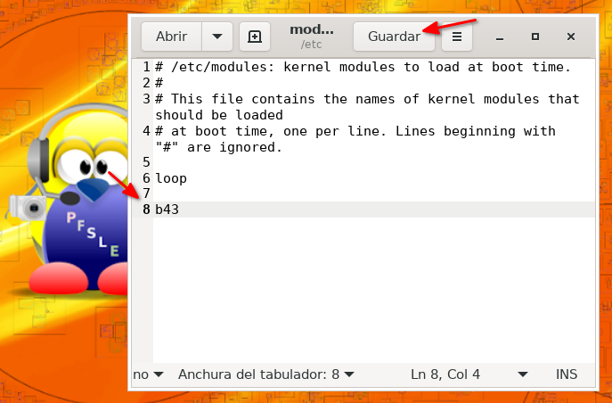
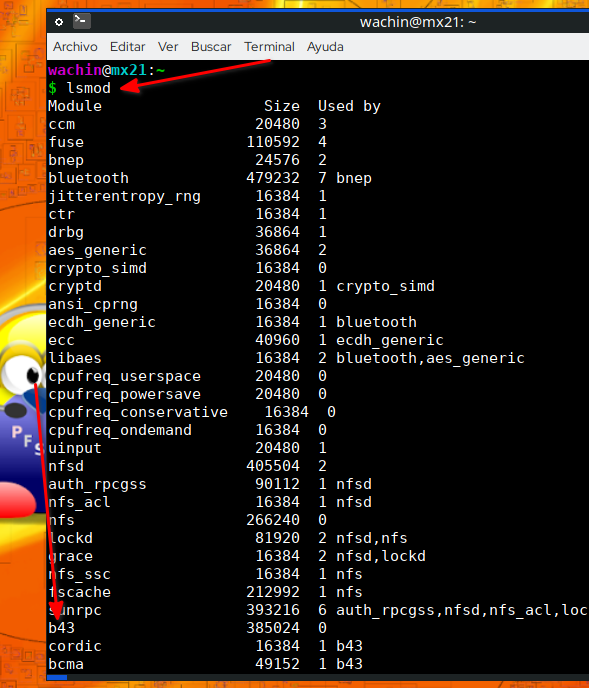
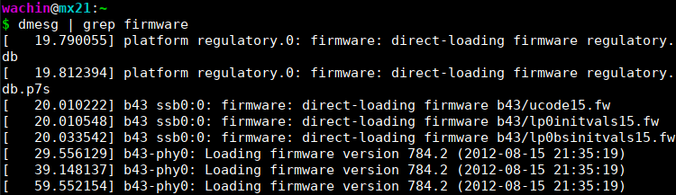

# En MX Linux 21 da problemas el Wi-Fi en Laptop Dell Inspiron 1750 pues con mucha frecuencia se desconecta el Internet
Tengo una Dell Inspiron 1750 donde he instalado MX Linux 21 de 32 bits y siempre en algún momento el Wi-Fi se desconectaba, aquí les dejo dos soluciones, la segunda es la mejor y la que estoy usando. 

Todo este tutorial podría servirles a ustedes para solucionar algún problema semejante con algún otro driver de WiFi

# Solución parcial, manual (lo que hacía yo antes)
Lo que había estado haciendo desde cuando uso MX Linux 21 cuando se desconectaba el Wi-Fi es lo siguiente, abría la configuración de la Red, para eso entre las aplicaciones del Sistema ponía la palabra:

red

y allí para saber cuál es mi controlador de Wi-Fi , me voy al administrador de Redes de MX Linux, en la primer pestaña "**status**" allí veo que el Wireless (que significa "inalámbrico") es:

en mi caso en mi Dell Inspiron 1750 el driver es:

lw0

ahora debo dar clic en la segunda en ése "**wl**" y luego clic en "**Unload Driver**":

con eso descargaba el driver (no se refiere a descargar archivos de internet sino a activarlo), y luego lo volvía a cargar dando clic en **Load Driver**:

y con eso después que se conectaba tenía internet otra vez (esperando un rato se conectaba a internet):

pero con esta solución igual en algún momento me volvía a quedar sin internet:

 pues se desconectaba y tenía que repetir el proceso otra vez, y a veces varias veces.
 
**Nota:** Estaba pensando en no poner esta solución pero le podría servir a alguien conocer esto pues podría alguien tener algún problema con otro controlador de Wi-Fi y podría servirle de algo esta información
 

# Nueva  solución mejorada, bloquear el que no funciona bien, añadir el que si al inicio
Lo siguiente es sólo en mi caso con la Dell Inpiron 1750, pero lo pueden usar como consulta para tal vez solucionar algún problema parecido en alguna otra laptop.

Bien, como yo se que el hardware del controlador del Wi-Fi de mi laptop es Broadcom porque allí mismo dice:

un día me puse a pensar el tratar de usar otro driver y así lo hice con prueba y error (en mi caso probé cada uno de los drivers de la lista que me aparece en esta laptop: 
 
b43  
b43legacy  
b44  
bcma  
brcm80211  
brcmsmac  
ssb  

es decir primero Descargaba el driver que venía cargado por defecto el wl y luego cargaba uno de la lista, y si no funcionaba ese lo descargaba y cargaba otro, y así sucesibamente, y de todos ellos el siguiente es el driver que me funcionó:

**b43**

Entonces la solución total para mí es  **bloquear** el driver que se carga por defecto, así:

**Nota**: Al dejarlo bloqueado núnca más se volverá a cargar (exepto que lo desbloquee claro).

y seleccionar el driver:

**b43**

y cargarlo dando clic en "**Load Driver**":

y esperar un momento a que automáticamente se conecte (pueden ser algunos minutos, no se desesperen que si funciona solo hay que esperar, ser pacientes):

y ya hay internet otra vez:

## Añadir el modulo del driver que siempre funciona al inicio
Pongo yo en una terminal para el editor de texto Gedit (si no lo tiene instalado instálelo o use otro pero edite el comando):

    sudo gedit /etc/modules

allí añada el modulo:

b43

al final, debe quedarle así:

y guarde y cierre Gedit u otro editor de texto que haya usado. Al reiniciar la laptop se cargará automáticamente el modulo y el WiFi funcionará siempre

# Si es curioso (Opcional)
Sólo si es curioso, la interfaz gráfica de "MX Asistente de Redes" lo que hace es modificar los archivos (son varios) en:

/etc/modprobe.d/

si gusta puede abrirlos archivos con algún editor de texto. Ejemplo en el archivo:

/etc/modprobe.d/blacklist.conf

se pondrán los driver que uno quiera bloquear.

También si desea ver el driver cargado, en mi caso yo se  que el que me funciona bien se llama b43 y como ya lo he cargado lo puedo ver en el sistema poniendo en una terminal:

    lsmod

así me aparece:

También lo puedo ver con:

    dmesg | grep firmware

Que Dios les bendiga

 
**CONSULTAS:**

Network configuration/Wireless - ArchWiki
https://wiki.archlinux.org/title/Network_configuration/Wireless

Kernel module - ArchWiki
https://wiki.archlinux.org/title/Kernel_module#Automatic_module_loading

14.04 - Automatically load module on system startup - Ask Ubuntu
https://askubuntu.com/questions/607962/automatically-load-module-on-system-startup
https://askubuntu.com/a/996571/145772

startup - Which system file is loading the "wl" (wifi) kernel module at boot time? - Unix & Linux Stack Exchange
https://unix.stackexchange.com/questions/222358/which-system-file-is-loading-the-wl-wifi-kernel-module-at-boot-time

