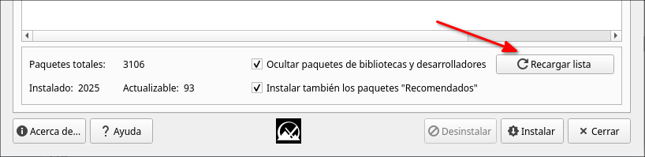
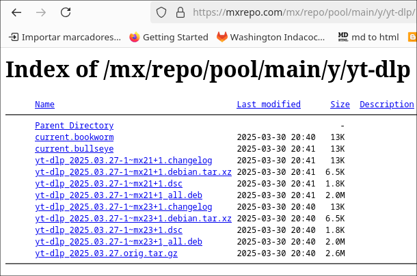
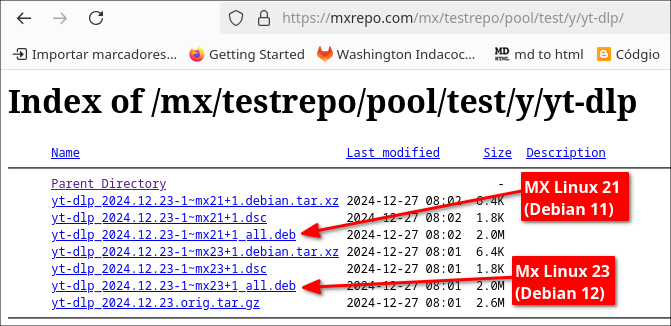
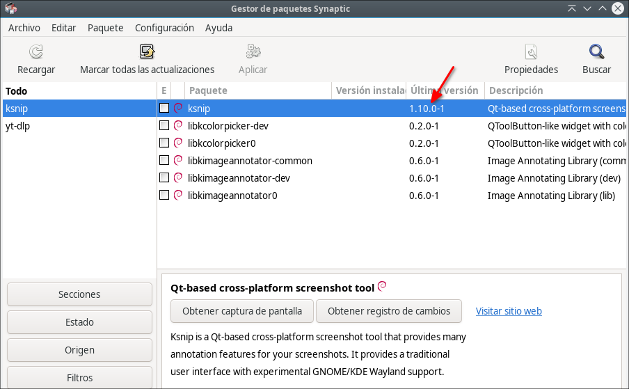
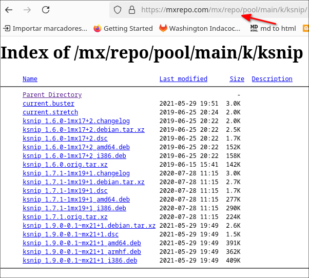
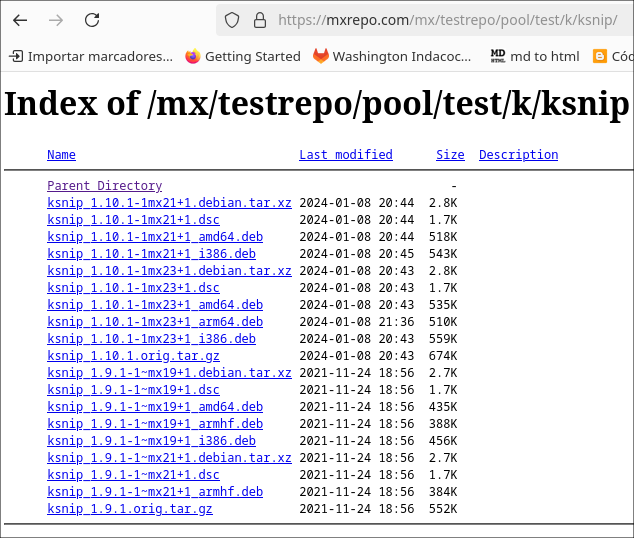
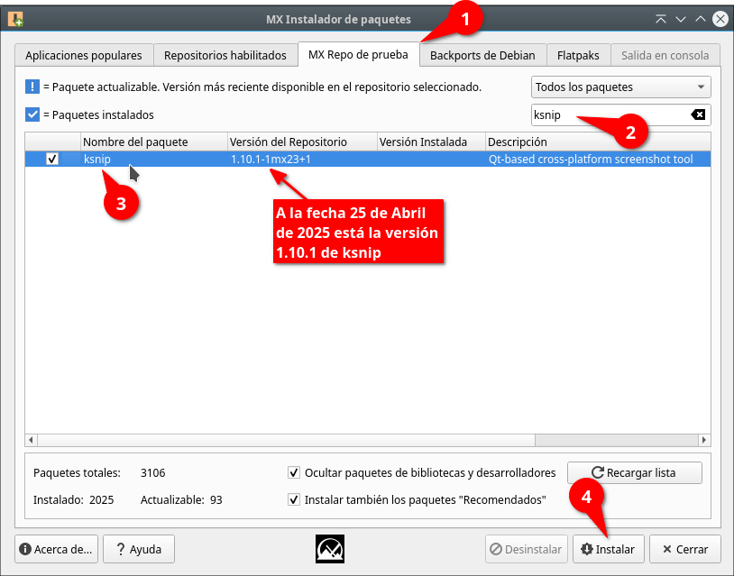

# Instalar el repositorio de MX Linux en Debian 12, 11, 10 y Sistemas Operativos Linux basados en el
Este tutorial es para instalar los repositorios de MX Linux a Sistemas Operativos Debian y basados en Debian que no lo tienen añadido, ejemplo (puede ser cualquier otro, como Debian mismo):

La siguiente imagen es del repositorio de MX Linux 21 añadido en [Q4OS versión 4](https://q4os.org/downloads3.html) visto en Synaptic:

[](https://blogger.googleusercontent.com/img/b/R29vZ2xl/AVvXsEjUZ0BS5HvsuwuvmHxlpJsA13z-DogK5MpV_P0MgnzDS7LiecvKXPXJKHfreGHLcDtGR28MTPS0wYqOd6c_ReDlh1Pf7-Q5WtMIur-_T1kR4onHinXcOjAH2n7ulL92dAB5MkImxIMhkH0HZR5iWM51eV7HvOmfWNG3vKkfEm0os4sc48hFiIb4ROx7raY/s603/20231118-182409%20repositorio%20de%20MX%20Linux%2021%20a%C3%B1adido.png)

## Qué se puede instalar desde este repositorio?

En los repositorios de MX Linux hay software muy importante como ejemplo:  
  
**Extensiones para  Dolphin Administrador de archivos:**

- kde-servicemenu-extract-and-compress  
- kde-servicemenu-checkhash-installdebs  
- kde-servicemenu-rootactions  
- kde-servicemenu-kim5  

**Herramientas**

- **ksnip:** (version actualizada desde el Repositorio de Pruebas "Test")
- **avidemux:** editor de video
- **yt-dlp:** (version actualizada desde el Repositorio de Pruebas "Test")
- **telegram-desktop** = Telegram (32 y 64 bit)
- **formatusb:** Para formatear un Pendrive
- **virtualBox:** La máquina virtual
- **mx-snapshot:** MX Snapshot es una herramienta utilizada para crear un CD en vivo desde el sistema en ejecución (Respins)
- otros
  

## Añadiendo los repositorios de MX Linux a Debian 12

La siguiente es una explicación genérica que hago para Debian 12, y estas explicaciones deberán servir para hacer esto en Debian 11, y Debian 10

Para añadir el repositorio de MX Linux debemos añadirlo en el:  
  
/etc/apt/sources.list.d/  

podemos hacerlo de dos maneras, usando un **editor de texto** o **nano** o **vim** (no confundir vi con vim, vi viene instalado muchas veces por defecto, pero vim es una versión mejorada más fácil de usar) que son editores de texto de terminal (tamién hay otros editores de terminal como micro, u otros)
  
## Usando Gedit u otro editor de texto para editar sources.list.d
podemos usar Gedit  u otro editor de texto, si es que lo deja hacer el sistema operativo, digo porque ejemplo Kate no deja hacer esto:
 
```bash
sudo gedit /etc/apt/sources.list.d/mx.list
```
 
## Usando nano para editar sources.list.d
Se puede usar nano desde la terminal. Nano es un editor de texto de terminal que siempre sirve para cosas como estas que necesitan elevar los permisos. 

- El siguiente comando creará el archivo mx.list automáticamente **con `nano`**::

```bash
sudo nano /etc/apt/sources.list.d/mx.list
```
- **Editar el archivo en `nano`**: ─ Añade las siguientes líneas, copialas:

MX Community Main and Test Repos
    
deb http://mxrepo.com/mx/repo/ bookworm main non-free

#deb http://mxrepo.com/mx/repo/ bookworm test

#ahs hardware stack repo
#deb http://mxrepo.com/mx/repo/ bookworm ahs 

y pegalas en nano.

 - **Guardar el archivo en `nano`**: ─ Presiona `Ctrl + O` (Control y O al mismo tiempo) para guardar los cambios. `nano` te pedirá confirmación para el nombre del archivo el cual te lo mostrará, presiona `Enter` para confirmar la escritura en el archivo mx.list. Para cerrar nano presiona Ctrl + X

Si necesitas ayuda para usar nano aquí dejo en mi blog en Blogger [un tutorial que he hecho](https://facilitarelsoftwarelibre.blogspot.com/2024/08/como-usar-nano-en-linux.html)

- **Actualizar la lista de repositorios**: ─ Una vez que hayas cerrado `nano`, ejecuta el siguiente comando para actualizar la lista de paquetes disponibles:

```bash
sudo apt update
```

## Usando vim para editar `sources.list.d`

Otra opción desde la terminal es usar `vim`, un editor de texto muy poderoso para usuarios más avanzados. A diferencia de `nano`, `vim` tiene modos de edición que pueden parecer confusos al principio, pero una vez que se aprende, es muy rápido y versátil.

- Para abrir o crear el archivo `mx.list` en `vim`, escribe el siguiente comando:

```bash
sudo vim /etc/apt/sources.list.d/mx.list
```

- Cuando se abra el archivo, presiona la tecla `i` para entrar al **modo de inserción** (Insert Mode). Verás que abajo dice `-- INSERT --`. Ahora sí puedes escribir o pegar el contenido.

Copia y pega lo siguiente:


#MX Community Main and Test Repos
deb http://mxrepo.com/mx/repo/ bookworm main non-free

#deb http://mxrepo.com/mx/repo/ bookworm test

#ahs hardware stack repo
#deb http://mxrepo.com/mx/repo/ bookworm ahs


- Cuando termines, **presiona `Esc`** para salir del modo de inserción.

- Para guardar y salir, escribe lo siguiente (debes estar en el modo normal, es decir, sin estar escribiendo texto):

```vim
:wq
```

Y luego presiona `Enter`.

- Si en cambio quieres salir **sin guardar**, escribe:

```vim
:q!
```

y presiona `Enter`.

> Si no estás familiarizado con vim y quieres aprender lo básico, puedes ver en mi blog en Blogger [mi mini guía de Vim aquí](https://facilitarelsoftwarelibre.blogspot.com/2025/04/como-instalar-y-usar-vim-editor-de-texto-de-terminal.html) 

- **Actualizar la lista de repositorios**: después de guardar el archivo, ejecuta:

```bash
sudo apt update
```

Siguiendo estos pasos, habrás añadido el repositorio y actualizado la lista de paquetes en tu sistema.

## Cómo instalar actualizado a yt-dlp desde los paquetes de Prueba (test)  

Voy a poner aquí cómo instalar la ultima versión de un programa llamado yt-dlp que sirve para descargar videos, audios ejemplo de Youtube y que no está en los repositorios de Debian sino en los de MX Linux

Para ello los desarrolladores de MX Linux crearon un paquete llamado:

**MX Instalar paquetes** 

este debemos instalarlo, poner en la terminal:

```bash
sudo apt install mx-repo-list mx-repo-manager mx-packageinstaller
```
y luego buscarlo y abrirlo:

[](https://blogger.googleusercontent.com/img/b/R29vZ2xl/AVvXsEj0dPdD7n0wFZEQCf5ttuyRGwhGKTvwtPwK_c0KcMKOdnSBcPpOkYD1LWdCXc1K2Rj9wSiqJhRM7_D1Al7RUJl28AutV4OVyKAoFsIb5M4_Y-ia6PCfuJgl-_vypXKTwH8IICMl6LoTzx6jjgAW5x25EwZ9C1kFFM-BEw_zs8FebSGOMSil_b4Ma0x8k8k/s562/20240205-054409%20MX%20Instalar%20paquetes.png)

**Nota**: La imagen de arriba es en xfe4-appfinder en MX Linux 21 usando el administrador ventanas Fluxbox.

### El motivo de ser de los repositrios de prueba
Los programas que hay en los repositorios de prueba son programas cuya finalidad es que después que estén corregidos por haber pasado en tantas pruebas puedan pasar a los repositorios estables de MX Linux, por tal motivo es posible que después que hayan dejado bien estable algún programa, lo pasen desde los repositorios de prueba a los repositorios estables (o sea, llegará un momento en que es posible que no veamos tal o cual versión en los repositorios de prueba sino en los estables)

sigamos, clic en la pestaña:

**MX Repo de prueba**

**[](https://blogger.googleusercontent.com/img/b/R29vZ2xl/AVvXsEh_RSXPCNku2HSLfoOHrEsu0n0qCQie2SdPMycQKfC_DWbvRGsf-rWd9wnuuv4HIms1LbaZfR3Vb6vkNpeKt-6JrzDveBnhUDyqCc1nEapPlMRNiN8yP-9XD7oY10zf5fanSblrwLjue4iXhUmkKUlryfQyb31TzVoFr-IkUsPdhi-cN2rG6Z1BdSgZlFU/s803/20240205-054512%20repo%20de%20prueba.png)


Antes de seguir recargue la lista:



ahora si, sigamos, en la imágen anterior dice:

"Advertencia  
Está a punto de utilizar el repositorio MX de  
prueba, cuyos paquetes se proporcionan solo con  
fines de prueba. Podrían llegar a dañar su sistema,  
por lo que se sugiere que haga un respaldo de su  
sistema e instale y/o actualice solo un paquete a la  
vez. Por favor, envie sus comentarios al Foro para  
que los paquetes puedan ser evaluados antes de pasar  
al repositorio principal (Main)"

y eso es lo que vamos a hacer, busquen a:

**yt-dlp** 

este paquete solo se instala él desde los repositorios de MX Linux, y si instala alguna dependencia lo hará desde los repositorios de Debian, marcar e instalar

La siguiente imagen es de MX Linux 21 (pero la imagen es vieja, la tomé en el 2023) que usa como base a Debian 11, allí la ultima versión solo estába en los paquetes de prueba de MX Linux (**MX Repo de prueba**):

[](https://blogger.googleusercontent.com/img/b/R29vZ2xl/AVvXsEh1Y2jcLWu1fC3rYR-sxvz03vzuIMX4DNl4sif2_ejHb_fUFjMO1mTkwY_f6-OapSrQzo1mXdHsHEDJUHQT9jTIDs6I6Na0SFwk98G7b6jtIkpTLgSP9iCdqjUkDfYLujFi86XQDU30FgfnjZ9TW_XiJLCvpV5okkNAShKt5o0yetGcBVoBClh9C-395t8/s803/20240121-163620%20buscando%20a%20yt-dlp%20en%20mx%20test%20repo.png)

**Nota:** Pueden dar clic en "**Mostrar detalles...**" para que vean si el programa va a instalar alguna dependencia, como dice el mensaje de arriba, el repositorio de prueba contiene software que podría llegar a dañar su sistema, pero en este caso solo se instala un paquete desde esos repositorios, y los demás son paquetes del mismo sistema  

[](https://blogger.googleusercontent.com/img/b/R29vZ2xl/AVvXsEgUuyqbNvHJjRbDj0lhHxr40Nra6U2cuF1vn-27wA6LOfFWcEV9kgU1biWC0zzZvfqhyphenhyphenvQvMF87eIPa3V2TAwxNmUQCBK0rD8gwftlHiIF1eeDrs03pGd7gBWoAVK7VlFuMReHToKYDpPGSAxuBURSXlCRusOCf0Vh1JigZ3zL6vOL8Dtj4O18Sgq5ZuNs/s800/20240121-163920%20instalar%20yt-dlp.png)

También si ya lo tenías instalado desde los repositorios de Debian lo puedes actualizar. La siguiente imagen es en Debian 12 donde instalé los repositorios de MX Linux 23 y fue tomada en enero de 2025 aprox:

[](https://blogger.googleusercontent.com/img/b/R29vZ2xl/AVvXsEj0RmB7wGC832eGhlH3OjPTJiOh-lGGBbeGX_2XpRhv2lmbFW73IwheOLJzVlbg1yCg3YsPMY-1ilkjGLNwSq0Kl4E6ZwE0yvBdSLAhCkx1cY7GeZjXe75njTsjlvFagdsvqWeRGX3zm0S8vo-twCqrqyZ3Jm87nKd2xdO_f6s_Iy5i3iizYbO88cUNvE0/s745/20250424-%200014%20actualizando%20yt-dlp.png)

descuiden con este programa pues no instala dependencias de test repo


**yt-dlp el 25 de Abril 2025 visto en los repositorios estables de MX Linux**, está la versión 2025-03-27

[http://mxrepo.com/mx/repo/pool/main/y/yt-dlp/](http://mxrepo.com/mx/repo/pool/main/y/yt-dlp/)



**yt-dlp el 25 de Abril visto en los repositorios de prueba de MX Linux**, está la versión 2024-12-23, como vemos han movido la versión más actual que tenían allí a la versión estable



e instalarlo con clic derecho y se deja instalar y lo que instala es todo desde los repositorios de MX mismo (instalará ffmpeg que pueden verlo en "**Mostrar los detalles...**"). 

 Lo que también me da una idea, tal vez ese deb se pueda instalar en Ubuntu, si alguien hace la prueba, me avisa por favor.  

Bien, para mi este programa no encierra ningún riesgo puesto que solo se instala el desde el testrepo y lo demás desde los repositorios de mx (lo que tratan de decir en el mensaje de advertencia es que si usted sabe qué programa ha instalado y si ese le cause algún problema pues lo puede desinstalar, pero si fueran muchos o muchas dependencias desde el testrepo usted no sabrá qué le causó algún problema y no sabrá que desinstalar)

## Instalando a ksnip desde los repositorios de prueba

Ksnip sirve para hacer capturas de pantalla

la siguiente imagen es de ksnip visto en Debian 12 en los repositorios, el 25 de abril 2025:



la siguiente imagen es de ksnip visto en los repositorios estables de MX Linux, el 25 de abril 2025:



la siguiente imagen es de ksnip visto en los repositorios de prueba (**testrepo**) de MX Linux, el 25 de abril 2025:



como observan la última versión ksnip 1.10.1 está todavía en el repositorio de prueba y no la han pasado al repositorio estable, por lo que la única manera de tener la última versión es desde el repositorio de prueba de MX:



Bueno, ahora si dejo las instrucciones para:

Debian 12
Debian 11

repito para la primera, pero solo los pasos de instalación del repositorio:

## Para Debian 12 bookworm: MX 23 Repo

Copie las siguientes líneas:

#MX Community Main and Test Repos

deb http://mxrepo.com/mx/repo/ bookworm main non-free

#deb http://mxrepo.com/mx/repo/ bookworm test

#ahs hardware stack repo
#deb http://mxrepo.com/mx/repo/ bookworm ahs 

en el archivo mx.list con alguno de los métodos que se indicó arriba y guarde

ahora descargue la llave desde:

[https://mxrepo.com/mx/repo/pool/main/m/mx23-archive-keyring/](https://mxrepo.com/mx/repo/pool/main/m/mx23-archive-keyring/)

a la fecha que hago este tutorial está el archivo:

[https://mxrepo.com/mx/repo/pool/main/m/mx23-archive-keyring/mx23-archive-keyring\_2023.6.6\_all.deb](https://mxrepo.com/mx/repo/pool/main/m/mx23-archive-keyring/mx23-archive-keyring_2023.6.6_all.deb)

[](https://blogger.googleusercontent.com/img/b/R29vZ2xl/AVvXsEhueQdbSd8OHyGbUnbS4cXkpp08vfq8YxpzLEjJfeAvRsOkGQD4-c2emanbOU_raOzAPloBJyC_r5fdAVQM-Iz5hFhNr27VrIIjD8ABWMorC_Gmj_960QIfQIYMfXUt5_e2XLUp7fa-ogoP_VcnmdY5MTMoHaK60UVM3fmpTIbo0JdbWN8w2vltq_SKgAQ/s790/20240719-082459%20mx23-archive-keyring_2023.6.6_all.deb.png)

  

**Nota:** Es posible que con el paso del tiempo lo cambien con otro más actual y cambie el nombre de la versión.

e instálelo, puede ser con dpkg desde la terminal, ejemplo para este archivo sería:

```bash
sudo dpkg -i mx23-archive-keyring\_\*.\*.deb
```

Este comando se descompone en varias partes:

1.  **`sudo`**: Ejecuta el comando con privilegios de superusuario (root). Esto es necesario porque instalar paquetes en el sistema requiere permisos de administrador.
    
2.  **`dpkg -i`**: `dpkg` es el gestor de paquetes de bajo nivel en Debian y sus derivados, como Ubuntu. La opción `-i` (o `--install`) indica que quieres instalar un paquete.
    
3.  **`mx23-archive-keyring_*.*.deb`**: Especifica el paquete que deseas instalar. En este caso, es un archivo `.deb` que contiene el keyring (anillo de claves) para los repositorios de MX Linux 23. El uso del comodín `*.*` permite coincidir con cualquier versión del paquete, es decir, no importa cuál sea el número de versión, siempre que comience con `mx23-archive-keyring`.
    
En conjunto, el comando instala el paquete `mx23-archive-keyring` que contiene las claves públicas necesarias para verificar la autenticidad de los paquetes del repositorio de MX Linux 23. Estas claves son importantes para asegurar que los paquetes instalados desde los repositorios no han sido manipulados y provienen de una fuente confiable.

Recargue los repositorios le recomiendo desde Synaptic:

[](https://blogger.googleusercontent.com/img/b/R29vZ2xl/AVvXsEg-laJM3nUXcOzImy90UkmyZU1PMtg3xZCMq-XCk9h7_NiAUuVXFHioCfb-G-64htcQVXuSb74YIFrrgaaBNpnklgHj6qRVHaejuN8vpm-64omih6XcFMZxaGQwEaOu1oSTvmto3dDb-oVHVbfmBPEkarEt9YM4pkQVxzHvaoMtedv-4YP7Ecx4edTFG98/s860/20240719-083406%20synaptic%20Recarga%20repos.png)

e instale el programa que necesite:

[](https://blogger.googleusercontent.com/img/b/R29vZ2xl/AVvXsEgxQI40yxl3gelqmUdDSRmTa5h6jJglCx-E-YtpcHsQRyc3B4941PukhXHsYziBYYtYPSEP_LQQNRLn0IeoTR3jI1XRc46ObfWTfyALpiop5j_4bRqhjLGsgqGjd1jD6iN2Zg2tUiUXTsK4gn71_ER-5YcQUSchjt4MOH13CthEikvqGDB1RoQC4FZbIzA/s964/20240719-083602%20repositorios%20de%20MX%20Linux%20activados%20en%20Debian%2012.png)

## Para Debian 11 bullseye: MX Linux 21 Repo

Copie las siguientes líneas:

#MX Community Main and Test Repos

deb http://mxrepo.com/mx/repo/ bullseye main non-free

#deb http://mxrepo.com/mx/repo/ bullseye test

#ahs hardware stack repo
#deb http://mxrepo.com/mx/repo/ bullseye ahs 

en el archivo mx.list con alguno de los métodos que se indicó arriba y guarde

ahora descargue la llave desde:

[https://mxrepo.com/mx/repo/pool/main/m/mx21-archive-keyring/](https://mxrepo.com/mx/repo/pool/main/m/mx21-archive-keyring/)

a la fecha que hago este tutorial está el archivo:

[https://mxrepo.com/mx/repo/pool/main/m/mx21-archive-keyring/mx21-archive-keyring\_2021.2.19\_all.deb](https://mxrepo.com/mx/repo/pool/main/m/mx21-archive-keyring/mx21-archive-keyring_2021.2.19_all.deb)

e instálelo, puede ser con dpkg desde la terminal, ejemplo para este archivo sería:

```bash
sudo dpkg -i mx21-archive-keyring\_\*.\*.deb  
```

Recargue los repositorios e instale el programa que necesite

## Para Debian 10 buster: MX Linux 19 Repo

Copie las siguientes líneas:

#MX Community Main and Test Repos
deb http://mxrepo.com/mx/repo/ buster main non-free

#deb http://mxrepo.com/mx/repo/ buster test

#ahs hardware stack repo
#deb http://mxrepo.com/mx/repo/ buster ahs 

en el archivo mx.list con alguno de los métodos que se indicó arriba y guarde

ahora descargue la llave desde:

[https://mxrepo.com/mx/repo/pool/main/m/mx19-archive-keyring/](https://mxrepo.com/mx/repo/pool/main/m/mx19-archive-keyring/)

a la fecha que hago este tutorial está el archivo:

[https://mxrepo.com/mx/repo/pool/main/m/mx19-archive-keyring/mx19-archive-keyring\_2020.4.29\_all.deb](https://mxrepo.com/mx/repo/pool/main/m/mx19-archive-keyring/mx19-archive-keyring_2020.4.29_all.deb)

e instálelo, puede ser con dpkg desde la terminal, ejemplo para este archivo sería:

```bash
sudo dpkg -i mx19-archive-keyring\_\*.\*.deb  
```
  
Recargue los repositorios e instale el programa que necesite

**Nota:** En Debian 10 buster a esta hay menos programas.


## Es posible descargar manualmente programas

Por si necesita manualmente descargar algun programa, puede entrar manualmente a las siguientes direcciones

[https://mxrepo.com/mx/repo/pool/](https://mxrepo.com/mx/repo/pool/)  

de allí yo he buscado en:  

pool  
non-free  

Dios les bendiga  

## CONSULTAS

**Lista de repositorios MX Linux**  
[https://github.com/MX-Linux/mx-repo-list/blob/master/repos.txt](https://github.com/MX-Linux/mx-repo-list/blob/master/repos.txt)  

**Repos — MX-23**  
[https://mxlinux.org/uncategorized/repos-mx-23/](https://mxlinux.org/uncategorized/repos-mx-23/)  


