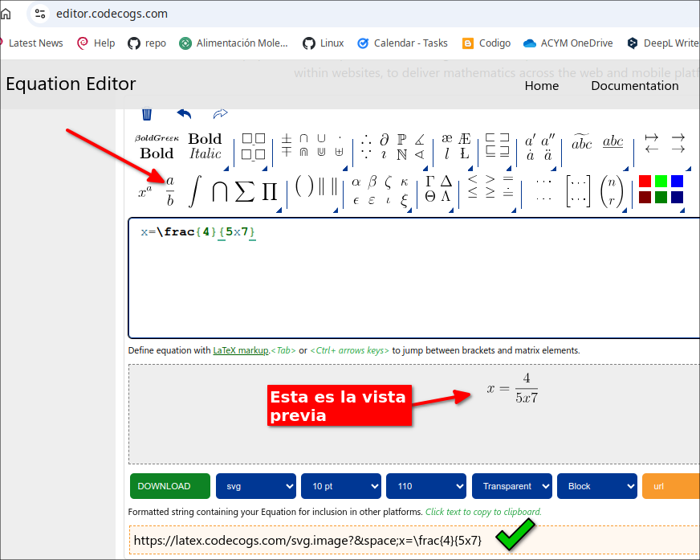
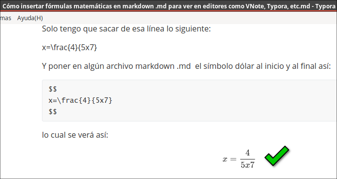
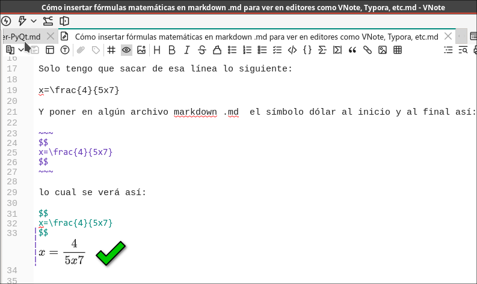
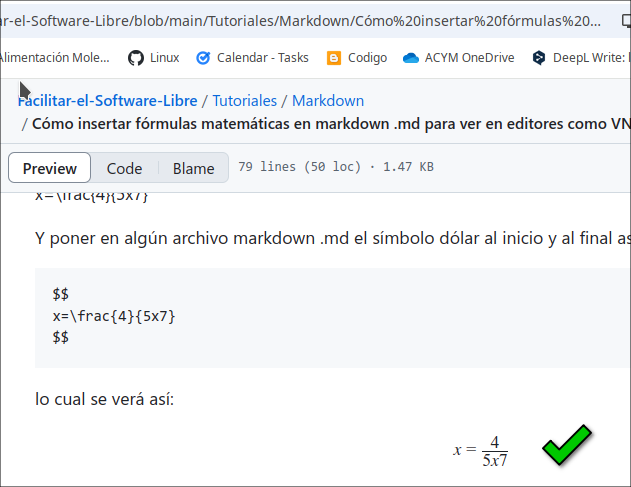
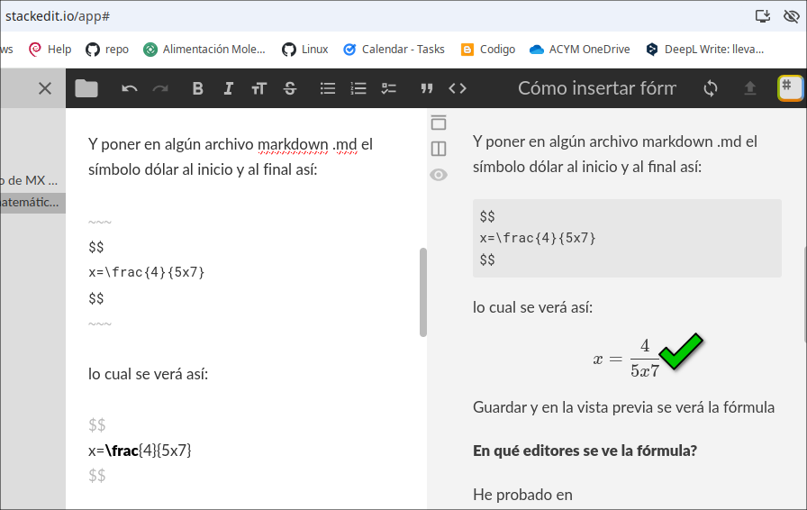
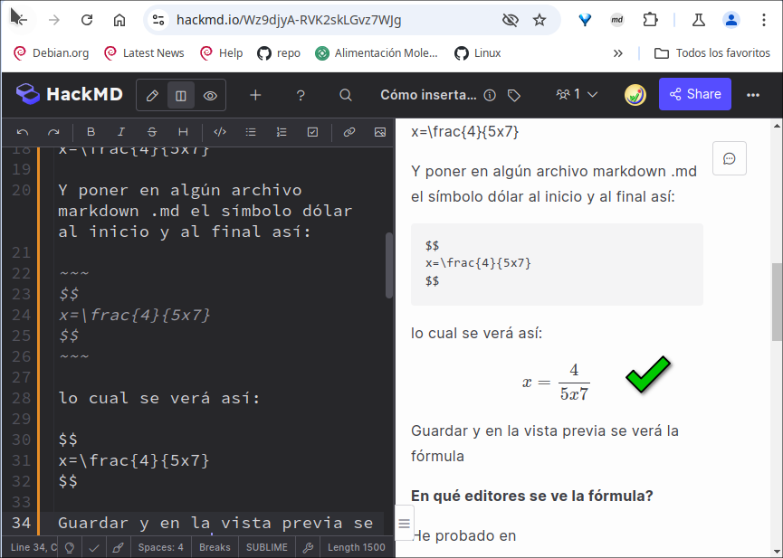

# Cómo insertar fórmulas matemáticas en editores Markdown.md

## El editor de ecuaciones en linea editor.codecogs.com

En el siguiente servicio online:

[https://editor.codecogs.com/](https://editor.codecogs.com/)

de donde traduzco:

"El editor de ecuaciones en línea más popular del mundo que utiliza el formato LaTeX. La API del editor permite una integración y personalización perfectas en sitios web para ofrecer cálculos matemáticos en plataformas web y móviles."

Escribí usando las herramientas que allí me ofrece, la siguiente fórmula:

x=\frac{4}{5x7} 

y me da abajo: 

[https://latex.codecogs.com/svg.image?x=\frac{4}{5x7}}](https://latex.codecogs.com/svg.image?x=\frac{4}{5x7})

## El código que debo insertar en el archivo markdown

Solo tengo que sacar de esa línea lo siguiente: 

x=\frac{4}{5x7}

Y poner en algún archivo markdown .md  el símbolo dólar al inicio y al final así:

~~~
$$
x=\frac{4}{5x7}
$$
~~~

lo cual se verá así:

$$
x=\frac{4}{5x7}
$$

En Markdown, existen los métodos "Math mode" y "Display mode" que se utilizan para incluir expresiones matemáticas, y la diferencia principal entre ellos radica en cómo se presentan visualmente las fórmulas:

1. **Math mode** (`$ ... $`):  
Todo lo que esté entre un par de signos de dólar (`$ ... $`) se muestra en "modo en línea" (inline), es decir, junto con el texto sin ocupar una línea completa.
Por ejemplo, `$ \sum_{n=1}^{\infty} $` se vería como: $\sum_{n=1}^{\infty}$, incrustado dentro del texto.

Este método es útil para expresiones cortas que forman parte de una oración.

2. **Display mode** (`$$ ... $$`):  
Cuando se usa un par doble de signos de dólar (`$$ ... $$`), el contenido se muestra en "modo de visualización" (display mode), ocupando toda una línea y centrado.

Por ejemplo:
~~~
$$ 
 \sum_{n=1}^{\infty} 
$$
~~~
 
se vería así:
$$
     \sum_{n=1}^{\infty}
$$
Esto es útil para expresiones más largas o para destacar fórmulas complejas que necesitan espacio adicional.

En resumen, el "Math mode" (`$ ... $`) es para expresiones en línea, mientras que el "Display mode" (`$$ ... $$`) es para expresiones en bloque y centradas.

## En qué editores Markdown se ve la fórmula?

He probado en:

- Typora

- NVote 

- [https://github.com/](https://github.com/)

- [https://stackedit.io/](https://stackedit.io/)

- [https://hackmd.io/](https://hackmd.io/)

- Debe verse en algún otro pero no he probado

**En qué editores NO se ve la fórmula?**
- Ghostwriter
- Apostrofe
- ReText
- Formiko

## Otros servicios para crear fórmulas matemáticas

Los siguientes servicios online también sirven para crear fórmulas, pero hay que saber usar latex

Math Live
[https://cortexjs.io/mathlive/demo/](https://cortexjs.io/mathlive/demo/)

Matcha (Abrir el editor -investigar cómo funciona-)
[https://www.mathcha.io/](https://www.mathcha.io/)

(No funciona bien en Celular)
[https://latexeditor.lagrida.com/](https://latexeditor.lagrida.com/)

equatheque
[https://visualmatheditor.equatheque.net/](https://visualmatheditor.equatheque.net/)

wiris
[https://demo.wiris.com/mathtype/en/developers.php](https://demo.wiris.com/mathtype/en/developers.php)

hostmath
[https://www.hostmath.com/](https://www.hostmath.com/)

Investigar:
[https://asciimath.org/](https://asciimath.org/)
[https://www.mathpearl.com/](https://www.mathpearl.com/)