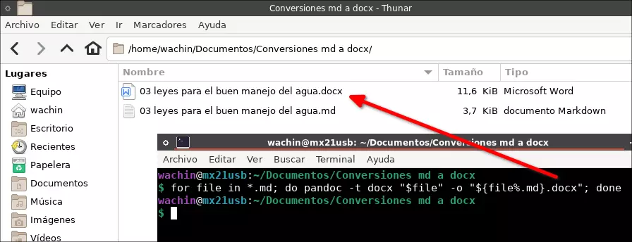

## Convertir por lotes archivos markdown .md a .docx con Pandoc desde la línea de comandos de Linux

Existen dos métodos principales para convertir por lotes (en masa) archivos markdown .md a .docx (documentos de Microsoft Office Word) con Pandoc desde la línea de comandos de Linux:

**1. Utilizando un bucle:**

Este método itera a través de cada archivo .md en un directorio y lo convierte individualmente.

```bash
for file in *.md; do pandoc -t docx "$file" -o "${file%.md}.docx"; done
```
Captura de pantalla:



**Explicación:**

* `for file in *.md` - Recorre todos los archivos con la extensión .md en el directorio actual.
* `pandoc -t docx "$file"` - Convierte el archivo actual (`$file`) a formato docx utilizando la opción `-t docx`.
* `-o "${file%.md}.docx"` - Define el nombre del archivo de salida.
* `"${file%.md}"` elimina la extensión .md del nombre de archivo original.
* `.docx` agrega la extensión .docx para el archivo de salida.

**2. Utilizando el comando `find`:**

Este método utiliza el comando `find` para localizar todos los archivos .md y ejecuta pandoc en cada uno de ellos.

```bash
find . -name "*.md" -exec pandoc -t docx {} -o {}.docx \;
```

**Explicación:**

* `find . -name "*.md"` - Busca todos los archivos llamados *.md en el directorio actual (`.`) y sus subdirectorios.
* `-exec pandoc -t docx {} -o {}.docx \;` - Ejecuta el siguiente comando para cada archivo encontrado:
* `pandoc -t docx {}` - Convierte el archivo actual (`{}`) a formato docx.
* `-o {}.docx` - Guarda el archivo de salida con el mismo nombre que el archivo original, reemplazando la extensión con .docx.

**Notas importantes:**

* Asegúrate de tener Pandoc instalado en tu sistema. Por lo general, puedes instalarlo con tu administrador de paquetes (por ejemplo, `sudo apt install pandoc` para Debian/Ubuntu).
* Estos comandos sobrescribirán cualquier archivo existente con el mismo nombre y la extensión .docx. Considera agregar un paso de copia de seguridad si es necesario (una vez convertidos sacarlos de allí)
* Puedes modificar estos comandos para especificar un directorio de salida diferente cambiando la opción `-o`.

Ambos métodos logran el mismo resultado, elige el que te parezca más legible.

Dios les bendiga


## Referencias

* **Sitio web de Pandoc:** [https://www.pandoc.org/](https://www.pandoc.org/)
* **Guía de usuario de Pandoc:** [https://pandoc.org/getting-started.html](https://pandoc.org/getting-started.html)
* **Escritura sostenible en texto plano usando Pandoc y Markdown:** [https://programminghistorian.org/es/lecciones/escritura-sostenible-usando-pandoc-y-markdown.html](https://programminghistorian.org/es/lecciones/escritura-sostenible-usando-pandoc-y-markdown.html)
* **Convertir de Markdown a docx y a LaTeX con Pandoc:** [https://maciaschain.gitlab.io/gnutas/pandoc-docx.html](https://maciaschain.gitlab.io/gnutas/pandoc-docx.html)
* **Convierta Obsidian Markdowns a MS Word, Power Point - Pandoc:** [https://unclesnote.com/es/240108111119/convert_obsidian_md_to_docx_pptx_pandoc](https://unclesnote.com/es/240108111119/convert_obsidian_md_to_docx_pptx_pandoc)
* **Stack Overflow:** [https://stackoverflow.com/questions/tagged/pandoc](https://stackoverflow.com/questions/tagged/pandoc)
* **Repositorio de GitHub de Pandoc:** [https://github.com/jgm/pandoc](https://github.com/jgm/pandoc)

