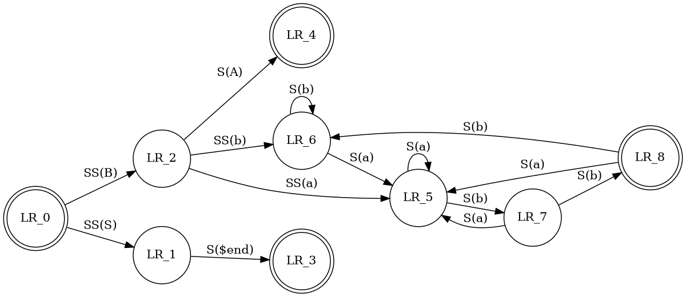

buscar:

dot language graphics editor

https://graphviz.org/resources/

el siguiente es uno de los mejores editores:

Graphviz Visual Editor
http://magjac.com/graphviz-visual-editor/

ejemplo de visualizar usando el

https://edotor.net/

este me da esta salida:

digraph finite_state_machine {
	rankdir=LR;
	size="8,5"

	node [shape = doublecircle]; LR_0 LR_3 LR_4 LR_8;
	node [shape = circle];

	LR_0 -> LR_2 [ label = "SS(B)" ];
	LR_0 -> LR_1 [ label = "SS(S)" ];
	LR_1 -> LR_3 [ label = "S($end)" ];
	LR_2 -> LR_6 [ label = "SS(b)" ];
	LR_2 -> LR_5 [ label = "SS(a)" ];
	LR_2 -> LR_4 [ label = "S(A)" ];
	LR_5 -> LR_7 [ label = "S(b)" ];
	LR_5 -> LR_5 [ label = "S(a)" ];
	LR_6 -> LR_6 [ label = "S(b)" ];
	LR_6 -> LR_5 [ label = "S(a)" ];
	LR_7 -> LR_8 [ label = "S(b)" ];
	LR_7 -> LR_5 [ label = "S(a)" ];
	LR_8 -> LR_6 [ label = "S(b)" ];
	LR_8 -> LR_5 [ label = "S(a)" ];
}

yo debo ponerle así:

y VNote la visualizará bien

