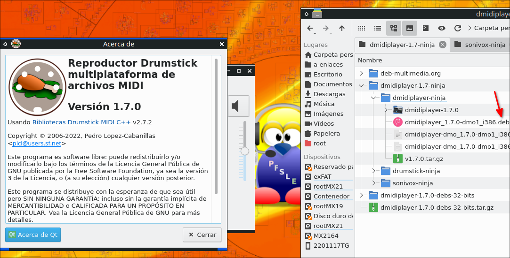

# Creando el deb de dmidiplayer 1.7.0 con ninja
El siguiente tutorial está hecho en MX Linux 21 de 32 bits (también sirve para 64 bits y generar sus respentivos deb)

Primero actualizar los repositorios y actualizar los paquetes:

    sudo apt update && sudo apt upgrade

Instalar las dependencias

    sudo apt install libasound2-dev doxygen libpulse-dev git \
    libfluidsynth-dev qttools5-dev cmake qttools5-dev pandoc \
    libxorg-gtest-dev libgmock-dev xsltproc graphviz \
    libuchardet-dev dh-make ninja-build

les aconsejo hacer lo siguiente, crear de una carpeta principal, ejemplo yo usaré una llamada:

🗀 dmidiplayer-1.7-ninja

y dentro crear subcarpetas

# Compilando sonivox 3.6.11 con ninja
alli dentro de la carpeta principal creo una subcarpeta con el nombre:

🗀 sonivox-ninja

entonces me queda así:

🗀 dmidiplayer-1.7-ninja/sonivox-ninja

en un administrador de archivos entro en esa carpeta y dentro abro una terminal allí y pongo los comandos:

    wget -c https://github.com/pedrolcl/sonivox/archive/refs/tags/v3.6.11.tar.gz
    tar -xvzf v3.6.11.tar.gz
    tar -czvf sonivox-3.6.11.tar.gz sonivox-3.6.11
    tar -xvzf sonivox-3.6.11.tar.gz
    cd sonivox-3.6.11
    mkdir -p build
    cd build
    cmake -G Ninja ../../sonivox-3.6.11 -DCMAKE_INSTALL_PREFIX:PATH=/usr
    ninja
    sudo ninja install
    cd ..
    

**Descargando carpeta debian de Christian Marillat**
    
Debemos descargar la carpeta **debian** que hizo Christian Marillat de deb-multimedia.org entrando en la siguiente dirección:

[https://www.deb-multimedia.org/pool/main/s/sonivox-dmo/](https://www.deb-multimedia.org/pool/main/s/sonivox-dmo/)

allí buscar el archivo:

sonivox-dmo_3.6.11-dmo1.debian.tar.xz

el enlace directo es:

[https://www.deb-multimedia.org/pool/main/s/sonivox-dmo/sonivox-dmo_3.6.11-dmo1.debian.tar.xz](https://www.deb-multimedia.org/pool/main/s/sonivox-dmo/sonivox-dmo_3.6.11-dmo1.debian.tar.xz)

descargue ese archivo estando en la carpeta principal:

🗀 dmidiplayer-1.7-ninja

creando una subcarpeta llamada:

🗀 deb-multimedia.org

y allí otra llamada:

🗀 sonivox-dmo

por todo le quedará así:

🗀 dmidiplayer-1.7-ninja/deb-multimedia.org/sonivox-dmo

**Nota 1:** Si desean también pueden descargar el archivo allí con wget abriendo una terminal allí:

    wget https://www.deb-multimedia.org/pool/main/s/sonivox-dmo/sonivox-dmo_3.6.11-dmo1.debian.tar.xz

**Nota 2:** Como puede que en el futuro ya no esté ese archivo he sacado un respaldo (contiene los tres codigos fuentes necesarios):

[https://github.com/wachin/dmidiplayer-272-ninja-christian-marillat](https://github.com/wachin/dmidiplayer-272-ninja-christian-marillat)

pueden clonar ese repositorio en la carpeta principal y usar mi respaldo si en algún momento lo necesitan.

Después de descargado el archivo usted debe descomprimirlo con clic derecho y Extraer aquí:

y copiar la carpeta: 

🗀 debian

y la pegarla dentro de la carpeta:

🗀 dmidiplayer-1.7-ninja/sonivox-ninja/sonivox-3.6.11/

le debe quedar así:

🗀 dmidiplayer-1.7-ninja/sonivox-ninja/sonivox-3.6.11/debian/

y en la terminal estando ubicados en:

🗀 dmidiplayer-1.7-ninja/sonivox-ninja/sonivox-3.6.11/

abrimos una terminal allí (o si ya estaba abierta allí) y ponemos el comando:
 
    dpkg-buildpackage -uc -b

y esperamos un rato, y luego en carpeta anterior, o sea en:

🗀 /dmidiplayer-1.7-ninja/sonivox-ninja/

se crearán los deb:

/dmidiplayer-1.7-ninja/sonivox-ninja/libsonivox-dev_3.6.11-dmo1_i386.deb  
/dmidiplayer-1.7-ninja/sonivox-ninja/libsonivox3_3.6.11-dmo1_i386.deb  
/dmidiplayer-1.7-ninja/sonivox-ninja/libsonivox3-dbgsym_3.6.11-dmo1_i386.deb  

Nota: El archivo dbgsym no lo necesitamos, lo podemos borrar.

Ahora **debemos desinstalar el sonivox compilado desde codigo fuente**, en su administrador de archivos estando ubicados en:

🗀 /dmidiplayer-1.7-ninja/sonivox-ninja/sonivox-3.6.11/build/

abrimos una terminal allí y ponemos:

    sudo xargs rm < install_manifest.txt

**ahora si debemos instalar los deb**:

/dmidiplayer-1.7-ninja/sonivox-ninja/libsonivox-dev_3.6.11-dmo1_i386.deb  
/dmidiplayer-1.7-ninja/sonivox-ninja/libsonivox3_3.6.11-dmo1_i386.deb  

en la carpeta donde están:

🗀 /dmidiplayer-1.7-ninja/sonivox-ninja/

abrimos una terminal allí y ponermos:

    sudo dpkg -i *.deb

debemos instalarlos si o si, pues de lo contrario no habrá información de la dependecia de estos archivos para los siguientes deb que vamos a crear

# Compilando drumstick 2.7.2 con ninja
Bien, en la carpeta principal:

🗀 /dmidiplayer-1.7-ninja/

creamos una subcarpeta llamada:

🗀 drumstick-ninja

abrimos una terminal allí dentro y ponemos:
    
    wget -c https://sourceforge.net/projects/drumstick/files/2.7.2/drumstick-2.7.2.tar.gz
    tar -xvzf drumstick-2.7.2.tar.gz
    cd drumstick-2.7.2
    mkdir -p build
    cd build
    cmake -G Ninja ../../drumstick-2.7.2 -DCMAKE_INSTALL_PREFIX:PATH=/usr
    ninja
    sudo ninja install
    cd ..

y ahora en la carpeta:

🗀 /deb-multimedia.org/ 

creamos la carpeta:

🗀 drumstick-dmo

y descargamos allí el archivo:

https://www.deb-multimedia.org/pool/main/d/drumstick-dmo/  
https://www.deb-multimedia.org/pool/main/d/drumstick-dmo/drumstick-dmo_2.7.2-dmo1.debian.tar.xz  

y descompirmimos el archivo con clic derecho Extraer aquí y obtenemos la carpeta:

🗀 /debian/

esta carpeta la copiamos y la pegamos en:

🗀 /dmidiplayer-1.7-ninja/drumstick-ninja/drumstick-2.7.2/

debe quedar así:

🗀 /dmidiplayer-1.7-ninja/drumstick-ninja/drumstick-2.7.2/debian

y abrimos una terminal en (si ya estaba una terminal abierta alí usela):

🗀 /dmidiplayer-1.7-ninja/drumstick-ninja/drumstick-2.7.2/

y ponemos:

    dpkg-buildpackage -uc -b

se crearán los deb:

/dmidiplayer-1.7-ninja/drumstick-ninja/drumstick-tools_2.7.2-dmo1_i386.deb  
/dmidiplayer-1.7-ninja/drumstick-ninja/drumstick-tools-dbgsym_2.7.2-dmo1_i386.deb  
/dmidiplayer-1.7-ninja/drumstick-ninja/libdrumstick-alsa2_2.7.2-dmo1_i386.deb  
/dmidiplayer-1.7-ninja/drumstick-ninja/libdrumstick-alsa2-dbgsym_2.7.2-dmo1_i386.deb  
/dmidiplayer-1.7-ninja/drumstick-ninja/libdrumstick-dev_2.7.2-dmo1_i386.deb  
/dmidiplayer-1.7-ninja/drumstick-ninja/libdrumstick-file2_2.7.2-dmo1_i386.deb  
/dmidiplayer-1.7-ninja/drumstick-ninja/libdrumstick-file2-dbgsym_2.7.2-dmo1_i386.deb  
/dmidiplayer-1.7-ninja/drumstick-ninja/libdrumstick-rt-backends_2.7.2-dmo1_i386.deb  
/dmidiplayer-1.7-ninja/drumstick-ninja/libdrumstick-rt-backends-dbgsym_2.7.2-dmo1_i386.deb  
/dmidiplayer-1.7-ninja/drumstick-ninja/libdrumstick-rt2_2.7.2-dmo1_i386.deb  
/dmidiplayer-1.7-ninja/drumstick-ninja/libdrumstick-rt2-dbgsym_2.7.2-dmo1_i386.deb  
/dmidiplayer-1.7-ninja/drumstick-ninja/libdrumstick-widgets2_2.7.2-dmo1_i386.deb  
/dmidiplayer-1.7-ninja/drumstick-ninja/libdrumstick-widgets2-dbgsym_2.7.2-dmo1_i386.deb  

de estos los dbg cortelos y pongalos en una carpeta aparte, no los borre pues se podria equivocar -es que son muchos- y perder alguno de los deb, es mejor que los corte y los ponga a parte y luego puede revisar si cometió algún error

Ahora debemos desinstalar el drumstick compilado desde codigo fuente. En su administrador de archivos estando ubicados en:

🗀 /dmidiplayer-1.7-ninja/drumstick-ninja/drumstick-2.7.2/build/

abrimos una terminal allí y ponemos:

    sudo ninja uninstall

ahora si debemos instalar los deb:

/dmidiplayer-1.7-ninja/drumstick-ninja/drumstick-tools_2.7.2-dmo1_i386.deb  
/dmidiplayer-1.7-ninja/drumstick-ninja/libdrumstick-alsa2_2.7.2-dmo1_i386.deb  
/dmidiplayer-1.7-ninja/drumstick-ninja/libdrumstick-dev_2.7.2-dmo1_i386.deb  
/dmidiplayer-1.7-ninja/drumstick-ninja/libdrumstick-file2_2.7.2-dmo1_i386.deb  
/dmidiplayer-1.7-ninja/drumstick-ninja/libdrumstick-rt-backends_2.7.2-dmo1_i386.deb  
/dmidiplayer-1.7-ninja/drumstick-ninja/libdrumstick-rt2_2.7.2-dmo1_i386.deb  
/dmidiplayer-1.7-ninja/drumstick-ninja/libdrumstick-widgets2_2.7.2-dmo1_i386.deb  

en la carpeta donde están:

🗀 /dmidiplayer-1.7-ninja/drumstick-ninja/

abrimos una terminal allí y ponermos:

    sudo dpkg -i *.deb

debemos instalarlos si o si, pues de lo contrario no habrá información de la dependecia de estos archivos para los siguientes deb que vamos a crear

# Compilando dmidiplayer 1.7.0 con ninja
En su administrador de archivos en la carpeta:

🗀 /dmidiplayer-1.7-building/

cree una subcarpeta:

🗀 dmidiplayer-ninja

y abra una terminal allí y ponga:

    wget -c https://github.com/pedrolcl/dmidiplayer/archive/refs/tags/v1.7.0.tar.gz
    tar -xvzf v1.7.0.tar.gz
    cd dmidiplayer-1.7.0 
    mkdir build
    cd build    
    cmake -G Ninja ../../dmidiplayer-1.7.0 -DCMAKE_INSTALL_PREFIX:PATH=/usr
    ninja
    sudo ninja install
    cd ..

 y ahora en la carpeta:

🗀 /deb-multimedia.org/ 

creamos la carpeta:

🗀 dmidiplayer-dmo

y descargamos allí el archivo:

https://www.deb-multimedia.org/pool/main/d/dmidiplayer-dmo/dmidiplayer-dmo  
https://www.deb-multimedia.org/pool/main/d/dmidiplayer-dmo/dmidiplayer-dmo_1.7.0-dmo1.debian.tar.xz  

y descompirmimos el archivo con clic derecho Extraer aquí y obtenemos la carpeta:

🗀 /debian/

esta carpeta la copiamos y la pegamos en:

🗀 /dmidiplayer-1.7-ninja/dmidiplayer-ninja/dmidiplayer-1.7.0/

nos debe quedar así:

🗀 /dmidiplayer-1.7-ninja/dmidiplayer-ninja/dmidiplayer-1.7.0/debian

y en su administrador de archivos estando ubicados en:

🗀 /dmidiplayer-1.7-ninja/dmidiplayer-ninja/dmidiplayer-1.7.0/

abra una terminal allí y ponga:

    dpkg-buildpackage -uc -b

se crearán los deb pero todavía no los instale

**Nota:** El archivo dbgsym lo puede borrar.

Ahora debemos **desinstalar** el dmidiplayer compilado desde codigo fuente. En su administrador de archivos estando ubicados en:

🗀 /dmidiplayer-1.7-ninja/dmidiplayer-ninja/dmidiplayer-1.7.0/build

abra allí una terminal y ponga el comando para desinstalar:

    sudo ninja uninstall
    
ahora si **instale el deb de dmidiplayer** que se creó en:

/dmidiplayer-1.7-ninja/dmidiplayer-ninja/dmidiplayer_1.7.0-dmo1_i386.deb

abriendo una terminal en:

🗀 /dmidiplayer-1.7-ninja/dmidiplayer-ninja/

con:

    sudo dpkg -i *.deb
    
y quedará instalado entre sus aplicaciones y abralo y funciona

# debs de dmidiplayer en github
He copiado todos los deb generados de sonivox, drumstick, dmidiplayer en una sóla carpeta llamada:

🗀 dmidiplayer-1.7.0-debs-32-bits

y la he comprimido a tar.gz

y he subido el archivo a mi cuenta de github:

# DESCARGAR DMIDIPLAYER Y DEPENDENCIAS
Como he subido los debs a mi cuenta de github si alguien los desea usar los puede descargar de allí:

[https://github.com/wachin/dmidiplayer/releases/tag/v1.7.0](https://github.com/wachin/dmidiplayer/releases/tag/v1.7.0)

Antes de instalar los deb primero instale las siguientes dependencias:

    sudo apt install libc6 libgcc-s1 libqt5core5a \
    libqt5gui5 libqt5printsupport5 libqt5widgets5 \
    libstdc++6 libuchardet0 libqt5network5 \
    libasound2 libpulse0

**Nota:** Al hacer esto nos evitamos después el tener que [intentar corregir las dependencias rotas](https://geekland.eu/reparar-paquetes-rotos-linux/)  con: `sudo apt-get install -f` así, nos evitamos el tener que hacerlo. (Si usted es curioso y le gustaría saber cómo obtuve la lista de esas dependencias, pues lo que hice fue descomprimir cada uno de los deb generamos y buscar en DEBIAN/control y reunir todas las dependencias y hacerlas una lista sacando las repetidas)

después si descomprima el archivo tar.gz y extraiga su contenido con clic derecho Extraer aquí y entrando en esa carpeta abra una terminal allí y ponga:

    sudo dpkg -i *.deb

y aquí una imagen representativa:

Dios les bendiga

**CONSULTAS**
    
**How to Use Ninja**  
https://gist.github.com/jrhemstad/811d1e41af9685670241fa472170ef32  
Configure CMake to create Ninja build files  
mkdir build && cd build  
PARALLEL_LEVEL=N cmake -GNinja ..  

**How to Build ClickHouse on Linux**  
https://clickhouse.com/docs/en/development/build/  
sudo apt update  
sudo apt install git cmake ninja-build clang++ python  
git clone --recursive https://github.com/ClickHouse/ClickHouse.git  
mkdir build && cd build  
cmake ../ClickHouse  
ninja  

**Build your C projects faster using ninja**  
https://ilyas-hamadouche.medium.com/build-your-c-projects-faster-using-ninja-3d7af9b418fc   
Install  
You can install Ninja using package managers, Linux Debian/Ubuntu:   
    sudo apt-get install ninja-build  
To generate Ninja build files, we need to run CMake with the flag -G Ninja. Run the following command in the terminal:  
    cmake -G Ninja  
CMake will generate its own cache/settings files, build.ninja and rules.ninja. This image shows the output files  

**dmidiplayer deb-multimedia.org | debian development folder**  
deb-multimedia dmidiplayer dmo 1.7.0 debian  
https://www.deb-multimedia.org/pool/main/d/dmidiplayer-dmo/dmidiplayer-dmo_1.7.0-dmo1.debian.tar.xz  
/debian/rules  
#!/usr/bin/make -f  
  
%:  
 dh $@ -Scmake+ninja  
  
override_dh_clean:  
	find docs -name index.html -delete  
  
 dh_clean  
  
override_dh_auto_test:  

