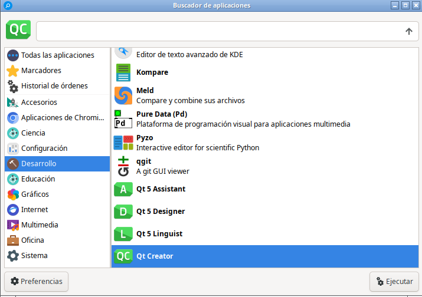

# Como instalar Qt Creator 9 en Debian 12 de 64 y 32 bit

Estaba instalando Qt Creator y me salió este mensaje:  


Can't add kits and can't choose Qt version in Qt Creator  


Aquí les pongo las palabras clave para buscar en Google:  


There is no GCC as a compiler and is compatible with your version of Qt for Qt Creator  

Consultando encontré que es necesario instalar varias dependencias pues sino no funciona. Estos son los paso:

Actualice sus repositorios:

```
sudo apt-get update
```

**Nota:** Esta instalación es para instalar Qt Creator 9 desde los paquetes de la Distribución Linux Debian 9, no desde [Qt](https://www.qt.io/offline-installers).


# **Instalar Qt Creator y Qt**
Los siguientes son los pasos para instalar Qt Creator en Debian 12 de 32 o 64 bit

## 1. Instala las dependencias
   - Abre una terminal y ejecuta el siguiente comando para instalar Qt Creator y las bibliotecas de Qt:
     ```
     sudo apt-get install cmake build-essential libqt5x11extras5-dev qt5-qmake \
     	dh-make qtbase5-dev-tools extra-cmake-modules qtdeclarative5-dev-tools \
     	qtdeclarative5-dev qtcreator qttools5-dev qttools5-dev-tools \
     	libqt5svg5-dev clang xterm cmake-extras qmlscene-qt6 qmlscene \
     	qml qmake6 qt6-base-dev qtcreator qmake6 libdbusmenu-qt5-dev
     ```
     
   - Añado que en la siguiente entrada: https://web.stanford.edu/dept/cs_edu/resources/qt/install-linux dicen que además hay que instalar lo siguiente:

     ```
      sudo apt-get -y install build-essential openssl libssl-dev libssl1.0  \
     	libgl1-mesa-dev libqt5x11extras5 '^libxcb.*-dev' libx11-xcb-dev \
         libglu1-mesa-dev libxrender-dev libxi-dev libxkbcommon-dev \
         libxkbcommon-x11-dev
     ```

      pero les cuento que sin ellas funciona Qt Creator desde los paquete de la distribución, pero las he instalado por un caso.

   - Esto instalará tanto el IDE Qt Creator con las bibliotecas necesarias para desarrollar aplicaciones en Qt.

## 2. **Abrir Qt Creator**
   - Una vez instalado, abre Qt Creator desde el menú de aplicaciones o ejecutando `qtcreator` en la terminal o desde sus aplicaciones:




## 3. **Crear un nuevo proyecto**
   - En Qt Creator, haz clic en **"File"** (Archivo) > **"New Project"** (Nuevo  proyecto).
   - En la ventana que aparece, selecciona **"Qt Widgets Application"** si deseas crear una aplicación de escritorio con interfaz gráfica. (También puedes seleccionar otros tipos de proyectos como **"Qt Console Application"** o **"Qt Quick Application"** según tus necesidades.)
   - Haz clic en **"Choose..."** (Elegir) después de seleccionar el tipo de proyecto.

## 4. **Configurar el proyecto**
   - **Nombre del proyecto:** Escribe un nombre para tu proyecto (Sin espacios)
   - **Location:** Elige la ubicación donde deseas guardar el proyecto **"Create in:"**
   - Haz clic en **"Next"** (Siguiente).

## 5. **Configurar el kit de desarrollo**
   - **"Build System"** cambia la opciòn por defecto (CMake) por qmake (si no hace esto en Debian 12 luego no se crea el archivo .pro).

   - Haz clic en **"Next"** (Siguiente).

   - **"Details"** Si desea puede dejar así como está **"Class Information"**

   - Haz clic en **"Next"** (Siguiente).

   - **"Translation"** Si desea puede elegir un idioma

   - Haz clic en **"Next"** (Siguiente).

   - **kits**,  Si todo ha salido bien estará seleccionado por defecto: **"Desktop"** (si no están instaladas las dependencias anteriormente mencionadas no aparece disponible Kits)

   - Haz clic en **"Next"** (Siguiente).

   - **"Summary"** Verá allí en la lista de los archivos que serán añadidos a .pro sin el cual no se puede hacer nada, ejemplo:

     Files to be added in
     /home/wachin/Dev-Qt/Pruebas/ChordT:
     ChordT.pro
     ChordT_es_EC.ts
     main.cpp
     mainwindow.cpp
     mainwindow.h
     mainwindow.ui


## 6. **Finalizar la configuración del proyecto**
   - Revisa el resumen del proyecto y haz clic en **"Finish"** (Finalizar).

## 7. **Construir y ejecutar el proyecto**
   - Una vez que hayas creado el proyecto, Qt Creator abrirá automáticamente el entorno de desarrollo con los archivos de tu proyecto.

## 8. **Modificar la Clase Principal Manualmente**

1. **Abrir Archivos del Proyecto:**

   - Una vez que el proyecto está creado, en el panel de **"Projects"** (Proyectos) en el lado izquierdo, expande las carpetas **"Sources"** y **"Headers"** para ver los archivos `.cpp` y `.h`.

2. **Modificar `main.cpp`:**

   - Abre el archivo `main.cpp`. Este archivo contiene el punto de entrada de tu aplicación.

   - Si estás utilizando `QMainWindow` como la ventana principal, el código se verá algo similar a esto:

     ```cpp
     #include "mainwindow.h"
     #include <QApplication>
     
     int main(int argc, char *argv[]) {
         QApplication a(argc, argv);
         MainWindow w;
         w.show();
         return a.exec();
     }
     ```

3. **Modificar `mainwindow.h` y `mainwindow.cpp`:**

   - Abre `mainwindow.h` y `mainwindow.cpp` para editar la clase de la ventana principal.

   - Si necesitas agregar widgets adicionales o personalizar la ventana principal, puedes hacerlo aquí. La clase `MainWindow` debería heredar de `QMainWindow`, y típicamente se verá así en el archivo `mainwindow.h`:

     ```cpp
     #ifndef MAINWINDOW_H
     #define MAINWINDOW_H
     
     #include <QMainWindow>
     
     namespace Ui {
     class MainWindow;
     }
     
     class MainWindow : public QMainWindow {
         Q_OBJECT
     
     public:
         explicit MainWindow(QWidget *parent = nullptr);
         ~MainWindow();
     
     private:
         Ui::MainWindow *ui;
     };
     
     #endif // MAINWINDOW_H
     ```

   - En `mainwindow.cpp`, se construye y configura la interfaz:

     ```cpp
     #include "mainwindow.h"
     #include "ui_mainwindow.h"
     
     MainWindow::MainWindow(QWidget *parent) :
         QMainWindow(parent),
         ui(new Ui::MainWindow) {
         ui->setupUi(this);
     }
     
     MainWindow::~MainWindow() {
         delete ui;
     }
     ```

4. **Diseño de la Interfaz Gráfica (`mainwindow.ui`):**

   - Abre `mainwindow.ui` en el editor de diseño gráfico de Qt Creator. Aquí puedes arrastrar y soltar widgets para diseñar la interfaz visual de tu aplicación.

   - Para compilar el proyecto, haz clic en el botón **"Build"** (Construir) o presiona `Ctrl + B`.
   - Para ejecutar el proyecto, haz clic en **"Run"** (Ejecutar) o presiona `Ctrl + R`.

## 9. **Modificar y agregar código**
   - Puedes comenzar a modificar el archivo principal (`main.cpp`) y la ventana principal (`mainwindow.ui` y `mainwindow.cpp`) para desarrollar tu aplicación.

## 10. Abrir un ejemplo de aplicación escrita en Qt

- Cierre Qt Creator y vuelvalo a abrir
- Clone el siguiente repositorio en algún directorio (debe tener instalado git):

   ```
   git clone https://github.com/Anchakor/MRichTextEditor
   ```

- En Qt Creator de clic en **"File"** > **"Open File or Project..."** y busque el archivo:  

  **MRichTextEditor.pro**  

- a la derecha de la ventana de clic en **"Configure Project"** y a la izquierda arriba en **"Projects"**  en **"MRichTextEditor (Master)"** busque el archivo: **MRichTextEditor.pro** dandole doble clic para que lo abra, y luego dele clic en:

- **"Build"** > **"Build Project MRichTextEditor"** y a la esquina abajo derecha está la información de la compilación, cuando se ponga verde ya está y de clic en:

- **"Build"** > **"Run"**

y se abrirá el programa.

### Proyectos de programas en Qt en GitHub

Puede buscar en [www.github.com](www.github.com) las palabras:

Text Editor Qt

allí encontré otro proyecto que también se abre:

[https://github.com/pr-ravi/TextEditor-Qt](https://github.com/pr-ravi/TextEditor-Qt)

Dios les bendiga

### Consultas:  

**How to install qt version?(for Linux)**  
[https://forum.qt.io/topic/116658/how-to-install-qt-version-for-linux](https://forum.qt.io/topic/116658/how-to-install-qt-version-for-linux )  

**Instalar ksnip 1.9.0 en Linux desde código fuente 32 y 64 bits (cmake prefix hacia /usr**  
[https://facilitarelsoftwarelibre.blogspot.com/2021/03/compilar-ksnip-desde-codigo-fuente-en-linux.html](https://facilitarelsoftwarelibre.blogspot.com/2021/03/compilar-ksnip-desde-codigo-fuente-en-linux.html)  

**"No QML utility installed" not letting me use Qt6**  
[https://forum.qt.io/topic/145219/no-qml-utility-installed-not-letting-me-use-qt6/9](https://forum.qt.io/topic/145219/no-qml-utility-installed-not-letting-me-use-qt6/9)  
sudo apt install qml-qt6  

**qtcreator: no qml utility**  
[https://groups.google.com/g/linux.debian.user/c/T9yImA-5abY](https://groups.google.com/g/linux.debian.user/c/T9yImA-5abY)  
But if i execute on cmdline  
qml -v  
the output is  
Qml Runtime 5.15.8  
"which qml" says /usr/bin/qml  
This packages are installed:  
sudo apt install qtcreator qml build-essential qtbase5-dev qt5-qmake cmake  

**Getting Started With Qt and Qt Creator on Linux**  
By Jeff Tranter Wednesday, October 12, 2016  
[https://www.ics.com/blog/getting-started-qt-and-qt-creator-linux](https://www.ics.com/blog/getting-started-qt-and-qt-creator-linux)  
sudo apt-get install build-essential libgl1-mesa-dev  

**clazy**  
[https://github.com/KDE/clazy](https://github.com/KDE/clazy)  
Ubuntu: sudo apt install g++ cmake clang llvm-dev git-core libclang-dev  

**Ubuntu 22.04 with Qt6 - qmake: could not find a Qt installation of ''**  
[https://askubuntu.com/questions/1460242/ubuntu-22-04-with-qt6-qmake-could-not-find-a-qt-installation-of](https://askubuntu.com/questions/1460242/ubuntu-22-04-with-qt6-qmake-could-not-find-a-qt-installation-of )  

**How to Compile Qt from Source Code on Linux**  
By Jeff Tranter Wednesday, January 4, 2017  
[https://www.ics.com/blog/how-compile-qt-source-code-linux](https://www.ics.com/blog/how-compile-qt-source-code-linux )  

[https://vitux.com/compiling-your-first-qt-program-in-ubuntu/](https://vitux.com/compiling-your-first-qt-program-in-ubuntu/)  
sudo apt-get install qt5-doc qtbase5-examples qtbase5-doc-html  

**Instalando dmidiplayer 1.7.0 en MX Linux 21 de 32 o 64 bits desde código fuente**  
[https://facilitarelsoftwarelibre.blogspot.com/2022/10/instalando-dmidiplayer-1.7-en-mx-linux-21-desde-src.html](https://facilitarelsoftwarelibre.blogspot.com/2022/10/instalando-dmidiplayer-1.7-en-mx-linux-21-desde-src.html )  