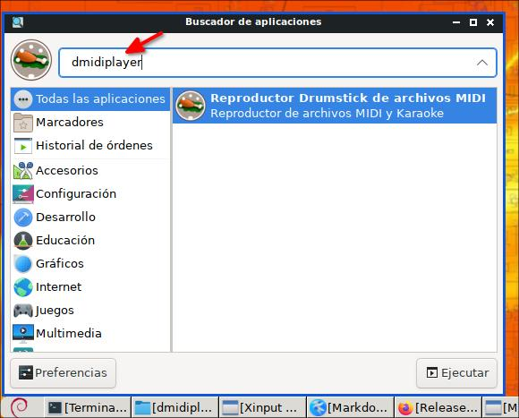
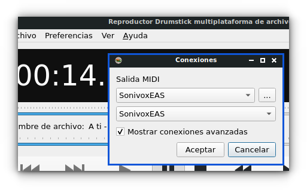
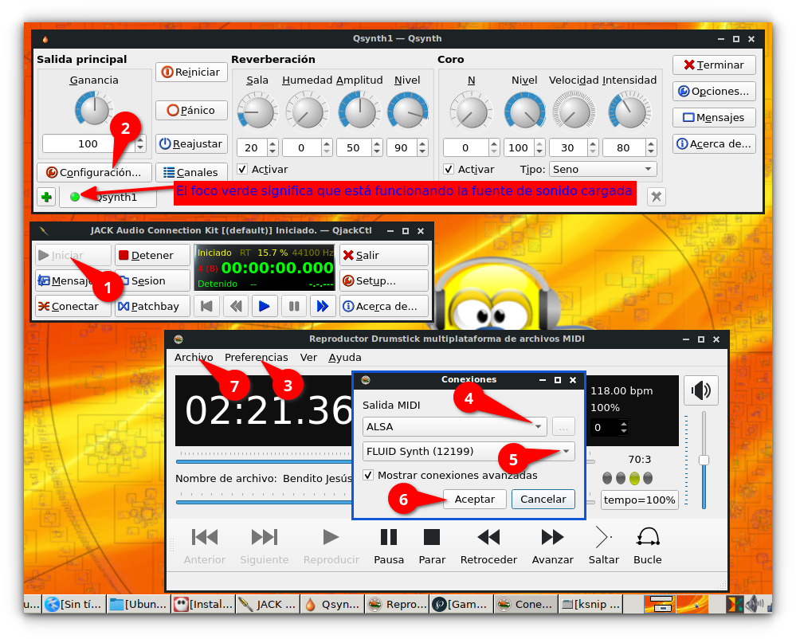

 

# Instalando dmidiplayer 1.5.3 en MX Linux 21 de 32 o 64 bits desde código fuente
La siguiente es la única manera en que he podido instalar dmidiplayer en MX Linux 21 (basado en Debian 11 Bullseye), puede que funcione en otro Linux pero todavía no lo he probado (usted puede testearlo). 
Lo siguiente es la solución unicamente para la versión 1.5.3, pues puede que luego cambien alguno en el código y se deba de instalar de otra forma.

## Desinstalando drumstick

Si usted tenía instalado desde los repositorios a drumstick desinstálelo:

    sudo apt remove drumstick-tools
 
Eso porque es necesaria una librería de desarrollo que viene unicamente en el código fuente.

# Dependencias

dmidiplayer depende de drumstick, uchardet, desde código fuente (no desde los repositorios), y para poderlas compilar necesita instalar las siguientes dependencias:

    sudo apt install libasound2-dev doxygen libpulse-dev libfluidsynth-dev qttools5-dev cmake qttools5-dev pandoc

**Nota:** *En mi sistema MX Linux 21 tenía instalado algunas otras librerías de desarrollo por lo que puede que falten algunas, pero usted podrá verlas al momento de intentar compilar pues allí saldrán1.5.3 mensajes de error y buscando en Google debería encontrar las faltantes.*

# Compilando drumstick

Entrar en la siguiente dirección:

https://sourceforge.net/projects/drumstick/files/

y realizo la compilación poniendo en la terminal uno por uno lo siguiente:

    wget -c https://sourceforge.net/projects/drumstick/files/2.6.0/drumstick-2.6.0.tar.gz
    tar -xvzf drumstick-2.6.0.tar.gz
    cd drumstick-2.6.0
    mkdir -p build
    cd build
    cmake -DCMAKE_INSTALL_PREFIX:PATH=/usr ..
    make
    sudo make install
    exit

También si lo desea en la dirección se puede descargar el código fuente manualmente, luego descomprimiendo el archivo y entrando allí desde una terminal y poniendo como está arriba indicado desde mkdir . . . . . se puede compilar:

https://sourceforge.net/projects/drumstick/files/2.6.0/

Al compilarlose instalaran los siguientes lanzadores en su sistema:

/usr/bin/drumstick-drumgrid  
/usr/bin/drumstick-guiplayer  
/usr/bin/drumstick-vpiano  

**Nota:** *Yo configuré en cmake para que haga la instalación en la ruta /usr pues de lo contrario se instalaba todo en /usr/local y no funcionaba el programa.*

**Para desinstalar:**
Lo siguiente es si en algún caso luego lo desea desinstalar, esto estándo en la carpeta del codigo fuente en una terminal:

    sudo make uninstall

# Compilando Uchardet
Siguiendo las instrucciones de instalación desde:

https://www.freedesktop.org/wiki/Software/uchardet/

abra una terminal y ponga uno por uno:

    git clone https://gitlab.freedesktop.org/uchardet/uchardet.git
    cd uchardet
    cmake .
    make
    sudo make install
    exit

**Para desinstalar:**
Lo siguiente es si en algún caso luego lo desea desinstalar, esto estándo en la carpeta del codigo fuente en una terminal:

    sudo make uninstall

# Compilando dmidiplayer 1.5.3
Las siguientes instrucciones son para la versión 1.5.3 para MX Linux 21 porque para esta versión de la siguiente manera funcionó bien:

    wget -c https://github.com/pedrolcl/dmidiplayer/archive/refs/tags/v1.5.3.tar.gz
    tar -xvzf v1.5.3.tar.gz
    cd dmidiplayer-1.5.3
    mkdir build
    cd build
    cmake .. -DCMAKE_INSTALL_PREFIX:PATH=/usr
    make
    sudo make install
    exit

Al hacer esto el programa quedará instalado entre sus aplicaciones:

quedando con el nombre: 

Reproductor Drumstick de archivos MIDI

**Nota:** *En cmake lo configuré para que vaya la instalación a /usr pues así funciona, pues por defecto estaba a usr/local y así no funcionaba. También no es necesario poner -DCMAKE_PREFIX_PATH="$HOME/Qt5;$HOME/drumstick2;$HOME/uchardet" como ha esta fecha 2022-04-28 dice en la página de https://github.com/pedrolcl/dmidiplayer porque al haber compilado a drumstick2 y uchardet e instalado ambos ya se configuraron correctamente las rutas en Linux, y en cuando a Qt pues también ya está configurado el path por las dependencias instaladas.*

**Para desinstalar:**
Lo siguiente es si en algún caso luego lo desea desinstalar, esto estándo en la carpeta del codigo fuente en una terminal:

    sudo make uninstall

# Compilación Alternativa dmididplayer
También se lo puede instalar de la siguiente manera y a esta fecha 2022-04-29 funciona:

    git clone https://github.com/pedrolcl/dmidiplayer
    cd dmidiplayer
    mkdir build
    cd build
    cmake .. -DCMAKE_INSTALL_PREFIX:PATH=/usr
    make
    sudo make install

pero no lo pongo como principal porque con el paso del tiempo el desarrollador seguirá mejorando y cambiando el código y puede que luego no se pueda instalar de esta manera

# Usando dmidiplayer
Abra el programa y de clic en:

**Archivo &rarr; Abrir** 

busque un archivo de alguna secuencia, pueden ser:

.kar  
.mid  
.midi  
.rmi  
.wrk  

en la siguiente imagen estoy escuchando un MIDI:

Por defecto el programa está configurado para reproducir los archivos de secuencias usando SonivoxEAS, esto lo puede constalar en:

**Preferencias  &rarr; Ajustes MIDI**

# Usando dmidiplayer con JACK
Si usted desea usar este programa en [UbuntuStudio](https://ubuntustudio.org/) o [AV Linux](http://www.bandshed.net/) debe usar ALSA

Antes de todo instale una fuente de sonido, para mi tiene buen sonido:

    sudo apt-get install musescore-general-soundfont-lossless

También puede instalar otras, aquí le dejo un tutorial:  

**[Fuentes de sonido (SoundFonts) gratis desde paquetes de Ubuntu, Debian, Deepin Linux y TuxGuitar](https://facilitarelsoftwarelibre.blogspot.com/2019/11/fuentes-de-sonido-soundfonts-gratuitas.html)**  

Ahora si, debe seguir estos pasos:

1. Abrir QjackCtl y darle **Play**
2. Abrir Qsynth y cargar una fuente de sonidos:  
   **Configuración &rarr; SoundFonts &rarr; Abrir**
3. Abrir dmidiplayer y en Ajustes MIDI seleccionar ALSA y debajo aparecerá FLUID Synth

En la siguiente imagen estoy escuchando un MIDI con muy buen sonido:

Dios les bendiga

