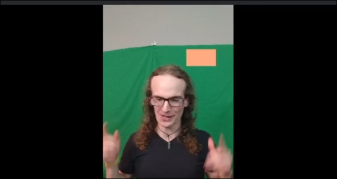
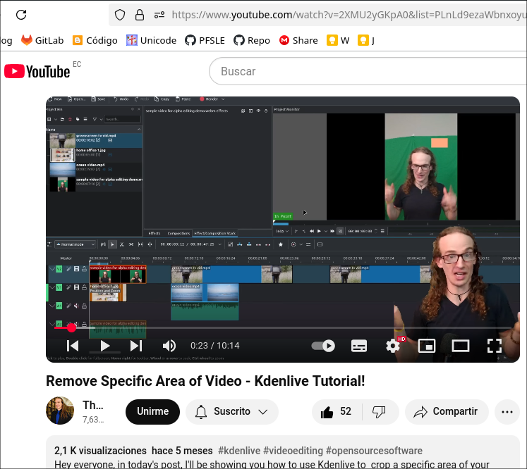

# 📹 Eliminar / Recortar un Área Específica de un Video en Kdenlive

En este tutorial, aprenderás a eliminar o modificar un elemento dentro de un video en **Kdenlive** basado en su posición, sin depender únicamente del color.

---

## 🛠️ Usando el efecto *Crop, Scale and Tilt*
El efecto **"Crop, Scale and Tilt"** se encuentra en:

> `Transformación, distorsión y perspectiva > Crop, Scale and Tilt`

### Opciones disponibles:
- **Crop left / Crop right / Crop top / Crop bottom** – Recorta los bordes del video.
- **Scale X / Scale Y** – Escala la imagen.
- **Tilt Y** – Inclina la imagen.

👉 Esto es útil para eliminar bordes, pero **no sirve para recortar un objeto en el centro del video**.

---

## 🔑 Uso de la Clave Cromática (*Chroma Key*) 🎨

Para eliminar un color específico (como una pantalla verde):

1. Ve a la pestaña de **Efectos** y busca **"Chroma Key"**.
2. Arrástralo al clip en la línea de tiempo.
3. Usa el **cuentagotas** para seleccionar el color que quieres eliminar.
4. Ajusta la tolerancia para evitar que se eliminen partes no deseadas.

❗ **Problema**: Si intentamos eliminar un color similar al de la piel, puede afectar otras partes del video.

### 🎨 ¿Qué es *Chroma* y *Chroma Key*?  

**1️⃣ Chroma**  
El término *Chroma* se refiere al **color** en un video o imagen.  

**2️⃣ Chroma Key** (*Clave de Croma*)  
Es una técnica de edición de video que permite **eliminar un color específico de una imagen o video** y reemplazarlo con otro fondo.  

### 🏗️ ¿Cómo funciona?  
El proceso consiste en:  
1. **Grabar el video con un fondo de color sólido**, generalmente **verde** o **azul**.  
2. **Usar un efecto de Chroma Key en un software de edición** (como Kdenlive, Premiere Pro o After Effects).  
3. **Eliminar el color seleccionado** y reemplazarlo con otro video, imagen o fondo.  

### 🎬 Ejemplos de uso:  
✅ **Noticias y meteorología** – Donde el presentador está frente a un mapa virtual.  
✅ **Efectos de cine** – Para crear escenas con mundos ficticios.  
✅ **Streaming y videojuegos** – Para eliminar el fondo y mostrar solo al jugador.  

📌 **Dato clave**: Se usa **verde o azul** porque estos colores contrastan con el tono de piel y la ropa de la mayoría de las personas.  

---

## 🏗️ Eliminación Basada en Posición 📍 (*Alpha Shapes*)

Si necesitas eliminar un objeto sin depender del color:

1. Ve a **Efectos** y busca **"Alpha Shapes"**.
2. Arrástralo al clip.
3. Ajusta la forma (**rectángulo, elipse, triángulo, diamante**) para cubrir el área a eliminar.
4. En la configuración del efecto, cambia la **operación** de `"Write on"` a `"Subtract"`.

✔ Esto elimina **todo dentro de la forma**, sin importar el color.

---

## 🖌️ Aplicar Efectos a un Área Específica 🖍️ (*Rotoscopía*)

Para cambiar el color o la saturación de una parte específica del video:

1. Ve a **Efectos** y busca **"Rotoscoping Mask"**.
2. Agrégalo al clip.
3. **Haz clic derecho** para crear los puntos de la máscara.
4. Ajusta los puntos para rodear el área deseada.
5. **Agrega un efecto** (por ejemplo, balance de color).
6. **Aplica la máscara** arrastrándola al clip.

💡 Esto permite modificar solo el área seleccionada, sin afectar el resto del video.

---

## 🎬 Ejemplo: Reemplazar una Pantalla en un Video 📺

1. Usa **"Alpha Shapes"** para eliminar la pantalla de una TV en el video.
2. Inserta el clip del video que quieres mostrar en la pantalla.
3. Usa el efecto **"Transform"** para ajustar la nueva imagen dentro del marco de la TV.

---

### 📢 Conclusión 🎥

Este método es útil para:
✅ Eliminar objetos no deseados.
✅ Modificar colores y efectos en zonas específicas.
✅ Crear efectos visuales avanzados sin depender del croma.

---

## Referencias

**Remove Specific Area of Video - Kdenlive Tutorial!**  
[https://www.youtube.com/watch?v=2XMU2yGKpA0&list=PLnLd9ezaWbnxoyuP73TTRLaE9Cr3QwLRz&index=13](https://www.youtube.com/watch?v=2XMU2yGKpA0&list=PLnLd9ezaWbnxoyuP73TTRLaE9Cr3QwLRz&index=13)

**croma**  
[https://dle.rae.es/croma?utm_source=chatgpt.com](https://dle.rae.es/croma?utm_source=chatgpt.com)  

**¿Qué es el croma?**  
[https://www.adobe.com/es/creativecloud/video/discover/what-is-chroma-key.html](https://www.adobe.com/es/creativecloud/video/discover/what-is-chroma-key.html)    

**Croma**  
[https://es.wikipedia.org/wiki/Croma](https://es.wikipedia.org/wiki/Croma)  

**Croma Key ¿Qué es y para qué sirve?**  
[https://www.monsuton.com/croma-key/](https://www.monsuton.com/croma-key/)  

